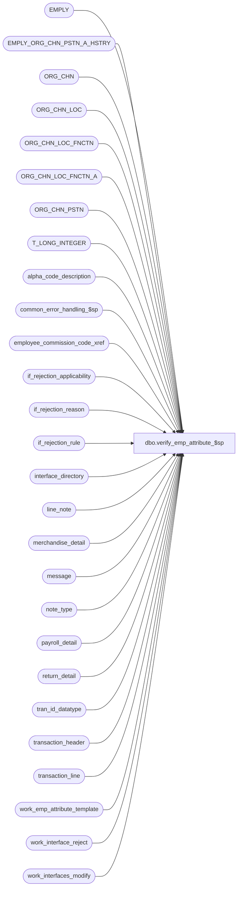

# dbo.verify_emp_attribute_$sp

**Database:** auditworks_external  
**Server:** bedrockdb01  

## Architecture Diagram



## Table Dependencies

| Referenced Table |
|---|
| EMPLY |
| EMPLY_ORG_CHN_PSTN_A_HSTRY |
| ORG_CHN |
| ORG_CHN_LOC |
| ORG_CHN_LOC_FNCTN |
| ORG_CHN_LOC_FNCTN_A |
| ORG_CHN_PSTN |
| T_LONG_INTEGER |
| alpha_code_description |
| common_error_handling_$sp |
| employee_commission_code_xref |
| if_rejection_applicability |
| if_rejection_reason |
| if_rejection_rule |
| interface_directory |
| line_note |
| merchandise_detail |
| message |
| note_type |
| payroll_detail |
| return_detail |
| tran_id_datatype |
| transaction_header |
| transaction_line |
| work_emp_attribute_template |
| work_interface_reject |
| work_interfaces_modify |

## Stored Procedure Code

```sql
create proc [dbo].[verify_emp_attribute_$sp] ( @transaction_id                 tran_id_datatype,
  @transaction_date               smalldatetime,
  @process_id                     binary(16),
  @user_id                        int,
  @reject_reason_number           int OUTPUT,
  @reject_reason_message          nvarchar(255) OUTPUT
)

AS

/*
Proc Name: verify_emp_attribute_$sp
     Desc: This routine will verify if the employee attributes are valid or not.
           If an employee attribute is invalid, then log to if_rejection_reason and set @reject_reason_number and @reject_reason_message.
           If there are more than one rejection reason, @reject_reason_number will have the lowest reject reason number.
           If all attributes are valid, then @reject_reason_number is not set.
           Called by modify_interface_$sp.

 HISTORY:
Date     Name        Defect# Description
Mar27,15 Phu          114095 Do not return error message if IF reject 21 through 41 are not applicable
Jun14,10 Vicci        118614 Make validations match those performed in edit_emp_attribute_$sp (valid selling/position are exist in master tables as primary)
Jan15,10 Vicci      1-44G2XS Use CONVERT instead of STR to avoid loss of precision (invalid check)
Nov18,09 Vicci       HRB1117 Correct all position and selling area validations.
Aug08,08 Paul          87777 Uplift 101197 to SA5
May14,08 Vicci        101197 Support effective date in commission code assigment.
Apr18,08 Phu           96766 Log IF rejects only if it's needed.
Jan03,08 Phu           96587 Apply 96531 to SA5: Do not reject invalid payroll employees when associated with voided lines 
                             and handle header-level attachments
Oct09,07 Paul          91395 Apply 90420 to SA5
Aug07,07 Phu           90420 Log employee to memo1 and employee attribute to memo2.
Jul19,07 Phu         DV-1364 Apply 85598, 87372, 89485 to SA5. Initial development.

*/

DECLARE
  @base                           numeric(21,0),
  @cashier_no                     int,
  @cashier_on_file                tinyint,
  @emp_attr_cursor_open           tinyint,
  @employee_commission_code       nvarchar(20),
  @employee_no                    int,
  @employee_on_file               tinyint,
  @emp_attr_need_validation       nchar(21), -- for 21 validations
  @errmsg                         nvarchar(255),
  @errno                          int,
  @if_reject_reason               tinyint,
  @line_note                      nvarchar(4000),
  @line_id                        numeric(5,0),
  @message_id                     int,
  @min_reject_reason              smallint,
  @note_type                      smallint,
  @object_name                    nvarchar(255),
  @operation_name                 nvarchar(100),
  @original_salesperson_flag      tinyint,
  @process_name                   nvarchar(100),
  @reject_diff                    tinyint,
  @reject_index                   tinyint,
  @rows                           int,
  @salesperson                    int,
  @salesperson_on_file            tinyint,
  @salesperson2                   int,
  @salesperson2_on_file           tinyint,
  @user_defined_emp_on_file       tinyint,
  @PRMY_ORG_CHN_NUM               T_LONG_INTEGER,
  @PRMY_ORG_CHN_NUM_2             T_LONG_INTEGER,
  @payroll_date			  datetime 


SET CONCAT_NULL_YIELDS_NULL OFF

SELECT @base = 10, @reject_diff = 20, -- do not change values
       @min_reject_reason = 99, @emp_attr_cursor_open = 0, @rows = 0,
       @process_name = 'verify_emp_attribute_$sp',
       @message_id = 201068

-- See if_rejection_rule table for description of I/F reject 21 to 41.
-- If I/F reject 21 need to validate then the first byte in @emp_attr_need_validation is set to 1, otherwise 0.
-- If I/F reject 22 need to validate then the second byte in @emp_attr_need_validation is set to 1, otherwise 0, and so on.

SELECT @emp_attr_need_validation = REVERSE(RIGHT('000000000000000000000' + LTRIM(convert(nvarchar, SUM(POWER(@base, CONVERT(numeric(21,0), ISNULL(ir.if_rejection_reason - @reject_diff, 1)) - 1)))), 21))
FROM if_rejection_rule ir
WHERE ir.if_rejection_reason >= 21
AND ir.if_rejection_reason <= 41
AND ISNULL(ir.active_rejection_rule,1) = 1
AND EXISTS (SELECT 1 FROM if_rejection_applicability ia, interface_directory id
            WHERE ir.if_rejection_reason = ia.if_reject_reason
            AND ia.interface_id = id.interface_id
            AND id.update_timing > 0
       AND (id.live_date is NULL OR id.live_date <= @transaction_date))

IF CONVERT(numeric(21,0), @emp_attr_need_validation) = 0
  RETURN

SELECT line_id, cashier_no, cashier_on_file, employee_no, employee_on_file,
       salesperson, salesperson_on_file, salesperson2, salesperson2_on_file, note_type, line_note,
       user_defined_emp_on_file, original_salesperson_flag, PRMY_ORG_CHN_NUM, PRMY_ORG_CHN_NUM_2, payroll_date
INTO #ver_emp_attr_trans
FROM work_emp_attribute_template

SELECT @errno = @@error
IF @errno != 0
BEGIN
  SELECT @errmsg = 'Unable to create table #ver_emp_attr_trans',
         @object_name = '#ver_emp_attr_trans',
         @operation_name = 'SELECT_INTO'
  GOTO error
END

-- Retrieve all trans that need to validate. Split into 4 INSERT SQLs for correct info.
-- user-defined employee role validation.
IF CONVERT(numeric(5,0), SUBSTRING(@emp_attr_need_validation, 1, 5)) > 0
BEGIN
  INSERT INTO #ver_emp_attr_trans (
    line_id, note_type, line_note, user_defined_emp_on_file, PRMY_ORG_CHN_NUM)
  SELECT DISTINCT
    ln.line_id, ln.note_type, ln.line_note, SIGN(ISNULL(e.EMPLY_NUM, 0)), e.PRMY_ORG_CHN_NUM
  FROM transaction_header h WITH (NOLOCK)
       INNER JOIN transaction_line l WITH (NOLOCK) ON (h.transaction_id = l.transaction_id AND l.line_void_flag = 0)
       INNER JOIN line_note ln WITH (NOLOCK) ON (l.transaction_id = ln.transaction_id AND (l.line_id = ln.line_id OR ln.line_id = 0))
       INNER JOIN note_type nt WITH (NOLOCK) ON (ln.note_type = nt.note_type AND nt.employee_validation = 1)
       LEFT JOIN EMPLY e WITH (NOLOCK) ON (CONVERT(INT, ln.line_note) = e.EMPLY_NUM AND e.ACTV = 1)
  WHERE h.transaction_id = @transaction_id
  AND h.transaction_void_flag IN (0,8) -- not void

  SELECT @errno = @@error, @rows = @rows + @@rowcount
  IF @errno != 0
  BEGIN
    SELECT @errmsg = 'Unable to insert for user-defined emmployee role validation',
           @object_name = '#ver_emp_attr_trans',
           @operation_name = 'INSERT'
    GOTO error
  END
END -- IF CONVERT(numeric(5,0), SUBSTRING(@emp_attr_need_validation, 1, 5)) > 0

-- salesperson validation
IF CONVERT(numeric(4,0), SUBSTRING(@emp_attr_need_validation, 6, 4)) > 0
BEGIN
  INSERT INTO #ver_emp_attr_trans (
    line_id, salesperson, salesperson_on_file, salesperson2, salesperson2_on_file,
    original_salesperson_flag, PRMY_ORG_CHN_NUM, PRMY_ORG_CHN_NUM_2)
  SELECT
    m.line_id, m.salesperson, SIGN(ISNULL(e1.EMPLY_NUM, 0)), m.salesperson2, SIGN(ISNULL(e2.EMPLY_NUM, 0)),
    0, e1.PRMY_ORG_CHN_NUM, e2.PRMY_ORG_CHN_NUM
  FROM transaction_header h WITH (NOLOCK)
       INNER JOIN transaction_line l WITH (NOLOCK) ON (h.transaction_id = l.transaction_id AND l.line_void_flag = 0)
       INNER JOIN merchandise_detail m WITH (NOLOCK) ON (l.transaction_id = m.transaction_id AND l.line_id = m.line_id)
       LEFT JOIN EMPLY e1 WITH (NOLOCK) ON (m.salesperson = e1.EMPLY_NUM AND e1.ACTV = 1)
       LEFT JOIN EMPLY e2 WITH (NOLOCK) ON (m.salesperson2 = e2.EMPLY_NUM AND e2.ACTV = 1)
  WHERE h.transaction_id = @transaction_id
  AND h.transaction_void_flag IN (0,8) -- not void

  SELECT @errno = @@error, @rows = @rows + @@rowcount
  IF @errno != 0
  BEGIN
    SELECT @errmsg = 'Unable to insert for salesperson validation',
           @object_name = '#ver_emp_attr_trans',
           @operation_name = 'INSERT'
    GOTO error
  END
END -- IF CONVERT(numeric(4,0), SUBSTRING(@emp_attr_need_validation, 6, 4)) > 0

-- payroll employee validation
IF CONVERT(numeric(4,0), SUBSTRING(@emp_attr_need_validation, 10, 4)) > 0
BEGIN
  INSERT INTO #ver_emp_attr_trans (
    line_id, employee_no, employee_on_file,
    PRMY_ORG_CHN_NUM, payroll_date)
  SELECT DISTINCT
    p.line_id, p.employee_no, SIGN(ISNULL(e.EMPLY_NUM, 0)),
    e.PRMY_ORG_CHN_NUM,
    p.payroll_date
  FROM transaction_header h WITH (NOLOCK)
       INNER JOIN transaction_line l WITH (NOLOCK) ON (h.transaction_id = l.transaction_id AND l.line_void_flag = 0)
       INNER JOIN payroll_detail p WITH (NOLOCK) ON (l.transaction_id = p.transaction_id AND (l.line_id = p.line_id OR p.line_id = 0))
       LEFT JOIN EMPLY e WITH (NOLOCK) ON (p.employee_no = e.EMPLY_NUM AND e.ACTV = 1)
  WHERE h.transaction_id = @transaction_id
  AND h.transaction_void_flag IN (0,8) -- not void

  SELECT @errno = @@error, @rows = @rows + @@rowcount
  IF @errno != 0
  BEGIN
    SELECT @errmsg = 'Unable to insert for payroll employee validation',
           @object_name = '#ver_emp_attr_trans',
           @operation_name = 'INSERT'
    GOTO error
  END
END -- IF CONVERT(numeric(4,0), SUBSTRING(@emp_attr_need_validation, 10, 4)) > 0

-- cashier validation
IF CONVERT(numeric(4,0), SUBSTRING(@emp_attr_need_validation, 14, 4)) > 0
BEGIN
  INSERT INTO #ver_emp_attr_trans (
    line_id, cashier_no, cashier_on_file,
    PRMY_ORG_CHN_NUM)
  SELECT
    0, h.cashier_no, SIGN(ISNULL(e.EMPLY_NUM, 0)),
    e.PRMY_ORG_CHN_NUM
  FROM transaction_header h WITH (NOLOCK)
       LEFT JOIN EMPLY e WITH (NOLOCK) ON (h.cashier_no = e.EMPLY_NUM AND e.ACTV = 1)
  WHERE h.transaction_id = @transaction_id
  AND h.transaction_void_flag IN (0,8) -- not void

  SELECT @errno = @@error, @rows = @rows + @@rowcount
  IF @errno != 0
  BEGIN
    SELECT @errmsg = 'Unable to insert for cashier validation',
           @object_name = '#ver_emp_attr_trans',
           @operation_name = 'INSERT'
    GOTO error
  END
END -- IF CONVERT(numeric(4,0), SUBSTRING(@emp_attr_need_validation, 14, 4)) > 0

-- original salesperson validation from return_detail
IF CONVERT(numeric(4,0), SUBSTRING(@emp_attr_need_validation, 18, 4)) > 0
BEGIN
  INSERT INTO #ver_emp_attr_trans (
    line_id, salesperson, salesperson_on_file, salesperson2, salesperson2_on_file,
    original_salesperson_flag, PRMY_ORG_CHN_NUM, PRMY_ORG_CHN_NUM_2)
  SELECT DISTINCT
    r.line_id, r.original_salesperson, SIGN(ISNULL(e1.EMPLY_NUM, 0)), r.original_salesperson2, SIGN(ISNULL(e2.EMPLY_NUM, 0)),
    1, e1.PRMY_ORG_CHN_NUM, e2.PRMY_ORG_CHN_NUM
  FROM transaction_header h WITH (NOLOCK)
       INNER JOIN transaction_line l WITH (NOLOCK) ON (h.transaction_id = l.transaction_id AND l.line_void_flag = 0)
       INNER JOIN return_detail r WITH (NOLOCK) ON (l.transaction_id = r.transaction_id AND (l.line_id = r.line_id OR r.line_id = 0))
       LEFT JOIN EMPLY e1 WITH (NOLOCK) ON (r.original_salesperson = e1.EMPLY_NUM AND e1.ACTV = 1)
       LEFT JOIN EMPLY e2 WITH (NOLOCK) ON (r.original_salesperson2 = e2.EMPLY_NUM AND e2.ACTV = 1)
  WHERE h.transaction_id = @transaction_id
  AND h.transaction_void_flag IN (0,8) -- not void

  SELECT @errno = @@error, @rows = @rows + @@rowcount
  IF @errno != 0
  BEGIN
    SELECT @errmsg = 'Unable to insert for original salesperson validation',
           @object_name = '#ver_emp_attr_trans',
           @operation_name = 'INSERT'
    GOTO error
  END
END -- IF CONVERT(numeric(4,0), SUBSTRING(@emp_attr_need_validation, 18, 4)) > 0

IF @rows = 0
BEGIN
  DROP TABLE #ver_emp_attr_trans
  RETURN
END

DECLARE employee_attribute_crsr CURSOR FOR
SELECT line_id, cashier_no, cashier_on_file, employee_no, employee_on_file,
       salesperson, salesperson_on_file, salesperson2, salesperson2_on_file, note_type, line_note,
       user_defined_emp_on_file, original_salesperson_flag, PRMY_ORG_CHN_NUM, PRMY_ORG_CHN_NUM_2, payroll_date
FROM #ver_emp_attr_trans
ORDER BY line_id

OPEN employee_attribute_crsr
SELECT @errno = @@error
IF @errno != 0
BEGIN
  SELECT @errmsg = 'Failed to open cursor employee_attribute_crsr',
         @object_name = 'employee_attribute_crsr',
         @operation_name = 'OPEN'
  GOTO error
END

SELECT @emp_attr_cursor_open = 1

WHILE 1 = 1
BEGIN
  FETCH employee_attribute_crsr INTO
    @line_id, @cashier_no, @cashier_on_file, @employee_no, @employee_on_file,
    @salesperson, @salesperson_on_file, @salesperson2, @salesperson2_on_file, @note_type, @line_note,
    @user_defined_emp_on_file, @original_salesperson_flag, @PRMY_ORG_CHN_NUM, @PRMY_ORG_CHN_NUM_2, @payroll_date

  IF @@fetch_status <> 0
    BREAK

  SELECT @reject_index = 0
  WHILE @reject_index < 21
  BEGIN
    SELECT @reject_index = @reject_index + 1
    IF SUBSTRING(@emp_attr_need_validation, @reject_index, 1) = '0'
      CONTINUE  

    SELECT @if_reject_reason = @reject_diff + @reject_index

    -- Invalid employee for user-defined employee role
    IF @if_reject_reason = 21 AND @user_defined_emp_on_file = 0
    BEGIN
      INSERT INTO work_interface_reject (
          process_id,
          transaction_id,
          line_id,
          if_reject_reason,
          memo1,
          memo3)
      VALUES (
          @process_id,
          @transaction_id,
          @line_id,
          @if_reject_reason,
          @line_note,                    -- employee
          convert(nvarchar, @note_type))  -- user-defined employee role
      SELECT @errno = @@error
      IF @errno != 0
      BEGIN
        SELECT @errmsg = 'Unable to insert for invalid employee for user-defined employee role',
               @object_name = 'if_rejection_reason',
               @operation_name = 'INSERT'
        GOTO error
      END

      SELECT @min_reject_reason = @if_reject_reason
    END -- IF @if_reject_reason = 21


    -- Invalid commission code for user-defined employee role
    ELSE IF @if_reject_reason = 22 AND @user_defined_emp_on_file = 1 -- also imply active
    BEGIN
      INSERT INTO work_interface_reject (
          process_id,
          transaction_id,
          line_id,
          if_reject_reason,
          memo1,
          memo2,
          memo3 )
      SELECT
          @process_id,
          @transaction_id,
          @line_id,
          @if_reject_reason,
          @line_note,
          NULL,
          convert(nvarchar, @note_type)
      WHERE CONVERT(INT, @line_note) NOT IN (SELECT x.employee_no FROM employee_commission_code_xref x WITH (NOLOCK)
                                              WHERE @transaction_date >= x.effective_from_date
                                                AND (@transaction_date <= x.effective_to_date OR x.effective_to_date IS NULL))
                              
      UNION

      SELECT
          @process_id,
          @transaction_id,
          @line_id,
          @if_reject_reason,
          @line_note,
          x.employee_commission_code,
          convert(nvarchar, @note_type)
      FROM employee_commission_code_xref x WITH (NOLOCK)
      WHERE x.employee_no = CONVERT(INT, @line_note)
       AND @transaction_date >= x.effective_from_date
       AND (@transaction_date <= x.effective_to_date OR x.effective_to_date IS NULL)
      AND x.employee_commission_code NOT IN (SELECT a.code
                                             FROM alpha_code_description a
                                             WHERE a.code_type = 15
                                             AND a.code_status = 'U'
                                             AND a.code >= '-1')

      SELECT @errno = @@error, @rows = @@rowcount
      IF @errno != 0
      BEGIN
        SELECT @errmsg = 'Unable to insert for invalid commission code for user-defined employee role',
               @object_name = 'if_rejection_reason',
               @operation_name = 'INSERT'
        GOTO error
      END

      IF @rows > 0
      BEGIN
        IF @min_reject_reason > @if_reject_reason
          SELECT @min_reject_reason = @if_reject_reason
      END
    END -- IF @if_reject_reason = 22
      

    -- Invalid primary position for user-defined employee role
    ELSE IF @if_reject_reason = 23 AND @user_defined_emp_on_file = 1
    BEGIN
      INSERT INTO work_interface_reject (
             process_id,
             transaction_id,
             line_id,
             if_reject_reason,
             memo1,
             memo2,
             memo3 )
      SELECT @process_id,
             @transaction_id,
             @line_id,
             @if_reject_reason,
             @line_note,
             a.PSTN_CODE,
             convert(nvarchar, @note_type)
        FROM EMPLY e WITH (NOLOCK)
          LEFT OUTER JOIN EMPLY_ORG_CHN_PSTN_A_HSTRY a WITH (NOLOCK)
            ON e.EMPLY_NUM = a.EMPLY_NUM
           AND a.PRMRY_LOC_A = 1 
           AND @transaction_date >= a.EFCTV_DATE
	   AND (@transaction_date < a.EXPRTN_DATE OR a.EXPRTN_DATE IS NULL)
          LEFT OUTER JOIN ORG_CHN_PSTN ocp WITH (NOLOCK)
            ON a.PSTN_CODE = ocp.PSTN_CODE
       WHERE e.EMPLY_NUM = CONVERT(INT, @line_note) 
         AND ocp.PSTN_CODE IS NULL
      SELECT @errno = @@error, @rows = @@rowcount
      IF @errno != 0
      BEGIN
        SELECT @errmsg = 'Unable to insert for invalid primary position for user-defined employee role',
               @object_name = 'if_rejection_reason',
               @operation_name = 'INSERT'
        GOTO error
      END

      IF @rows > 0
      BEGIN
        IF @min_reject_reason > @if_reject_reason
          SELECT @min_reject_reason = @if_reject_reason
      END
    END -- IF @if_reject_reason = 23


    -- Invalid primary selling area for user-defined employee role
    ELSE IF @if_reject_reason = 24 AND @user_defined_emp_on_file = 1
    BEGIN
      INSERT INTO work_interface_reject (
             process_id,
             transaction_id,
             line_id,
             if_reject_reason,
             memo1,
             memo2,
             memo3 )
      SELECT @process_id,
             @transaction_id,
             @line_id,
             @if_reject_reason,
             @line_note,
             convert(nvarchar, oclfx.FNCTN_NUM),  -- different than 4.1
             convert(nvarchar, @note_type)
        FROM EMPLY e WITH (NOLOCK)
             LEFT OUTER JOIN EMPLY_ORG_CHN_PSTN_A_HSTRY a WITH (NOLOCK)
               ON e.EMPLY_NUM = a.EMPLY_NUM
              AND @transaction_date >= a.EFCTV_DATE AND (@transaction_date < a.EXPRTN_DATE OR a.EXPRTN_DATE IS NULL)
              AND a.PRMRY_LOC_A = 1 
             LEFT OUTER JOIN ORG_CHN_LOC ocl WITH (NOLOCK)
               ON a.PRMRY_LOC_ID = ocl.LOC_ID
             LEFT OUTER JOIN ORG_CHN_LOC_FNCTN_A oclfx WITH (NOLOCK)
               ON ocl.LOC_ID = oclfx.LOC_ID
              AND oclfx.PRMRY_LOC_FNCTN_A = 1
             LEFT OUTER JOIN ORG_CHN_LOC_FNCTN oclf WITH (NOLOCK)
               ON oclfx.FNCTN_NUM = oclf.FNCTN_NUM
              AND oclf.SYS_CODE = 'DISP'
       WHERE e.EMPLY_NUM = CONVERT(INT, @line_note) 
         AND oclf.FNCTN_NUM IS NULL
      -- IF @transaction_date < a.EFCTV_DATE OR @transaction_date > a.EXPRTN_DATE,
      -- then it is logged as invalid primary position for user-defined employee role I/F reject.
      SELECT @errno = @@error, @rows = @@rowcount
      IF @errno != 0
      BEGIN
        SELECT @errmsg = 'Unable to insert for invalid primary selling area for user-defined employee role',
               @object_name = 'if_rejection_reason',
               @operation_name = 'INSERT'
        GOTO error
      END

      IF @rows > 0
      BEGIN
        IF @min_reject_reason > @if_reject_reason
          SELECT @min_reject_reason = @if_reject_reason
      END
    END -- IF @if_reject_reason = 24


    -- Invalid home store for user-defined employee role
    ELSE IF @if_reject_reason = 25 AND @user_defined_emp_on_file = 1
    BEGIN
      INSERT INTO work_interface_reject (
             process_id,
             transaction_id,
             line_id,
             if_reject_reason,
             memo1,
             memo2,
             memo3 )
      SELECT @process_id,
             @transaction_id,
             @line_id,
             @if_reject_reason,
             @line_note,
             convert(nvarchar, COALESCE(a.ORG_CHN_NUM, @PRMY_ORG_CHN_NUM)),
             convert(nvarchar, @note_type)
        FROM (SELECT CONVERT(INT, @line_note) EMPLY_NUM) e
             LEFT OUTER JOIN EMPLY_ORG_CHN_PSTN_A_HSTRY a WITH (NOLOCK)
               ON e.EMPLY_NUM = a.EMPLY_NUM
              AND @transaction_date >= a.EFCTV_DATE AND (@transaction_date < a.EXPRTN_DATE OR a.EXPRTN_DATE IS NULL)
              AND a.PRMRY_LOC_A = 1 
             LEFT OUTER JOIN ORG_CHN oc WITH (NOLOCK)
               ON COALESCE(a.ORG_CHN_NUM, @PRMY_ORG_CHN_NUM) = oc.ORG_CHN_NUM
       WHERE oc.ORG_CHN_NUM IS NULL
      SELECT @errno = @@error, @rows = @@rowcount
      IF @errno != 0
      BEGIN
        SELECT @errmsg = 'Unable to insert for invalid home store for user-defined employee role',
               @object_name = 'if_rejection_reason',
               @operation_name = 'INSERT'
        GOTO error
      END

      IF @rows > 0
      BEGIN
        IF @min_reject_reason > @if_reject_reason
          SELECT @min_reject_reason = @if_reject_reason
      END
    END -- IF @if_reject_reason = 25


    -- Invalid commission code for salesperson
    ELSE IF @if_reject_reason = 26 AND @original_salesperson_flag = 0 -- salesperson from merch
    BEGIN
      INSERT INTO work_interface_reject (
          process_id,
          transaction_id,
          line_id,
          if_reject_reason,
          memo1,
          memo2)
      SELECT
          @process_id,
          @transaction_id,
          @line_id,
          @if_reject_reason,
          -- if salesperson is on file and salesperson2 is NOT on file then memo1 contains salesperson.
         -- if salesperson is NOT on file and salesperson2 is on file then memo1 contains salesperson2.
          -- if both salesperson and salesperson1 are on file then memo1 contains salesperson.
          -- if both salesperson and salesperson2 are NOT on file then WHERE clause will exclude it
          convert(nvarchar, ISNULL(@salesperson * (1 - SIGN(@salesperson2_on_file)), 0) + ISNULL(@salesperson2 * (1 - SIGN(@salesperson_on_file)), 0) + ISNULL(@salesperson * SIGN(@salesperson_on_file * @salesperson2_on_file), 0)),
          NULL
      WHERE ((@salesperson_on_file = 1
              AND @salesperson NOT IN (SELECT x.employee_no FROM employee_commission_code_xref x WITH (NOLOCK)
                                        WHERE @transaction_date >= x.effective_from_date
                                          AND (@transaction_date <= x.effective_to_date OR x.effective_to_date IS NULL))
             )
             OR (@salesperson2_on_file = 1
                 AND @salesperson2 NOT IN (SELECT x2.employee_no FROM employee_commission_code_xref x2 WITH (NOLOCK)
                                            WHERE @transaction_date >= x2.effective_from_date
                                              AND (@transaction_date <= x2.effective_to_date OR x2.effective_to_date IS NULL))
              ))

      UNION

      SELECT
          @process_id,
          @transaction_id,
          @line_id,
          @if_reject_reason,
          convert(nvarchar, @salesperson),
          x.employee_commission_code
      FROM employee_commission_code_xref x WITH (NOLOCK)
      WHERE @salesperson_on_file = 1
      AND @salesperson = x.employee_no
      AND @transaction_date >= x.effective_from_date
      AND (@transaction_date <= x.effective_to_date OR x.effective_to_date IS NULL)
      AND x.employee_commission_code NOT IN (SELECT a.code
                                             FROM alpha_code_description a
                       WHERE a.code_type = 15
                                             AND a.code_status = 'U'
                                             AND a.code >= '-1')

      SELECT @errno = @@error, @rows = @@rowcount
      IF @errno != 0
      BEGIN
        SELECT @errmsg = 'Unable to insert for invalid commission code for salesperson',
               @object_name = 'if_rejection_reason',
               @operation_name = 'INSERT'
        GOTO error
      END

      -- make sure either salesperson or salesperson2 (not both) is logged for the same transaction_id, line_id.
      IF @rows = 0
      BEGIN
        INSERT INTO work_interface_reject (
          process_id,
          transaction_id,
          line_id,
          if_reject_reason,
          memo1,
          memo2)
        SELECT
          @process_id,
          @transaction_id,
          @line_id,
          @if_reject_reason,
          convert(nvarchar, @salesperson2),
          x.employee_commission_code
        FROM employee_commission_code_xref x WITH (NOLOCK)
        WHERE @salesperson2_on_file = 1
        AND @salesperson2 = x.employee_no
        AND @transaction_date >= x.effective_from_date
        AND (@transaction_date <= x.effective_to_date OR x.effective_to_date IS NULL)
        AND x.employee_commission_code NOT IN (SELECT a.code
                                               FROM alpha_code_description a
                                               WHERE a.code_type = 15
                                 AND a.code_status = 'U'
                                               AND a.code >= '-1')

        SELECT @errno = @@error, @rows = @@rowcount
        IF @errno != 0
        BEGIN
          SELECT @errmsg = 'Unable to insert for invalid commission code for salesperson2',
                 @object_name = 'if_rejection_reason',
                 @operation_name = 'INSERT'
          GOTO error
        END
      END -- IF @rows = 0

      IF @rows > 0
      BEGIN
        IF @min_reject_reason > @if_reject_reason
          SELECT @min_reject_reason = @if_reject_reason
      END
    END -- IF @if_reject_reason = 26


    -- Invalid primary position for salesperson
    ELSE IF @if_reject_reason = 27 AND @original_salesperson_flag = 0 -- salesperson from merch
    BEGIN
      INSERT INTO work_interface_reject (
          process_id,
          transaction_id,
          line_id,
          if_reject_reason,
          memo1,
          memo2)
       SELECT @process_id,
          @transaction_id,
          @line_id,
          @if_reject_reason,
          -- if salesperson is on file and salesperson2 is NOT on file then memo1 contains salesperson.
          -- if salesperson is NOT on file and salesperson2 is on file then memo1 contains salesperson2.
          -- if both salesperson and salesperson2 are on file then memo1 contains salesperson.
          -- if both salesperson and salesperson2 are NOT on file then WHERE clause will exclude the trans.
          CASE WHEN (@salesperson_on_file > 0 AND ocp.PSTN_CODE IS NULL) THEN convert(nvarchar, @salesperson) ELSE convert(nvarchar, @salesperson2) END,
          CASE WHEN (@salesperson_on_file > 0 AND ocp.PSTN_CODE IS NULL) THEN a.PSTN_CODE ELSE a2.PSTN_CODE END 
     FROM (SELECT @salesperson EMPLY_NUM, @salesperson2 EMPLY_NUM2) e
         LEFT OUTER JOIN EMPLY_ORG_CHN_PSTN_A_HSTRY a WITH (NOLOCK)
           ON @salesperson_on_file > 0
          AND e.EMPLY_NUM = a.EMPLY_NUM
          AND @transaction_date >= a.EFCTV_DATE AND (@transaction_date < a.EXPRTN_DATE OR a.EXPRTN_DATE IS NULL)
          AND a.PRMRY_LOC_A = 1 
         LEFT OUTER JOIN ORG_CHN_PSTN ocp WITH (NOLOCK)
           ON a.PSTN_CODE = ocp.PSTN_CODE
         LEFT OUTER JOIN EMPLY_ORG_CHN_PSTN_A_HSTRY a2 WITH (NOLOCK)
           ON @salesperson2_on_file > 0 AND @salesperson2 IS NOT NULL
          AND e.EMPLY_NUM2 = a2.EMPLY_NUM
          AND @transaction_date >= a2.EFCTV_DATE AND (@transaction_date < a2.EXPRTN_DATE OR a2.EXPRTN_DATE IS NULL)
          AND a2.PRMRY_LOC_A = 1 
         LEFT OUTER JOIN ORG_CHN_PSTN ocp2 WITH (NOLOCK)
           ON a2.PSTN_CODE = ocp2.PSTN_CODE
    WHERE (   (@salesperson_on_file > 0 AND ocp.PSTN_CODE IS NULL) 
           OR (@salesperson2_on_file = 1 AND @salesperson2 IS NOT NULL AND ocp2.PSTN_CODE IS NULL))
      SELECT @errno = @@error, @rows = @@rowcount
      IF @errno != 0
      BEGIN
        SELECT @errmsg = 'Unable to insert for invalid primary position for salesperson',
               @object_name = 'if_rejection_reason',
               @operation_name = 'INSERT'
        GOTO error  
      END
      
    IF @rows > 0
      BEGIN
        IF @min_reject_reason > @if_reject_reason
          SELECT @min_reject_reason = @if_reject_reason
      END
    END -- IF @if_reject_reason = 27


    -- Invalid primary selling area for salesperson
    ELSE IF @if_reject_reason = 28 AND @original_salesperson_flag = 0
    BEGIN
      INSERT INTO work_interface_reject (
             process_id,
             transaction_id,
             line_id,
             if_reject_reason,
             memo1,
             memo2)
      SELECT @process_id,
             @transaction_id,
             @line_id,
             @if_reject_reason, 
             convert(nvarchar, @salesperson),
             convert(nvarchar, oclfx.FNCTN_NUM)  -- different than 4.1
        FROM (SELECT @salesperson EMPLY_NUM) e
         LEFT OUTER JOIN EMPLY_ORG_CHN_PSTN_A_HSTRY a WITH (NOLOCK)
           ON e.EMPLY_NUM = a.EMPLY_NUM
          AND @transaction_date >= a.EFCTV_DATE AND (@transaction_date < a.EXPRTN_DATE OR a.EXPRTN_DATE IS NULL)
          AND a.PRMRY_LOC_A = 1 
         LEFT OUTER JOIN ORG_CHN_LOC ocl WITH (NOLOCK)
           ON a.PRMRY_LOC_ID = ocl.LOC_ID
         LEFT OUTER JOIN ORG_CHN_LOC_FNCTN_A oclfx WITH (NOLOCK)
           ON ocl.LOC_ID = oclfx.LOC_ID
          AND oclfx.PRMRY_LOC_FNCTN_A = 1
         LEFT OUTER JOIN ORG_CHN_LOC_FNCTN oclf WITH (NOLOCK)
           ON oclfx.FNCTN_NUM = oclf.FNCTN_NUM
          AND oclf.SYS_CODE = 'DISP'
        WHERE @salesperson_on_file = 1
          AND oclf.FNCTN_NUM IS NULL
      -- IF @transaction_date < a.EFCTV_DATE OR @transaction_date > a.EXPRTN_DATE,
      -- then it is logged as invalid primary position for salesperson.
      SELECT @errno = @@error, @rows = @@rowcount
      IF @errno != 0
      BEGIN
        SELECT @errmsg = 'Unable to insert for invalid primary selling area for salesperson',
               @object_name = 'if_rejection_reason',
               @operation_name = 'INSERT'
        GOTO error
      END

      -- make sure either salesperson or salesperson2 (not both) is logged for the same transaction_id, line_id.
      IF @rows = 0
      BEGIN
      INSERT INTO work_interface_reject (
             process_id,
             transaction_id,
             line_id,
             if_reject_reason,
             memo1,
             memo2)
      SELECT @process_id,
             @transaction_id,
             @line_id,
             @if_reject_reason, 
             convert(nvarchar, @salesperson2),
             convert(nvarchar, oclfx.FNCTN_NUM)  -- different than 4.1
        FROM (SELECT @salesperson2 EMPLY_NUM) e
         LEFT OUTER JOIN EMPLY_ORG_CHN_PSTN_A_HSTRY a WITH (NOLOCK)
           ON e.EMPLY_NUM = a.EMPLY_NUM
          AND @transaction_date >= a.EFCTV_DATE AND (@transaction_date < a.EXPRTN_DATE OR a.EXPRTN_DATE IS NULL)
          AND a.PRMRY_LOC_A = 1 
         LEFT OUTER JOIN ORG_CHN_LOC ocl WITH (NOLOCK)
           ON a.PRMRY_LOC_ID = ocl.LOC_ID
         LEFT OUTER JOIN ORG_CHN_LOC_FNCTN_A oclfx WITH (NOLOCK)
           ON ocl.LOC_ID = oclfx.LOC_ID
          AND oclfx.PRMRY_LOC_FNCTN_A = 1
         LEFT OUTER JOIN ORG_CHN_LOC_FNCTN oclf WITH (NOLOCK)
           ON oclfx.FNCTN_NUM = oclf.FNCTN_NUM
          AND oclf.SYS_CODE = 'DISP'
  WHERE @salesperson2_on_file = 1
          AND @salesperson2 IS NOT NULL
          AND oclf.FNCTN_NUM IS NULL
        SELECT @errno = @@error, @rows = @@rowcount
        IF @errno != 0
        BEGIN
          SELECT @errmsg = 'Unable to insert for invalid primary selling area for salesperson2',
                 @object_name = 'if_rejection_reason',
                 @operation_name = 'INSERT'
          GOTO error
        END
      END -- IF @rows = 0

      IF @rows > 0
      BEGIN
        IF @min_reject_reason > @if_reject_reason
          SELECT @min_reject_reason = @if_reject_reason
      END
    END -- IF @if_reject_reason = 28


    -- Invalid home store for salesperson
    ELSE IF @if_reject_reason = 29 AND @original_salesperson_flag = 0
    BEGIN
      INSERT INTO work_interface_reject (
             process_id,
             transaction_id,
             line_id,
             if_reject_reason,
             memo1,
             memo2)
      SELECT @process_id,
             @transaction_id,
             @line_id,
             @if_reject_reason,
             convert(nvarchar, @salesperson),
             convert(nvarchar, COALESCE(a.ORG_CHN_NUM, @PRMY_ORG_CHN_NUM))
        FROM (SELECT @salesperson EMPLY_NUM) e
          LEFT OUTER JOIN EMPLY_ORG_CHN_PSTN_A_HSTRY a WITH (NOLOCK)
            ON e.EMPLY_NUM = a.EMPLY_NUM
           AND @transaction_date >= a.EFCTV_DATE AND (@transaction_date < a.EXPRTN_DATE OR a.EXPRTN_DATE IS NULL)
           AND a.PRMRY_LOC_A = 1 
          LEFT OUTER JOIN ORG_CHN oc WITH (NOLOCK)
            ON COALESCE(a.ORG_CHN_NUM, @PRMY_ORG_CHN_NUM) = oc.ORG_CHN_NUM
       WHERE @salesperson_on_file = 1
         AND oc.ORG_CHN_NUM IS NULL
      SELECT @errno = @@error, @rows = @@rowcount
      IF @errno != 0
      BEGIN
        SELECT @errmsg = 'Unable to insert for invalid home store for salesperson',
               @object_name = 'if_rejection_reason',
               @operation_name = 'INSERT'
        GOTO error
      END

      -- make sure either salesperson or salesperson2 (not both) is logged for the same transaction_id, line_id.
      IF @rows = 0
      BEGIN
        INSERT INTO work_interface_reject (
               process_id,
               transaction_id,
               line_id,
               if_reject_reason,
               memo1,
               memo2)
        SELECT @process_id,
               @transaction_id,
               @line_id,
               @if_reject_reason,
               convert(nvarchar, @salesperson2),
               convert(nvarchar, COALESCE(a.ORG_CHN_NUM, @PRMY_ORG_CHN_NUM_2))
          FROM (SELECT @salesperson2 EMPLY_NUM) e
            LEFT OUTER JOIN EMPLY_ORG_CHN_PSTN_A_HSTRY a WITH (NOLOCK)
              ON e.EMPLY_NUM = a.EMPLY_NUM
             AND @transaction_date >= a.EFCTV_DATE AND (@transaction_date < a.EXPRTN_DATE OR a.EXPRTN_DATE IS NULL)
             AND a.PRMRY_LOC_A = 1 
            LEFT OUTER JOIN ORG_CHN oc WITH (NOLOCK)
              ON COALESCE(a.ORG_CHN_NUM, @PRMY_ORG_CHN_NUM_2) = oc.ORG_CHN_NUM
         WHERE @salesperson2_on_file = 1
           AND @salesperson2 IS NOT NULL
           AND oc.ORG_CHN_NUM IS NULL
        SELECT @errno = @@error, @rows = @@rowcount
        IF @errno != 0
        BEGIN
          SELECT @errmsg = 'Unable to insert for invalid home store for salesperson2',
                 @object_name = 'if_rejection_reason',
                 @operation_name = 'INSERT'
          GOTO error
        END
      END -- IF @rows = 0

      IF @rows > 0
      BEGIN
        IF @min_reject_reason > @if_reject_reason
          SELECT @min_reject_reason = @if_reject_reason
      END
    END -- IF @if_reject_reason = 29


    -- Invalid commission code for payroll employee
    ELSE IF @if_reject_reason = 30 AND @employee_on_file = 1
    BEGIN        
      INSERT INTO work_interface_reject (
             process_id,
             transaction_id,
    line_id,
             if_reject_reason,
             memo1,
             memo2)
      SELECT @process_id,
             @transaction_id,
             @line_id,
             @if_reject_reason,
             convert(nvarchar, @employee_no),
             NULL
       WHERE @employee_no NOT IN (SELECT x.employee_no 
                                    FROM employee_commission_code_xref x WITH (NOLOCK)
                                   WHERE COALESCE(@payroll_date, @transaction_date) >= x.effective_from_date
                                     AND (COALESCE(@payroll_date, @transaction_date) <= x.effective_to_date OR x.effective_to_date IS NULL))
       UNION
      SELECT @process_id,
             @transaction_id,
             @line_id,
             @if_reject_reason,
             convert(nvarchar, @employee_no),
             x.employee_commission_code
        FROM employee_commission_code_xref x
       WHERE @employee_no = x.employee_no
         AND COALESCE(@payroll_date, @transaction_date) >= x.effective_from_date
         AND (COALESCE(@payroll_date, @transaction_date) <= x.effective_to_date OR x.effective_to_date IS NULL)
         AND x.employee_commission_code NOT IN (SELECT a.code
                                                  FROM alpha_code_description a WITH (NOLOCK)
                                                 WHERE a.code_type = 15
                                                   AND a.code_status = 'U'
                                                   AND a.code >= '-1')
      SELECT @errno = @@error, @rows = @@rowcount
      IF @errno != 0
      BEGIN
        SELECT @errmsg = 'Unable to insert for invalid commission code for payroll employee',
               @object_name = 'if_rejection_reason',
               @operation_name = 'INSERT'
        GOTO error
      END

      IF @rows > 0
      BEGIN
        IF @min_reject_reason > @if_reject_reason
          SELECT @min_reject_reason = @if_reject_reason
      END
    END -- IF @if_reject_reason = 30
      

  -- Invalid primary position for payroll employee
    ELSE IF @if_reject_reason = 31 AND @employee_on_file = 1
    BEGIN
      INSERT INTO work_interface_reject (
             process_id,
             transaction_id,
             line_id,
             if_reject_reason,
             memo1,
             memo2)
      SELECT @process_id,
             @transaction_id,
             @line_id,
             @if_reject_reason,
             convert(nvarchar, @employee_no),
             a.PSTN_CODE 
        FROM (SELECT @employee_no EMPLY_NUM) e
         LEFT OUTER JOIN EMPLY_ORG_CHN_PSTN_A_HSTRY a WITH (NOLOCK)
           ON e.EMPLY_NUM = a.EMPLY_NUM
          AND COALESCE(@payroll_date, @transaction_date) >= a.EFCTV_DATE AND (COALESCE(@payroll_date, @transaction_date) < a.EXPRTN_DATE OR a.EXPRTN_DATE IS NULL)
          AND a.PRMRY_LOC_A = 1 
         LEFT OUTER JOIN ORG_CHN_PSTN ocp WITH (NOLOCK)
           ON a.PSTN_CODE = ocp.PSTN_CODE
        WHERE ocp.PSTN_CODE IS NULL
      SELECT @errno = @@error, @rows = @@rowcount
      IF @errno != 0
      BEGIN
        SELECT @errmsg = 'Unable to insert for invalid primary position for payroll employee',
               @object_name = 'if_rejection_reason',
               @operation_name = 'INSERT'
        GOTO error
      END

      IF @rows > 0
      BEGIN
        IF @min_reject_reason > @if_reject_reason
          SELECT @min_reject_reason = @if_reject_reason
      END
    END -- IF @if_reject_reason = 31


    -- Invalid primary selling area for payroll employee
    ELSE IF @if_reject_reason = 32 AND @employee_on_file = 1
    BEGIN
      INSERT INTO work_interface_reject (
          process_id,
          transaction_id,
          line_id,
          if_reject_reason,
          memo1,
          memo2)
      SELECT DISTINCT
          @process_id,
          @transaction_id,
          @line_id,
          @if_reject_reason,
          convert(nvarchar, @employee_no),
          oclfx.FNCTN_NUM 
      FROM (SELECT @employee_no EMPLY_NUM) e
         LEFT OUTER JOIN EMPLY_ORG_CHN_PSTN_A_HSTRY a WITH (NOLOCK)
           ON e.EMPLY_NUM = a.EMPLY_NUM
          AND COALESCE(@payroll_date, @transaction_date) >= a.EFCTV_DATE AND (COALESCE(@payroll_date, @transaction_date) < a.EXPRTN_DATE OR a.EXPRTN_DATE IS NULL)
          AND a.PRMRY_LOC_A = 1 
         LEFT OUTER JOIN ORG_CHN_LOC ocl WITH (NOLOCK)
           ON a.PRMRY_LOC_ID = ocl.LOC_ID
         LEFT OUTER JOIN ORG_CHN_LOC_FNCTN_A oclfx WITH (NOLOCK)
           ON ocl.LOC_ID = oclfx.LOC_ID
          AND oclfx.PRMRY_LOC_FNCTN_A = 1
         LEFT OUTER JOIN ORG_CHN_LOC_FNCTN oclf WITH (NOLOCK)
           ON oclfx.FNCTN_NUM = oclf.FNCTN_NUM
          AND oclf.SYS_CODE = 'DISP'
      WHERE oclf.FNCTN_NUM IS NULL
      -- IF @transaction_date < a.EFCTV_DATE OR @transaction_date > a.EXPRTN_DATE,
      -- then it is logged as invalid primary position for payroll employee.
      SELECT @errno = @@error, @rows = @@rowcount
      IF @errno != 0
      BEGIN
        SELECT @errmsg = 'Unable to insert for invalid primary selling area for payroll employee',
               @object_name = 'if_rejection_reason',
               @operation_name = 'INSERT'
        GOTO error
      END

      IF @rows > 0
      BEGIN
        IF @min_reject_reason > @if_reject_reason
          SELECT @min_reject_reason = @if_reject_reason
      END
    END -- IF @if_reject_reason = 32


    -- Invalid home store for payroll employee
    ELSE IF @if_reject_reason = 33 AND @employee_on_file = 1
    BEGIN
      INSERT INTO work_interface_reject (
             process_id,
             transaction_id,
             line_id,
             if_reject_reason,
             memo1,
             memo2)
      SELECT @process_id,
             @transaction_id,
             @line_id,
             @if_reject_reason,
             convert(nvarchar, @employee_no),
             convert(nvarchar, COALESCE(a.ORG_CHN_NUM, @PRMY_ORG_CHN_NUM))
        FROM (SELECT @employee_no EMPLY_NUM) e
             LEFT OUTER JOIN EMPLY_ORG_CHN_PSTN_A_HSTRY a WITH (NOLOCK)
               ON e.EMPLY_NUM = a.EMPLY_NUM
              AND COALESCE(@payroll_date, @transaction_date) >= a.EFCTV_DATE AND (COALESCE(@payroll_date, @transaction_date) < a.EXPRTN_DATE OR a.EXPRTN_DATE IS NULL)
              AND a.PRMRY_LOC_A = 1 
             LEFT OUTER JOIN ORG_CHN oc WITH (NOLOCK)
               ON COALESCE(a.ORG_CHN_NUM, @PRMY_ORG_CHN_NUM) = oc.ORG_CHN_NUM
       WHERE oc.ORG_CHN_NUM IS NULL
      SELECT @errno = @@error, @rows = @@rowcount
      IF @errno != 0
      BEGIN
        SELECT @errmsg = 'Unable to insert for invalid home store for payroll employee',
               @object_name = 'if_rejection_reason',
               @operation_name = 'INSERT'
        GOTO error
      END

      IF @rows > 0
      BEGIN
        IF @min_reject_reason > @if_reject_reason
          SELECT @min_reject_reason = @if_reject_reason
      END
    END -- IF @if_reject_reason = 33


    -- Invalid commission code for associate
    ELSE IF @if_reject_reason = 34 AND @cashier_on_file = 1
    BEGIN
      INSERT INTO work_interface_reject (
             process_id,
             transaction_id,
             line_id,
             if_reject_reason,
             memo1,
             memo2)
      SELECT @process_id,
             @transaction_id,
             @line_id, -- value is zero
             @if_reject_reason,
             convert(nvarchar, @cashier_no),
             x.employee_commission_code
        FROM (SELECT @cashier_no EMPLY_NUM) e
             LEFT OUTER JOIN employee_commission_code_xref x WITH (NOLOCK)
               ON e.EMPLY_NUM = x.employee_no
              AND @transaction_date >= x.effective_from_date AND (@transaction_date <= x.effective_to_date OR x.effective_to_date IS NULL)
             LEFT OUTER JOIN alpha_code_description a WITH (NOLOCK)
               ON a.code_type = 15
              AND a.code_status = 'U'
              AND a.code >= '-1'
              AND x.employee_commission_code = a.code
       WHERE a.code IS NULL
      SELECT @errno = @@error, @rows = @@rowcount
      IF @errno != 0
      BEGIN
        SELECT @errmsg = 'Unable to insert for invalid commission code for associate',
               @object_name = 'if_rejection_reason',
               @operation_name = 'INSERT'
        GOTO error
      END

      IF @rows > 0
      BEGIN
        IF @min_reject_reason > @if_reject_reason
          SELECT @min_reject_reason = @if_reject_reason
      END
    END -- IF @if_reject_reason = 34


    -- Invalid primary position for cashier
    ELSE IF @if_reject_reason = 35 AND @cashier_on_file = 1
    BEGIN
      INSERT INTO work_interface_reject (
             process_id,
             transaction_id,
             line_id,
             if_reject_reason,
             memo1,
             memo2)
      SELECT @process_id,
             @transaction_id,
             @line_id, -- value is zero
             @if_reject_reason,
             convert(nvarchar, @cashier_no),
             a.PSTN_CODE
        FROM (SELECT @cashier_no EMPLY_NUM) e
 	     LEFT OUTER JOIN EMPLY_ORG_CHN_PSTN_A_HSTRY a WITH (NOLOCK)
               ON e.EMPLY_NUM = a.EMPLY_NUM
              AND @transaction_date >= a.EFCTV_DATE AND (@transaction_date < a.EXPRTN_DATE OR a.EXPRTN_DATE IS NULL)
              AND a.PRMRY_LOC_A = 1 
             LEFT OUTER JOIN ORG_CHN_PSTN ocp WITH (NOLOCK)
               ON a.PSTN_CODE = ocp.PSTN_CODE	
       WHERE ocp.PSTN_CODE IS NULL							
      SELECT @errno = @@error, @rows = @@rowcount
      IF @errno != 0
      BEGIN
        SELECT @errmsg = 'Unable to insert for invalid primary position for associate',
               @object_name = 'if_rejection_reason',
               @operation_name = 'INSERT'
        GOTO error
      END

      IF @rows > 0
      BEGIN
        IF @min_reject_reason > @if_reject_reason
          SELECT @min_reject_reason = @if_reject_reason
      END
    END -- IF @if_reject_reason = 35


    -- Invalid primary selling area for associate
    ELSE IF @if_reject_reason = 36 AND @cashier_on_file = 1
    BEGIN
      INSERT INTO work_interface_reject (
             process_id,
             transaction_id,
             line_id,
             if_reject_reason,
             memo1,
             memo2)
      SELECT DISTINCT
             @process_id,
             @transaction_id,
             @line_id, -- value is zero
             @if_reject_reason,
             convert(nvarchar, @cashier_no),
             convert(nvarchar, oclfx.FNCTN_NUM) -- different than 4.1
        FROM (SELECT @cashier_no EMPLY_NUM) e
      -- IF t.transaction_date < a.EFCTV_DATE OR t.transaction_date > a.EXPRTN_DATE,
      -- then it is logged as invalid primary position for associate.
              LEFT OUTER JOIN EMPLY_ORG_CHN_PSTN_A_HSTRY a WITH (NOLOCK)
                ON e.EMPLY_NUM = a.EMPLY_NUM
               AND @transaction_date >= a.EFCTV_DATE AND (@transaction_date < a.EXPRTN_DATE OR a.EXPRTN_DATE IS NULL)
               AND a.PRMRY_LOC_A = 1 
              LEFT OUTER JOIN ORG_CHN_LOC ocl WITH (NOLOCK)
                ON a.PRMRY_LOC_ID = ocl.LOC_ID
              LEFT OUTER JOIN ORG_CHN_LOC_FNCTN_A oclfx WITH (NOLOCK)
                ON ocl.LOC_ID = oclfx.LOC_ID
               AND oclfx.PRMRY_LOC_FNCTN_A = 1
              LEFT OUTER JOIN ORG_CHN_LOC_FNCTN oclf WITH (NOLOCK)
                ON oclfx.FNCTN_NUM = oclf.FNCTN_NUM
               AND oclf.SYS_CODE = 'DISP'
       WHERE oclf.FNCTN_NUM IS NULL 
      SELECT @errno = @@error, @rows = @@rowcount
      IF @errno != 0
      BEGIN
        SELECT @errmsg = 'Unable to insert for invalid primary selling area for associate',
               @object_name = 'if_rejection_reason',
     @operation_name = 'INSERT'
        GOTO error
      END

      IF @rows > 0
      BEGIN
        IF @min_reject_reason > @if_reject_reason
          SELECT @min_reject_reason = @if_reject_reason
      END
    END -- IF @if_reject_reason = 36


    -- Invalid home store for associate
    ELSE IF @if_reject_reason = 37 AND @cashier_on_file = 1
    BEGIN
      INSERT INTO work_interface_reject (
             process_id,
             transaction_id,
             line_id,
             if_reject_reason,
             memo1,
             memo2)
      SELECT @process_id,
             @transaction_id,
             @line_id, -- value is zero
             @if_reject_reason,
             convert(nvarchar, @cashier_no),
             convert(nvarchar, COALESCE(a.ORG_CHN_NUM, @PRMY_ORG_CHN_NUM))
        FROM (SELECT @cashier_no EMPLY_NUM) e
             LEFT OUTER JOIN EMPLY_ORG_CHN_PSTN_A_HSTRY a WITH (NOLOCK)
               ON e.EMPLY_NUM = a.EMPLY_NUM
              AND @transaction_date >= a.EFCTV_DATE AND (@transaction_date < a.EXPRTN_DATE OR a.EXPRTN_DATE IS NULL)
              AND a.PRMRY_LOC_A = 1 
             LEFT OUTER JOIN ORG_CHN oc WITH (NOLOCK)
               ON COALESCE(a.ORG_CHN_NUM, @PRMY_ORG_CHN_NUM) = oc.ORG_CHN_NUM
       WHERE oc.ORG_CHN_NUM IS NULL
      SELECT @errno = @@error, @rows = @@rowcount
      IF @errno != 0
      BEGIN
        SELECT @errmsg = 'Unable to insert for invalid home store for associate',
               @object_name = 'if_rejection_reason',
               @operation_name = 'INSERT'
        GOTO error
      END

      IF @rows > 0
      BEGIN
        IF @min_reject_reason > @if_reject_reason
          SELECT @min_reject_reason = @if_reject_reason
      END
    END -- IF @if_reject_reason = 37


    -- Invalid commission code for original salesperson
    ELSE IF @if_reject_reason = 38 AND @original_salesperson_flag = 1 -- salesperson from return
    BEGIN
      INSERT INTO work_interface_reject (
             process_id,
             transaction_id,
             line_id,
             if_reject_reason,
             memo1,
             memo2)
      SELECT @process_id,
             @transaction_id,
             @line_id,
             @if_reject_reason,
          -- if original salesperson is on file and original salesperson2 is NOT on file then memo1 contains original salesperson.
          -- if original salesperson is NOT on file and original salesperson2 is on file then memo1 contains original salesperson2.
          -- if both original salesperson and original salesperson2 are on file then memo1 contains original salesperson.
          -- if both original salesperson and original salesperson2 are NOT on file then WHERE clause will exclude the trans.
             convert(nvarchar, ISNULL(@salesperson * (1 - SIGN(@salesperson2_on_file)), 0) + ISNULL(@salesperson2 * (1 - SIGN(@salesperson_on_file)), 0) + ISNULL(@salesperson * SIGN(@salesperson_on_file * @salesperson2_on_file), 0)),
             CASE WHEN @salesperson_on_file = 1 AND a.code IS NULL THEN x.employee_commission_code ELSE x2.employee_commission_code END
        FROM (SELECT @salesperson EMPLY_NUM, @salesperson2 EMPLY_NUM2) e
             LEFT OUTER JOIN employee_commission_code_xref x WITH (NOLOCK)
               ON @salesperson_on_file = 1
              AND e.EMPLY_NUM = x.employee_no 
              AND @transaction_date >= x.effective_from_date
              AND (@transaction_date <= x.effective_to_date OR x.effective_to_date IS NULL)
             LEFT OUTER JOIN alpha_code_description a
               ON a.code_type = 15
              AND a.code_status = 'U'
              AND a.code >= '-1'
              AND x.employee_commission_code = a.code
             LEFT OUTER JOIN employee_commission_code_xref x2 WITH (NOLOCK)
               ON @salesperson2_on_file = 1
              AND @salesperson2 IS NOT NULL
              AND e.EMPLY_NUM2 = x2.employee_no 
              AND @transaction_date >= x2.effective_from_date
              AND (@transaction_date <= x2.effective_to_date OR x2.effective_to_date IS NULL)
             LEFT OUTER JOIN alpha_code_description a2
               ON a2.code_type = 15
              AND a2.code_status = 'U'
              AND a2.code >= '-1'
              AND x2.employee_commission_code = a2.code
       WHERE (@salesperson_on_file = 1 AND a.code IS NULL)
          OR (@salesperson2_on_file = 1 AND @salesperson2 IS NOT NULL AND a2.code IS NULL)
      SELECT @errno = @@error, @rows = @@rowcount
      IF @errno != 0
      BEGIN
        SELECT @errmsg = 'Unable to insert for invalid commission code for original salesperson',
               @object_name = 'if_rejection_reason',
               @operation_name = 'INSERT'
        GOTO error
      END

      -- make sure either salesperson or salesperson2 (not both) is logged for the same transaction_id, line_id.
      IF @rows = 0
      BEGIN
       INSERT INTO work_interface_reject (
          process_id,
          transaction_id,
          line_id,
          if_reject_reason,
          memo1,
          memo2)
        SELECT
          @process_id,
          @transaction_id,
          @line_id,
          @if_reject_reason,
          convert(nvarchar, @salesperson2),
          x.employee_commission_code
        FROM employee_commission_code_xref x WITH (NOLOCK)
        WHERE @salesperson2_on_file = 1
        AND @salesperson2 = x.employee_no
        AND @transaction_date >= x.effective_from_date
        AND (@transaction_date <= x.effective_to_date OR x.effective_to_date IS NULL)
        AND x.employee_commission_code NOT IN (SELECT a.code
                                               FROM alpha_code_description a
                                               WHERE a.code_type = 15
                                               AND a.code_status = 'U'
                                               AND a.code >= '-1')

        SELECT @errno = @@error, @rows = @@rowcount
        IF @errno != 0
        BEGIN
          SELECT @errmsg = 'Unable to insert for invalid commission code for original salesperson2',
                 @object_name = 'if_rejection_reason',
                 @operation_name = 'INSERT'
          GOTO error
        END
      END -- IF @rows = 0

      IF @rows > 0
      BEGIN
        IF @min_reject_reason > @if_reject_reason
          SELECT @min_reject_reason = @if_reject_reason
      END
    END -- IF @if_reject_reason = 38


    -- Invalid primary position for original salesperson
    ELSE IF @if_reject_reason = 39 AND @original_salesperson_flag = 1 -- salesperson from return
    BEGIN
      INSERT INTO work_interface_reject (
          process_id,
          transaction_id,
          line_id,
          if_reject_reason,
          memo1,
          memo2)
      SELECT
          @process_id,
          @transaction_id,
          @line_id,
          @if_reject_reason,
          -- if original salesperson is on file and original salesperson2 is NOT on file then memo1 contains original salesperson.
          -- if original salesperson is NOT on file and original salesperson2 is on file then memo1 contains original salesperson2.
          -- if both original salesperson and original salesperson2 are on file then memo1 contains original salesperson.
          -- if both original salesperson and original salesperson2 are NOT on file then WHERE clause will exclude the trans.
          convert(nvarchar, ISNULL(@salesperson * (1 - SIGN(@salesperson2_on_file)), 0) + ISNULL(@salesperson2 * (1 - SIGN(@salesperson_on_file)), 0) + ISNULL(@salesperson * SIGN(@salesperson_on_file * @salesperson2_on_file), 0)),
          NULL
      WHERE ((@salesperson_on_file = 1
              AND @salesperson NOT IN (SELECT a.EMPLY_NUM 
											   FROM EMPLY_ORG_CHN_PSTN_A_HSTRY a WITH (NOLOCK),
												    ORG_CHN_LOC ocl
											  WHERE a.EMPLY_NUM = @salesperson
											    AND a.PRMRY_LOC_A = 1 AND @transaction_date >= a.EFCTV_DATE 
												AND (@transaction_date < a.EXPRTN_DATE OR a.EXPRTN_DATE IS NULL)
												AND a.PRMRY_LOC_ID = ocl.LOC_ID)
             )
             OR (@salesperson2_on_file = 1
                 AND @salesperson2 NOT IN (SELECT a2.EMPLY_NUM 
											   FROM EMPLY_ORG_CHN_PSTN_A_HSTRY a2 WITH (NOLOCK),
												    ORG_CHN_LOC ocl2
											  WHERE a2.EMPLY_NUM = @salesperson2
											    AND a2.PRMRY_LOC_A = 1 AND @transaction_date >= a2.EFCTV_DATE 
												AND (@transaction_date < a2.EXPRTN_DATE OR a2.EXPRTN_DATE IS NULL)
												AND a2.PRMRY_LOC_ID = ocl2.LOC_ID)
                ))

      SELECT @errno = @@error, @rows = @@rowcount
      IF @errno != 0
      BEGIN
        SELECT @errmsg = 'Unable to insert for invalid primary position for original salesperson',
               @object_name = 'if_rejection_reason',
               @operation_name = 'INSERT'
        GOTO error  
      END

      IF @rows > 0
      BEGIN
        IF @min_reject_reason > @if_reject_reason
          SELECT @min_reject_reason = @if_reject_reason
      END
    END -- IF @if_reject_reason = 39


    -- Invalid primary selling area for original salesperson
    ELSE IF @if_reject_reason = 40 AND @original_salesperson_flag = 1 -- salesperson from return
    BEGIN
      INSERT INTO work_interface_reject (
        process_id,
        transaction_id,
        line_id,
        if_reject_reason,
        memo1,
        memo2)
      SELECT
        @process_id,
        @transaction_id,
        @line_id,
        @if_reject_reason,
        convert(nvarchar, @salesperson),
        NULL -- different than 4.1
      WHERE @salesperson_on_file = 1
      AND @salesperson not in (SELECT a.EMPLY_NUM 
											   FROM EMPLY_ORG_CHN_PSTN_A_HSTRY a WITH (NOLOCK),
												    ORG_CHN_LOC ocl
											  WHERE a.EMPLY_NUM = @salesperson
											    AND a.PRMRY_LOC_A = 1 AND @transaction_date >= a.EFCTV_DATE 
												AND (@transaction_date < a.EXPRTN_DATE OR a.EXPRTN_DATE IS NULL)
												AND a.PRMRY_LOC_ID = ocl.LOC_ID)
      SELECT @errno = @@error, @rows = @@rowcount
      IF @errno != 0
      BEGIN
        SELECT @errmsg = 'Unable to insert for invalid primary selling area for original salesperson',
               @object_name = 'if_rejection_reason',
               @operation_name = 'INSERT'
        GOTO error
      END

      -- make sure either salesperson or salesperson2 (not both) is logged for the same transaction_id, line_id.
      IF @rows = 0
      BEGIN
        INSERT INTO work_interface_reject (
          process_id,
          transaction_id,
          line_id,
          if_reject_reason,
          memo1,
          memo2)
        SELECT
          @process_id,
          @transaction_id,
          @line_id,
          @if_reject_reason,
          convert(nvarchar, @salesperson2),
          NULL -- different than 4.1
        WHERE @salesperson2_on_file = 1
        AND @salesperson2  is not null
        AND @salesperson2 NOT IN (SELECT a.EMPLY_NUM 
											   FROM EMPLY_ORG_CHN_PSTN_A_HSTRY a WITH (NOLOCK),
												    ORG_CHN_LOC ocl
											  WHERE a.EMPLY_NUM = @salesperson2
											    AND a.PRMRY_LOC_A = 1 AND @transaction_date >= a.EFCTV_DATE 
												AND (@transaction_date < a.EXPRTN_DATE OR a.EXPRTN_DATE IS NULL)
												AND a.PRMRY_LOC_ID = ocl.LOC_ID)
        SELECT @errno = @@error, @rows = @@rowcount
        IF @errno != 0
        BEGIN
          SELECT @errmsg = 'Unable to insert for invalid primary selling area for original salesperson2',
                 @object_name = 'if_rejection_reason',
                 @operation_name = 'INSERT'
          GOTO error
        END
      END -- IF @rows = 0

      IF @rows > 0
      BEGIN
        IF @min_reject_reason > @if_reject_reason
SELECT @min_reject_reason = @if_reject_reason
      END
    END -- IF @if_reject_reason = 40


    -- Invalid home store for original salesperson
    ELSE IF @if_reject_reason = 41 AND @original_salesperson_flag = 1 -- salesperson from return
    BEGIN
      INSERT INTO work_interface_reject (
          process_id,
          transaction_id,
          line_id,
          if_reject_reason,
          memo1,
          memo2)
      SELECT
          @process_id,
        @transaction_id,
          @line_id,
          @if_reject_reason,
          convert(nvarchar, @salesperson),
          convert(nvarchar, @PRMY_ORG_CHN_NUM)
      WHERE @salesperson_on_file = 1
      AND @PRMY_ORG_CHN_NUM NOT IN (SELECT ORG_CHN_NUM FROM ORG_CHN WITH (NOLOCK))

      SELECT @errno = @@error, @rows = @@rowcount
      IF @errno != 0
      BEGIN
        SELECT @errmsg = 'Unable to insert for invalid home store for original salesperson',
               @object_name = 'if_rejection_reason',
               @operation_name = 'INSERT'
        GOTO error
      END

      -- make sure either salesperson or salesperson2 (not both) is logged for the same transaction_id, line_id.
      IF @rows = 0
      BEGIN
        INSERT INTO work_interface_reject (
          process_id,
          transaction_id,
          line_id,
          if_reject_reason,
          memo1,
          memo2)
        SELECT
          @process_id,
          @transaction_id,
          @line_id,
          @if_reject_reason,
          convert(nvarchar, @salesperson2),
          convert(nvarchar, @PRMY_ORG_CHN_NUM_2)
        WHERE @salesperson2_on_file = 1
        AND @PRMY_ORG_CHN_NUM_2 NOT IN (SELECT ORG_CHN_NUM FROM ORG_CHN WITH (NOLOCK))

        SELECT @errno = @@error, @rows = @@rowcount
        IF @errno != 0
        BEGIN
          SELECT @errmsg = 'Unable to insert for invalid home store for original salesperson2',
                 @object_name = 'if_rejection_reason',
                 @operation_name = 'INSERT'
          GOTO error
        END
      END -- IF @rows = 0

      IF @rows > 0
      BEGIN
        IF @min_reject_reason > @if_reject_reason
          SELECT @min_reject_reason = @if_reject_reason
      END
    END -- IF @if_reject_reason = 41
  END -- while @reject_index < 21
END -- while 1 = 1

CLOSE employee_attribute_crsr
DEALLOCATE employee_attribute_crsr
SELECT @emp_attr_cursor_open = 0

IF @min_reject_reason < 99 -- there is at least 1 reject
BEGIN
  UPDATE work_interface_reject
  SET interface_affected_flag = 1
  FROM work_interface_reject wr, work_interfaces_modify wm WITH (NOLOCK), if_rejection_applicability ir
  WHERE wr.process_id = @process_id
  AND wr.process_id = wm.process_id
  AND wr.transaction_id = @transaction_id
  AND wm.interface_id = ir.interface_id
  AND wr.if_reject_reason = ir.if_reject_reason
  AND wr.if_reject_reason >= 21
  AND wr.if_reject_reason <= 41

  SELECT @errno = @@error, @rows = @@rowcount
  IF @errno != 0
  BEGIN
    SELECT @errmsg = 'Failed to set interface_affected_flag = 1',
           @object_name = 'work_interface_reject',
           @operation_name = 'UPDATE'                
    GOTO error
  END

  IF @rows > 0
  BEGIN
  UPDATE work_interfaces_modify
  SET interface_status = 99 
  FROM work_interfaces_modify wm WITH (NOLOCK), work_interface_reject wr WITH (NOLOCK), if_rejection_applicability ir
  WHERE wm.process_id = @process_id
  AND wm.process_id = wr.process_id
  AND wr.transaction_id = @transaction_id
  AND wm.interface_id = ir.interface_id
  AND wr.if_reject_reason = ir.if_reject_reason
  AND wr.interface_affected_flag = 1

  SELECT @errno = @@error
  IF @errno != 0
  BEGIN
    SELECT @errmsg = 'Failed to set interface_status = 99',
           @object_name = 'work_interfaces_modify',
           @operation_name = 'UPDATE'                
    GOTO error
  END

  UPDATE transaction_header
  SET if_rejection_flag = 1
  FROM work_interface_reject wr WITH (NOLOCK), transaction_header th
  WHERE wr.process_id = @process_id
  AND wr.interface_affected_flag = 1
  AND wr.transaction_id = th.transaction_id

  SELECT @errno = @@error
  IF @errno != 0
  BEGIN
    SELECT @errmsg = 'Failed to set if_rejection_flag = 1',
           @object_name = 'transaction_header',
           @operation_name = 'UPDATE'                
    GOTO error
  END

  UPDATE transaction_line
  SET interface_rejection_flag = 1
  FROM work_interface_reject wr WITH (NOLOCK), transaction_line tl
  WHERE wr.process_id = @process_id
  AND wr.interface_affected_flag = 1
  AND wr.transaction_id = tl.transaction_id
  AND wr.line_id = tl.line_id

  SELECT @errno = @@error
  IF @errno != 0
  BEGIN
    SELECT @errmsg = 'Failed to set interface_rejection_flag = 1',
           @object_name = 'transaction_line',
           @operation_name = 'UPDATE'                
    GOTO error
  END

  INSERT INTO if_rejection_reason (transaction_id, line_id, if_reject_reason, memo1, memo2, memo3)
  SELECT DISTINCT transaction_id, line_id, if_reject_reason, memo1, memo2, memo3
  FROM work_interface_reject WITH (NOLOCK)
  WHERE process_id = @process_id
  AND interface_affected_flag = 1
  AND if_reject_reason >= 21
  AND if_reject_reason <= 41

  SELECT @errno = @@error
  IF @errno != 0
  BEGIN
    SELECT @errmsg = 'Failed to insert if_rejection_reason (employee attributes)',
           @object_name = 'if_rejection_reason',
           @operation_name = 'INSERT'                
    GOTO error
  END
  
  END -- IF @rows > 0

  DELETE FROM work_interface_reject
  WHERE process_id = @process_id
  AND if_reject_reason >= 21
  AND if_reject_reason <= 41

  SELECT @errno = @@error
  IF @errno != 0
  BEGIN
    SELECT @errmsg = 'Failed to delete work_interface_reject',
           @object_name = 'work_interface_reject',
           @operation_name = 'DELETE'                
    GOTO error
  END

  IF @rows > 0
  BEGIN
  SELECT @reject_reason_number = @min_reject_reason + 201740  -- if @min_reject_reason = 21 then @reject_reason_number is 201761
  SELECT @reject_reason_message = m.text
  FROM message m
  WHERE m.id = @reject_reason_number

  SELECT @errno = @@error
  IF @errno != 0
  BEGIN
    SELECT @errmsg = 'Failed to select text message',
           @object_name = 'message',
           @operation_name = 'SELECT'
    GOTO error
  END
  END -- IF @rows > 0

END

RETURN


error:

  IF @emp_attr_cursor_open = 1
  BEGIN
    CLOSE employee_attribute_crsr
    DEALLOCATE employee_attribute_crsr
  END

  EXEC common_error_handling_$sp 100, @errno, @errmsg, 0, @message_id, 
       @process_name, @object_name, @operation_name, 0, 1, 0, null, 0, null, 
       null, null, null, null, null, 0, @process_id, @user_id

  RETURN
```

