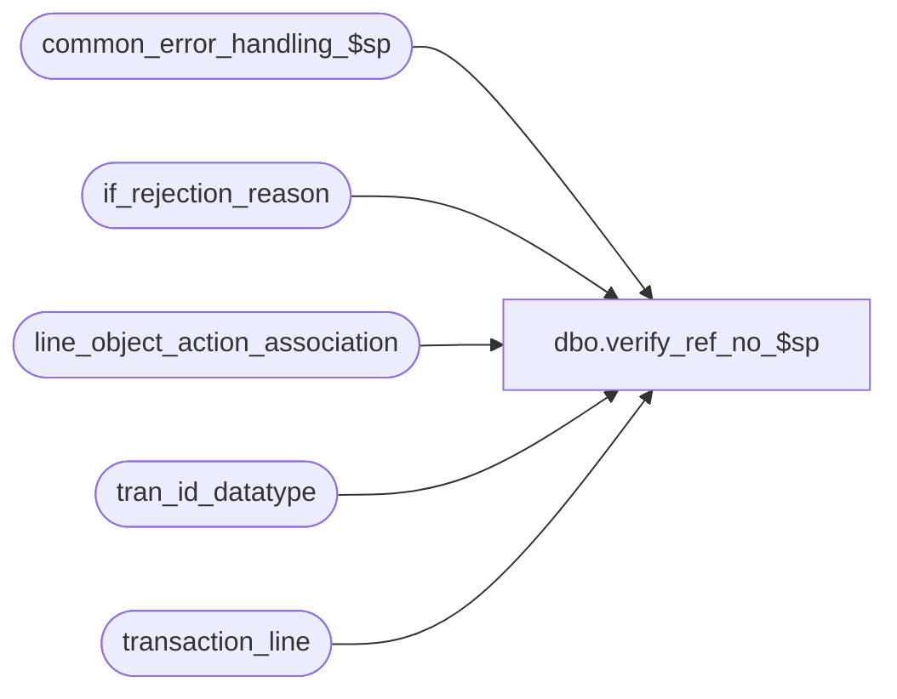

# dbo.verify_ref_no_$sp

**Database:** auditworks_external  
**Server:** bedrockdb01  

## Architecture Diagram



## Table Dependencies

| Referenced Table |
|---|
| common_error_handling_$sp |
| if_rejection_reason |
| line_object_action_association |
| tran_id_datatype |
| transaction_line |

## Stored Procedure Code

```sql
create proc [dbo].[verify_ref_no_$sp] 
@process_id	 	binary(16),
@user_id                int,
@transaction_id		tran_id_datatype,
@errmsg			nvarchar(255) OUTPUT,
@transaction_category   tinyint

AS

/*
PROC NAME: verify_ref_no_$sp
     DESC: Verifies that reference_no field in transaction line is populated.
           If not then creates if rejection 
           Called from modify_interface_$sp.  
           returns 0 = reference_nos exist
                   1 = reference_nos do not exist
  HISTORY: 
Date     Name         Def Desc
Jul05,05 Paul     DV-1239 Use tran_id_datatype
Jun01,05 Paul     DV-1254 drop temp table, add nolock hints
Sep22,04 Paul     DV-1146 receive user_id
Apr23,04 Maryam   DV-1071 Modified to receive @user_name and @process_id as input parameters
			  and pass it to common_error_handling_$sp.
Aug20,02 Winnie   1-D91OT To allow reference_no to be set as optional.
May10,02 Paul     1-CD0IX added R3 error handling
Jun08,00 Daphna      4857 author

*/

DECLARE
  @errno		int,
  @return_flag		tinyint,
  @message_id		int,
  @object_name		nvarchar(255),
  @process_name		nvarchar(100),
  @rows			int,
  @operation_name	nvarchar(100)

SELECT 	@return_flag = 0,
	@process_name = 'verify_ref_no_$sp',
	@message_id = 201068

SELECT line_id, ref_no = ISNULL(LTRIM(reference_no),'-1')
  INTO #refno
  FROM transaction_line tl WITH (NOLOCK), line_object_action_association la WITH (NOLOCK)
 WHERE tl.reference_type >= 1 
   AND la.reference_no_option = 0
   AND la.transaction_category = @transaction_category
   AND tl.transaction_id = @transaction_id
   AND tl.line_void_flag = 0 
   AND tl.line_object = la.line_object 
   AND tl.line_action = la.line_action

SELECT @errno = @@error, @rows = @@rowcount
IF @errno != 0
BEGIN
   SELECT @errmsg = 'Failed to insert into temp table #refno',
           @object_name = '#refno',
           @operation_name = 'INSERT'
  GOTO error
END

IF @rows = 0
  BEGIN
   DROP TABLE #refno
   RETURN 0
  END

SELECT @return_flag = SIGN(COUNT(*))
  FROM #refno WITH (NOLOCK)
 WHERE ref_no LIKE '-1'   -- field is null 

SELECT @errno = @@error
IF @errno != 0
BEGIN
  SELECT @errmsg = 'Failed to select from #refno',
           @object_name = '#refno',
           @operation_name = 'SELECT'
  GOTO error
END 

IF @return_flag = 1
BEGIN  /* some reference no's are null/empty that should be populated */

   INSERT if_rejection_reason (
	transaction_id,
	line_id,
	if_reject_reason)
   SELECT @transaction_id, 
          line_id,
          86
     FROM #refno WITH (NOLOCK)
    WHERE ref_no LIKE '-1'

   SELECT @errno = @@error
   IF @errno != 0
   BEGIN
     SELECT @errmsg = 'Failed to insert into if_rejection_reason',
           @object_name = 'if_rejection_reason',
           @operation_name = 'INSERT'
     GOTO error
   END
   
   UPDATE transaction_line
      SET interface_rejection_flag = 1
     FROM  if_rejection_reason i,  transaction_line l
    WHERE i.transaction_id = @transaction_id
      AND i.if_reject_reason = 86
      AND i.transaction_id = l.transaction_id
      AND i.line_id = l.line_id

   SELECT @errno = @@error
   IF @errno != 0
   BEGIN
     SELECT @errmsg = 'Failed to update transaction_line',
           @object_name = 'transaction_line',
           @operation_name = 'UPDATE'
      GOTO error
   END
   
END /* some reference no's are null/empty that should be populated */

DROP TABLE #refno

RETURN @return_flag

error:   /* Common error handler. */

	EXEC common_error_handling_$sp 100, @errno, @errmsg, 0, @message_id, 
	  @process_name, @object_name, @operation_name, 0, 1, 0, null, 0,
	  null, null, null, null, null, null, 0, @process_id, @user_id
	RETURN
```

