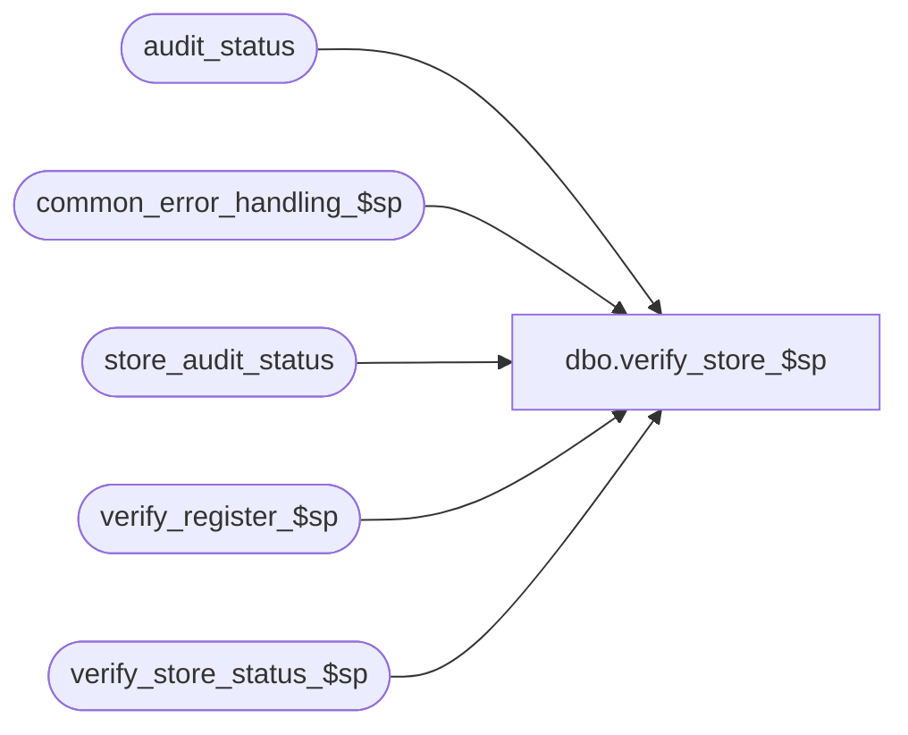

# dbo.verify_store_$sp

**Database:** auditworks_external  
**Server:** bedrockdb01  

## Architecture Diagram



## Table Dependencies

| Referenced Table |
|---|
| audit_status |
| common_error_handling_$sp |
| store_audit_status |
| verify_register_$sp |
| verify_store_status_$sp |

## Stored Procedure Code

```sql
create proc [dbo].[verify_store_$sp] 
@process_id                     binary(16),
@user_id                        int,
@store_no 			int,
@transaction_date 		smalldatetime,
@date_reject_id 		tinyint,
@errmsg				nvarchar(255) OUTPUT

AS

/*
PROC NAME: verify_store_$sp
     DESC: Verify all registers for a store-date and set audit_status to verified = 200 
           from edited = 100 if it meets verification criteria.
	   Will also autoaccept if already verified and autoaccept flag is on.
	   Will set status of store/sales_date in store_audit_status to verified as well 
	   if all registers of that particular store/sales_date were all set to verified.

HISTORY:
Date     Name        Def# Desc
Sep07,05 Paul     DV-1312 apply 51057 to SA5
Sep22,04 Paul     DV-1146 receive user_id
Apr28,04 Maryam   DV-1071 Receive @process_id and @user_name and pass them to the sub procs.
Apr08,05 David      51057 Revalidate missing status in case trnx have been received for another register.
May27,03 Paul     1-KX549 remove username from call to verify_store_status_$sp
May10,02 Paul     1-CD0IX added R3 error handling
Apr04,01 Phu	     7501 Use sql function to retrieve user name
Dec12,00 Paul        7109 ignore registers which are missing or already accepted
Jun05,00 Maryam      6244 call verify_store_status_$sp
Mar30,00 Daphna D    6090 Allow verification of invalid store
Jan27,00 Daphna F    5891 Ensure store's status = 100 if there are store-level
				concerns before evaluating registers' statuses
Jun14,99 Louise M.   4526 Added code to handle trickle processing.
Feb10,98 Paul S
Nov22,96 Paul S	     author version 1.03

*/

DECLARE
  @errno 			int,
  @minimum_audit_status		smallint,
  @min_register_no		smallint,
  @register_no			smallint,
  @store_audit_status		smallint,
  @trickle_in_progress_flag	tinyint,
  @message_id			int,
  @object_name			nvarchar(255),
  @process_name			nvarchar(100),
  @operation_name		nvarchar(100)

SELECT @trickle_in_progress_flag = 0,
	@min_register_no = -1,
	@process_name = 'verify_store_$sp',
	@message_id = 201068

SELECT @trickle_in_progress_flag = ISNULL(trickle_in_progress_flag,0)
  FROM store_audit_status
 WHERE store_no = @store_no
   AND sales_date = @transaction_date
   AND date_reject_id = @date_reject_id

SELECT @errno = @@error
IF @errno != 0
  BEGIN
   SELECT @errmsg = 'Failed to select from store_audit_status',
          @object_name = 'store_audit_status',
          @operation_name = 'SELECT'
   GOTO error
  END
 
IF @trickle_in_progress_flag = 1
  RETURN
  
 
WHILE 1=1
BEGIN

SELECT @register_no = MIN(register_no)
  FROM audit_status
 WHERE store_no = @store_no
   AND sales_date = @transaction_date
   AND register_no > @min_register_no
   AND date_reject_id = @date_reject_id
   AND audit_status >= 5
   AND audit_status < 300

SELECT @errno = @@error
IF @errno != 0
  BEGIN
   SELECT @errmsg = 'Failed to select from audit_status',
          @object_name = 'audit_status',
          @operation_name = 'SELECT'
   GOTO error
  END

IF @register_no IS NULL /* then */
  BREAK

SELECT @min_register_no = @register_no

EXEC verify_register_$sp @process_id, @user_id, @store_no, @register_no,
   @transaction_date, @date_reject_id, @errmsg OUTPUT, 0

SELECT @errno = @@error
IF @errno != 0
  BEGIN
   IF @errmsg IS NULL /* then */
     SELECT @errmsg = 'Failed to execute stored procedure verify_register_$sp'
   SELECT @object_name = 'verify_register_$sp',
          @operation_name = 'EXECUTE'
   GOTO error
  END

END /* While 1=1 */

EXEC verify_store_status_$sp @process_id, NULL, @store_no, @transaction_date, @date_reject_id, @errmsg OUTPUT

SELECT @errno = @@error
IF @errno <> 0
  BEGIN
   IF @errmsg IS NULL /* then */
     SELECT @errmsg = 'Failed to execute stored procedure verify_store_status_$sp'
   SELECT @object_name = 'verify_store_status_$sp',
          @operation_name = 'EXECUTE'
   GOTO error
  END	      

RETURN

error:
	EXEC common_error_handling_$sp 36, @errno, @errmsg, 0, @message_id, 
	  @process_name, @object_name, @operation_name, 0, 1, 0, null, 0, null,
	  null, null, null, null, null, 0, @process_id, @user_id
	RETURN
```

