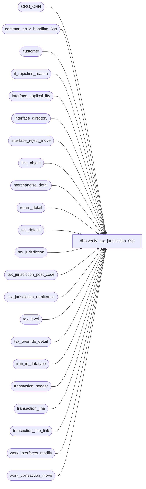

# dbo.verify_tax_jurisdiction_$sp

**Database:** auditworks_external  
**Server:** bedrockdb01  

## Architecture Diagram



## Table Dependencies

| Referenced Table |
|---|
| ORG_CHN |
| common_error_handling_$sp |
| customer |
| if_rejection_reason |
| interface_applicability |
| interface_directory |
| interface_reject_move |
| line_object |
| merchandise_detail |
| return_detail |
| tax_default |
| tax_jurisdiction |
| tax_jurisdiction_post_code |
| tax_jurisdiction_remittance |
| tax_level |
| tax_override_detail |
| tran_id_datatype |
| transaction_header |
| transaction_line |
| transaction_line_link |
| work_interfaces_modify |
| work_transaction_move |

## Stored Procedure Code

```sql
create proc dbo.verify_tax_jurisdiction_$sp  
@process_id	 		binary(16),
@user_id                        int, 
@transaction_id			tran_id_datatype, -- mandatory if called from modify_interface_$sp
@exception_jurisdiction_check	tinyint,
@tax_default_check		tinyint,
@function_no                    tinyint,
@errmsg				nvarchar(255) OUTPUT,
@source_function_no		tinyint = NULL --only populated when function_no is 37

AS

/* Proc Name: verify_tax_jurisdiction_$sp
   DESCRIPTION : This routine will verify if the tax jurisdiction exists on tax override trans.
                 Also checks default tax jurisdiction for all line_objects in the trans.
   Called from: modify_interface_$sp, move_merchandise_$sp if @function_no <> 37
                sales_tax_populate_$sp if @function_no = 37: pre audit tax
     NOTE: Any changes made to this proc should also be done for edit_verify_tax_jur_$sp.

IMPORTANT:
  Special script to create #tax_transactions not needed anymore.

Date     Author        Def# Action
Feb12,14 Vicci       149810 Exclude inactive jurisdictions.
Oct05,11 Vicci     1-47N6AB When not using interface-applicability, don't complain about line-object with a line-object-type of 0 not being in the tax-default table (they shouldn't be...).
Mar11,11 Vicci        64852 Treat function 89 (mass correct tax I/F rejects) like function 9 (move).
Mar11,11 Vicci       125554 Receive @source_function_no since otherwise when pre-audit-tax is called by the move
                            the interface_reject_move table doesn't get populated.  
Nov23,09 Vicci       114269 Cause transaction to reject if tax line has a tax level that does not exist in the tax jurisdiction of any item in the transaction.
Jul24,09 Vicci       109078 Recognize fulfillment_store_no;  handle tax-jurisdiction override not being on tax line but
                            only on items to which it is attributed.
Oct25,06 Phu          77931 Fix outer join for SQL 2005 Mode 90.
Jul05,05 Paul       DV-1239 Use tran_id_datatype
Apr14,05 David      DV-1202 Use pos_tax_jurisdiction_code instead of pos_tax_jurisdiction.
Mar22,05 Maryam     DV-1202 Handle the indirect association via line links. Handle send to customer as from_line_id  is changed to be line_id.
Dec14,04 David      DV-1191 Improve performance by adding hints.
Sep22,04 Paul       DV-1146 receive user_id
May18,04 David      DV-1071 Use ORG_CHN table instead of store_salesaudit
Apr23,04 Maryam     DV-1071 Modified to receive @user_name and @process_id as input parameters
                            and pass it to common_error_handling_$sp.
Jan23,03 Phu           5933 Retrieve sent tax jurisdiction if zip code is defined
Aug01,02 Phu        1-E3LUO Retrieve tax_jurisdiction of sent transaction
Apr25,02 Phu        1-C9P5S Pre audit tax
Oct15,01 Maryam        8840 remove edit code.
Oct09,01 Paul          8819 added alias names to join, updated remarks
Oct05,01 Maryam        8816 check sa_rejection_flag when moving transactions.
Sep26,01 Maryam        8787 Change the data type of @if_reject_flag to be tinyint.
Aug10,01 Maryam        8283 rewrite the proc.
Mar08,01 Paul          7381 correctly flag interfaces as rejected
Jan23,01 Vicci         7277 Only verify merch, fee, tax, and expense lines.
Mar24,00 Daphna        6087 prevent duplicate entry into if_reject_reason for same missing
                              jurisdiction/tax default but diff tax level
Mar14,00 Daphna        5994  add condition line_void_flag = 0 to declaration of tax_crsr
                              and tax_default_crsr to prevent evaluation of voided lines					
Mar01,00 Phu           5900  Change @@fetch_status > 0 to @@fetch_status <> 0 for MS SQL compatibility
Dec08,99 Paul          5544  Add logic to handle both types of tax verification
Oct07,98 Paul
         Yin		author


*/

DECLARE
  @errno		int,
  @if_reject_flag	tinyint,
  @applicability_method tinyint,
  @include_expense      tinyint,
  @message_id           int,
  @object_name          nvarchar(255),
  @operation_name       nvarchar(100),
  @process_name         nvarchar(100),
  @rows                 int,
  @row_count            int,
  @count                int,
  @cursor_open          tinyint,
  @tax_jurisdiction     nchar(5),
  @line_id         numeric(5,0)

SELECT @message_id = 201068,
       @process_name = 'verify_tax_jurisdiction_$sp',
       @rows = 0,
       @include_expense = 0,
       @if_reject_flag = 0

IF @source_function_no IS NULL
  SELECT @source_function_no = @function_no

IF @exception_jurisdiction_check <> 1 AND @tax_default_check <> 1
  RETURN

IF @function_no IN (22, 161) -- dayend and rebuild don't need to verify tax
  RETURN

CREATE TABLE #verify_tax(
    store_no		int not null,
    transaction_date	smalldatetime not null,
    transaction_id	numeric(14,0) not null, -- tran_id_datatype
    line_id		numeric (5,0) not null, 
    line_object		smallint not null,
    tax_jurisdiction	nchar(5) not null,
    tax_level		tinyint null,
    tax_rate_code	tinyint null,
    exception_flag	tinyint default 0 not null)	

SELECT @errno = @@error
IF @errno <> 0
BEGIN
  SELECT @errmsg = 'Unable to create temp table #verify_tax.',
         @object_name = '#verify_tax',
         @operation_name = 'CREATE'
  GOTO error
END

CREATE TABLE #tax_remit (
	store_no 			int 		not null,
	transaction_date 		smalldatetime 	not null,
	transaction_id 			numeric(14,0)	not null, -- tran_id_datatype
	line_id				numeric (5,0)	not null, 
	line_object			smallint	not null,
	tax_jurisdiction 		nchar(5) 	not null,
	tax_level 			tinyint 	null,
	tax_rate_code			tinyint 	null,
	remittance_tax_level 		tinyint 	null )

  SELECT @errno = @@error
  IF @errno <> 0 
  BEGIN
    SELECT @errmsg = 'Failed to create temp table.',
           @object_name = '#tax_remit',
           @operation_name = 'CREATE'
    GOTO error  
  END


IF @function_no = 37 -- pre audit tax
BEGIN
  INSERT #verify_tax(
    store_no,
    transaction_date,
    transaction_id,
    line_id,
    line_object,
    tax_jurisdiction,
    tax_level,
    exception_flag)
  SELECT
    tpm.store_no,
    tpm.transaction_date,
    tpm.transaction_id,
    tpm.line_id,
    tpm.line_object,
    tpm.tax_jurisdiction,
    l.tax_level,
    SIGN(override_tax_category)
  FROM #tax_post_main tpm WITH (NOLOCK)
       LEFT JOIN tax_level l ON (tpm.line_object = l.line_object)

  SELECT @errno = @@error, @rows = @@rowcount
  IF @errno <> 0
  BEGIN
    SELECT @errmsg = 'Unable to insert into temp table #verify_tax.',
           @object_name = '#verify_tax',
           @operation_name = 'INSERT'
    GOTO error
  END

END -- if @function_no = 37
ELSE
BEGIN
    SELECT @applicability_method = applicability_method
      FROM interface_directory
     WHERE interface_id = 12 

    SELECT @errno = @@error
    IF @errno <> 0
    BEGIN
      SELECT @errmsg = 'Unable to select from interface_directory.',
             @object_name = 'interface_directory',
             @operation_name = 'SELECT'
      GOTO error
    END

    IF @applicability_method IN (6,7)
      SELECT @include_expense = 1
      
    IF @function_no IN (9, 89)
      BEGIN
        IF @applicability_method = 0 
          INSERT #verify_tax(
                 store_no,
                 transaction_date,
                 transaction_id,
                 line_id,
                 line_object,
                 tax_jurisdiction,
                 tax_level)
          SELECT
                 th.store_no,
                 th.transaction_date,
                 wt.transaction_id,
	         line_id,
	         tl.line_object,
	         s.TAX_JRSDCTN_CODE,
	         tax_level
            FROM work_transaction_move wt WITH (NOLOCK)
                 INNER JOIN transaction_header th WITH (NOLOCK) ON (wt.transaction_id = th.transaction_id)
      INNER JOIN transaction_line tl WITH (NOLOCK) ON (th.transaction_id = tl.transaction_id)
                 INNER JOIN ORG_CHN s ON (th.store_no = s.ORG_CHN_NUM)
                 INNER JOIN interface_applicability ia ON (th.transaction_category = ia.transaction_category AND tl.line_object = ia.line_object AND tl.line_action = ia.line_action)
                 LEFT JOIN tax_level l ON (tl.line_object = l.line_object)
           WHERE wt.process_id = @process_id
             AND th.sa_rejection_flag = 0
             AND th.transaction_void_flag IN (0,8)
             AND th.date_reject_id = 0
             AND tl.line_object_type IN (1, 2, 5, 7)
             AND tl.line_void_flag = 0
             AND ia.interface_id = 12

        ELSE
          INSERT #verify_tax(
                 store_no,
                 transaction_date,
                 transaction_id,
		 line_id,
                 line_object,
                 tax_jurisdiction,
                 tax_level)
          SELECT
                 th.store_no,
                 th.transaction_date,
                 wt.transaction_id,
	         line_id,
	         tl.line_object,
	         s.TAX_JRSDCTN_CODE,
	         tax_level
            FROM work_transaction_move wt WITH (NOLOCK)
                 INNER JOIN transaction_header th WITH (NOLOCK) ON (wt.transaction_id = th.transaction_id)
                 INNER JOIN transaction_line tl WITH (NOLOCK) ON (th.transaction_id = tl.transaction_id)
                 INNER JOIN ORG_CHN s ON (th.store_no = s.ORG_CHN_NUM)
                 LEFT JOIN tax_level l ON (tl.line_object = l.line_object)
           WHERE wt.process_id = @process_id
             AND th.sa_rejection_flag = 0
             AND th.transaction_void_flag IN (0,8)
             AND th.date_reject_id = 0
             AND tl.line_object_type IN (1, 2, 5, 7 * @include_expense)
             AND tl.line_object_type <> 0
             AND tl.line_void_flag = 0

      END --if @function_no IN (9, 89)
    ELSE
      BEGIN  
        IF @applicability_method = 0  --based on interface applicability
          INSERT #verify_tax(
                 store_no,
                 transaction_date,
                 transaction_id,
                 line_id,
                 line_object,
                 tax_jurisdiction,
                 tax_level)
          SELECT
                 th.store_no,
                 transaction_date,
                 @transaction_id,
                 line_id,
	         tl.line_object,
	         s.TAX_JRSDCTN_CODE,
	         tax_level
            FROM transaction_header th WITH (NOLOCK)
                 INNER JOIN transaction_line tl WITH (NOLOCK) ON (th.transaction_id = tl.transaction_id)
                 INNER JOIN ORG_CHN s ON (th.store_no = s.ORG_CHN_NUM)
                 INNER JOIN interface_applicability ia ON (th.transaction_category = ia.transaction_category
                                                           AND tl.line_object = ia.line_object
                                                           AND tl.line_action = ia.line_action)
                 LEFT JOIN tax_level l ON (tl.line_object = l.line_object)
           WHERE th.transaction_id = @transaction_id
             AND th.transaction_void_flag IN (0,8)
             AND tl.line_object_type IN (1, 2, 5, 7)
             AND tl.line_void_flag = 0
             AND ia.interface_id = 12

        ELSE 
          INSERT #verify_tax(
                 store_no,
                 transaction_date,
                 transaction_id,
                 line_id,
                 line_object,
                 tax_jurisdiction,
                 tax_level)
          SELECT
                 th.store_no,
                 transaction_date,
                 @transaction_id,
	         line_id,
	         tl.line_object,
	         s.TAX_JRSDCTN_CODE,
	         tax_level
            FROM transaction_header th WITH (NOLOCK)
  INNER JOIN transaction_line tl WITH (NOLOCK) ON (th.transaction_id = tl.transaction_id)
                 INNER JOIN ORG_CHN s ON (th.store_no = s.ORG_CHN_NUM)
                 LEFT JOIN tax_level l ON (tl.line_object = l.line_object)
           WHERE th.transaction_id = @transaction_id
	     AND th.transaction_void_flag IN (0,8)
             AND tl.line_object_type IN (1, 2, 5, 7 * @include_expense)
             AND tl.line_object_type <> 0
             AND tl.line_void_flag = 0

      END  

    SELECT @errno = @@error, @row_count = @@rowcount
    IF @errno <> 0
    BEGIN
      SELECT @errmsg = 'Failed to insert into #verify_tax.',
             @object_name = '#verify_tax',
             @operation_name = 'INSERT'
      GOTO error
    END

    IF @row_count = 0
      GOTO cleanup_n_exit

    -- for oracle will not work because of multiple level
    UPDATE #verify_tax
       SET tax_jurisdiction = exception_tax_jurisdiction,
           exception_flag = 1
      FROM #verify_tax t, tax_override_detail tod WITH (NOLOCK)
     WHERE t.transaction_id = tod.transaction_id 
       AND (t.line_id = tod.line_id OR tod.line_id = 0)
       AND exception_tax_jurisdiction IS NOT NULL --
       AND t.tax_jurisdiction != tod.exception_tax_jurisdiction

    SELECT @rows = @rows + @@rowcount,
           @errno = @@error
    IF @errno <> 0
    BEGIN
      SELECT @errmsg = 'Failed to update #verify_tax (tax_override_detail).',
             @object_name = '#verify_tax',
             @operation_name = 'UPDATE'
      GOTO error
    END

    UPDATE #verify_tax
       SET tax_jurisdiction = f.TAX_JRSDCTN_CODE,
           exception_flag = 1
      FROM #verify_tax t
           INNER JOIN merchandise_detail m
              ON t.transaction_id = m.transaction_id
             AND t.line_id = m.line_id
           INNER JOIN ORG_CHN f
              ON m.fulfillment_store_no = f.ORG_CHN_NUM
     WHERE t.exception_flag <> 1
       AND t.tax_jurisdiction != f.TAX_JRSDCTN_CODE
    SELECT @rows = @rows + @@rowcount,
           @errno = @@error
    IF @errno <> 0
    BEGIN
      SELECT @errmsg = 'Failed to update #verify_tax (fulfillment store).',
             @object_name = '#verify_tax',
             @operation_name = 'UPDATE'
      GOTO error
    END

    UPDATE #verify_tax
       SET tax_jurisdiction = ss.TAX_JRSDCTN_CODE,
           exception_flag = 1
      FROM #verify_tax t, ORG_CHN ss, return_detail rd WITH (NOLOCK)
     WHERE t.transaction_id = rd.transaction_id
       AND (rd.line_id = t.line_id OR rd.line_id = 0)
       AND rd.return_from_store = ss.ORG_CHN_NUM 
       AND t.tax_jurisdiction != ss.TAX_JRSDCTN_CODE
       AND t.exception_flag <> 1

    SELECT @rows = @rows + @@rowcount,
           @errno = @@error
    IF @errno <> 0
    BEGIN
      SELECT @errmsg = 'Failed to update #verify_tax (return_detail).',
             @object_name = '#verify_tax',
             @operation_name = 'UPDATE'
      GOTO error
    END

    UPDATE #verify_tax
       SET tax_jurisdiction = ss.TAX_JRSDCTN_CODE,
           exception_flag = 1
      FROM #verify_tax t, ORG_CHN ss, return_detail rd WITH (NOLOCK), transaction_line_link k WITH(NOLOCK)
     WHERE t.transaction_id = k.transaction_id
       AND t.line_id = k.line_id 
       AND k.transaction_id = rd.transaction_id
       AND k.linked_line_id = rd.line_id
       AND rd.return_from_store = ss.ORG_CHN_NUM 
       AND t.tax_jurisdiction != ss.TAX_JRSDCTN_CODE

    SELECT @rows = @rows + @@rowcount,
           @errno = @@error
    IF @errno <> 0
    BEGIN
      SELECT @errmsg = 'Failed to update #verify_tax (return_detail) via transaction line link.',
             @object_name = '#verify_tax',
             @operation_name = 'UPDATE'
      GOTO error
    END    
    

/* Set tax_jurisdiction based on send-to customer */
    UPDATE #verify_tax
       SET tax_jurisdiction = tj.tax_jurisdiction,
           exception_flag = 1
      FROM #verify_tax vt, customer c WITH (NOLOCK), tax_jurisdiction tj
     WHERE vt.transaction_id = c.transaction_id
       AND (vt.line_id = c.line_id OR c.line_id = 0)
       AND c.customer_role = 2
       AND c.pos_tax_jurisdiction_code = tj.pos_tax_jurisdiction_code
       AND tj.pos_tax_jurisdiction_code IS NOT NULL

    SELECT @errno = @@error,
           @rows = @rows + @@rowcount
    IF @errno <> 0
      BEGIN
        SELECT @errmsg = 'Failed to set tax_jurisdiction for sent tax jurisdiction.',
               @object_name = '#verify_tax',
               @operation_name = 'UPDATE'
        GOTO error
      END
    
    UPDATE #verify_tax
       SET tax_jurisdiction = tj.tax_jurisdiction,
           exception_flag = 1
      FROM #verify_tax vt,
           transaction_line_link k WITH (NOLOCK),
           customer c WITH (NOLOCK),
           tax_jurisdiction tj
     WHERE vt.transaction_id = k.transaction_id
       AND vt.line_id = k.line_id
       AND k.transaction_id = c.transaction_id
       AND k.linked_line_id = c.line_id
       AND c.customer_role = 2
       AND c.pos_tax_jurisdiction_code = tj.pos_tax_jurisdiction_code
       AND tj.pos_tax_jurisdiction_code IS NOT NULL

    SELECT @errno = @@error,
           @rows = @rows + @@rowcount
    IF @errno <> 0
      BEGIN
        SELECT @errmsg = 'Failed to set tax_jurisdiction for sent tax jurisdiction via transaction line link.',
               @object_name = '#verify_tax',
               @operation_name = 'UPDATE'
        GOTO error
      END


    UPDATE #verify_tax
       SET tax_jurisdiction = tjp.tax_jurisdiction,
           exception_flag = 1        
      FROM #verify_tax vt, customer c WITH (NOLOCK), tax_jurisdiction_post_code tjp
     WHERE vt.transaction_id = c.transaction_id
       AND (vt.line_id = c.line_id OR c.line_id = 0)
       AND c.customer_role = 2
       AND c.post_code >= tjp.from_post_code
       AND c.post_code <= tjp.to_post_code
       AND c.pos_tax_jurisdiction_code IS NULL --

    SELECT @errno = @@error,
      @rows = @rows + @@rowcount
    IF @errno <> 0
      BEGIN
        SELECT @errmsg = 'Failed to update #verify_tax from tax_jurisdiction_post_code.',
               @object_name = '#verify_tax',
               @operation_name = 'UPDATE'
        GOTO error
      END

    UPDATE #verify_tax
       SET tax_jurisdiction = tjp.tax_jurisdiction,
           exception_flag = 1        
      FROM #verify_tax vt, 
           transaction_line_link k WITH (NOLOCK),
           customer c WITH (NOLOCK),
           tax_jurisdiction_post_code tjp
     WHERE vt.transaction_id = k.transaction_id
       AND vt.line_id = k.line_id
       AND k.transaction_id = c.transaction_id
       AND k.linked_line_id = c.line_id
       AND c.customer_role = 2
       AND c.post_code >= tjp.from_post_code
       AND c.post_code <= tjp.to_post_code
       AND c.pos_tax_jurisdiction_code IS NULL --

    SELECT @errno = @@error,
           @rows = @rows + @@rowcount
    IF @errno <> 0
      BEGIN
        SELECT @errmsg = 'Failed to update #verify_tax from tax_jurisdiction_post_code via transaction line link.',
               @object_name = '#verify_tax',
               @operation_name = 'UPDATE'
        GOTO error
      END
      
END -- else of if @function_no = 37

IF @tax_default_check = 0 AND @rows = 0
  GOTO cleanup_n_exit

    --114269
    UPDATE #verify_tax
       SET tax_jurisdiction = t.max_tax_jurisdiction
      FROM (SELECT v.transaction_id, v.tax_level, max(CASE WHEN o.line_object_type = 5 THEN '' ELSE tax_jurisdiction END) item_tax_jurisdiction
              FROM #verify_tax v
                   INNER JOIN line_object o
                      ON v.line_object = o.line_object
             GROUP BY v.transaction_id, v.tax_level
            HAVING max(CASE WHEN o.line_object_type = 5 THEN '' ELSE tax_jurisdiction END) = '') q,
           (SELECT itm.transaction_id, max(itm.tax_jurisdiction) max_tax_jurisdiction
     FROM #verify_tax itm
                   INNER JOIN line_object io
                      ON itm.line_object = io.line_object
                     AND io.line_object_type <> 5
             GROUP BY itm.transaction_id) t
     WHERE #verify_tax.transaction_id = q.transaction_id
       AND #verify_tax.tax_level = q.tax_level
       AND q.transaction_id = t.transaction_id
    SELECT @errno = @@error
    IF @errno <> 0
    BEGIN
      SELECT @errmsg = 'Failed to modify tax jurisdiction of tax rows whose tax level does not exist in the tax jurisdiction of any items in the transaction',
             @object_name = '#verify_tax',
             @operation_name = 'UPDATE'
      GOTO error
    END

    INSERT INTO #tax_remit  
    SELECT t.store_no,
           t.transaction_date,
           t.transaction_id,
           t.line_id,
           t.line_object,
           t.tax_jurisdiction,
           t.tax_level,
           t.tax_rate_code,
           CASE WHEN COALESCE(j.active_flag, 0) = 1 THEN tjr.tax_level ELSE NULL END
      FROM #verify_tax t WITH (NOLOCK)
           LEFT JOIN tax_jurisdiction_remittance tjr ON (t.tax_jurisdiction = tjr.tax_jurisdiction
                                                         AND (t.tax_level IS NULL OR t.tax_level = tjr.tax_level ))
           LEFT JOIN tax_jurisdiction j
             ON t.tax_jurisdiction = j.tax_jurisdiction
     WHERE (exception_flag = 1 OR @tax_default_check = 1)

    SELECT @errno = @@error
    IF @errno <> 0
    BEGIN
      SELECT @errmsg = 'Failed to insert into #tax_remit.',
             @object_name = '#tax_remit',
             @operation_name = 'INSERT'
      GOTO error
    END
    --since some attachments are not on tax lines but only on merch to which tax line is applied 
    UPDATE #tax_remit
       SET remittance_tax_level = fx.remittance_tax_level,
           tax_jurisdiction = fx.tax_jurisdiction 
      FROM (SELECT tx.transaction_id, tx.line_id, 
                   max(itm.remittance_tax_level) remittance_tax_level, 
                   max(itm.tax_jurisdiction) tax_jurisdiction
              FROM #tax_remit tx, #tax_remit itm, line_object o 
             WHERE tx.remittance_tax_level IS NULL
               AND tx.line_object = o.line_object
               AND o.line_object_type = 5
               AND tx.transaction_id = itm.transaction_id 
               AND tx.tax_level = itm.remittance_tax_level
             GROUP BY tx.transaction_id, tx.line_id) fx
     WHERE #tax_remit.transaction_id = fx.transaction_id
       AND #tax_remit.line_id = fx.line_id
       AND #tax_remit.remittance_tax_level IS NULL
    SELECT @errno = @@error
    IF @errno <> 0
    BEGIN
      SELECT @errmsg = 'Failed to update #tax_remit.',
             @object_name = '#tax_remit',
             @operation_name = 'UPDATE'
      GOTO error
    END
     
   UPDATE #tax_remit
      SET tax_rate_code = td.tax_rate_code
     FROM #tax_remit tr , tax_default td
    WHERE tr.tax_jurisdiction = td.tax_jurisdiction
      AND tr.line_object = td.line_object
      AND tr.remittance_tax_level = td.tax_level 
      AND tr.transaction_date >= td.effective_from_date 
      AND (tr.transaction_date <= td.effective_until_date OR td.effective_until_date IS NULL)   

    SELECT @errno = @@error
    IF @errno <> 0
    BEGIN
      SELECT @errmsg = 'Failed to update #tax_remit.',
             @object_name = '#tax_remit',
             @operation_name = 'UPDATE'
      GOTO error
    END
    
    IF @source_function_no in (89, 9)  --mass correct tax, move 
      BEGIN
        INSERT interface_reject_move (
	       process_id,
	       transaction_id,
	       line_id,
	       if_reject_reason,
	       memo1,
	       memo2)
        SELECT @process_id,
               transaction_id,
               line_id,
	       7,
	       MAX(tax_jurisdiction),
	       CONVERT(nvarchar, MAX(tax_level))
          FROM #tax_remit WITH (NOLOCK)
         WHERE remittance_tax_level IS NULL --
         GROUP BY transaction_id, line_id
        SELECT @errno = @@error
        IF @errno <> 0
        BEGIN
          SELECT @errmsg = 'Failed to insert interface_reject_move (type 7)',
                 @object_name = 'interface_reject_move',
                 @operation_name = 'INSERT'
          GOTO error
        END

        INSERT interface_reject_move (
	       process_id,
	       transaction_id,
	       line_id,
	       if_reject_reason,
	       memo1,
	       memo2,
	       memo3)
        SELECT @process_id,
               transaction_id,
               line_id,
	       8,
	       MAX(tax_jurisdiction),
	       CONVERT(nvarchar, MAX(remittance_tax_level)),
	       CONVERT(nvarchar, MAX(line_object))
          FROM #tax_remit WITH (NOLOCK)
         WHERE tax_rate_code IS NULL --
         AND remittance_tax_level IS NOT NULL --
        GROUP BY transaction_id, line_id

        SELECT @errno = @@error
        IF @errno <> 0
        BEGIN
          SELECT @errmsg = 'Failed to insert interface_reject_move (type 8)',
                 @object_name = 'interface_reject_move',
                 @operation_name = 'INSERT'
          GOTO error
        END
      
      END --IF @source_function_no IN (89, 9)
    ELSE
      BEGIN 
        INSERT if_rejection_reason (
	       transaction_id,
	       line_id,
	       if_reject_reason,
	       memo1,
	       memo2)
        SELECT transaction_id,
               line_id,
	       7,
	       MAX(tax_jurisdiction),
	       CONVERT(nvarchar, MAX(tax_level))
          FROM #tax_remit WITH (NOLOCK)
         WHERE remittance_tax_level IS NULL --
         GROUP BY transaction_id, line_id 

        SELECT @count = @@rowcount, 
       @errno = @@error
        IF @errno <> 0
        BEGIN
          SELECT @errmsg = 'Failed to insert if_rejection_reason (type 7)',
                 @object_name = 'if_rejection_reason',
                 @operation_name = 'INSERT'
          GOTO error
        END
      
        IF @count >= 1
          SELECT @if_reject_flag = 1   
   
        INSERT if_rejection_reason (
	       transaction_id,
	       line_id,
	       if_reject_reason,
	       memo1,
	       memo2,
	       memo3)
        SELECT transaction_id,
               line_id,
	       8,
	       MAX(tax_jurisdiction),
	       convert(nvarchar, MAX(remittance_tax_level)),
	       convert(nvarchar, MAX(line_object))
	  FROM #tax_remit WITH (NOLOCK)
         WHERE tax_rate_code IS NULL --
         AND remittance_tax_level IS NOT NULL --
         GROUP BY transaction_id, line_id

        SELECT @row_count = @@rowcount, 
               @errno = @@error
        IF @errno <> 0
        BEGIN
          SELECT @errmsg = 'Failed to insert if_rejection_reason (type 8)',
                 @object_name = 'if_rejection_reason',
                 @operation_name = 'INSERT'
          GOTO error
        END

        IF @row_count >= 1
          SELECT @if_reject_flag = 2

        IF @if_reject_flag >= 1
          BEGIN  
            UPDATE work_interfaces_modify
               SET interface_status = 99 
             WHERE (tax_default_check >= 1 OR exception_jurisdiction_check >= 1)
               AND process_id = @process_id

            SELECT @errno = @@error
            IF @errno <> 0
            BEGIN
              SELECT @errmsg = 'Failed to UPDATE work_interfaces_modify.',
                     @object_name = 'work_interfaces_modify',
                     @operation_name = 'UPDATE'
              GOTO error
            END

          /* tax jurisdiction not on file in tax_default */
            UPDATE transaction_line
               SET interface_rejection_flag = 1
              FROM #tax_remit tr WITH (NOLOCK), transaction_line tl
             WHERE tr.transaction_id = tl.transaction_id
             AND tr.line_id = tl.line_id
               AND interface_rejection_flag != 1
               AND (remittance_tax_level IS NULL OR tax_rate_code IS NULL)

            SELECT @errno = @@error
            IF @errno <> 0
          BEGIN
              SELECT @errmsg = 'Failed to UPDATE transaction_line.',
                     @object_name = 'transaction_line',
                     @operation_name = 'UPDATE'
              GOTO error
            END

          END -- If @if_reject_flag >= 1
      END --ELSE of IF @source_function_no IN (89, 9)


cleanup_n_exit:

DROP TABLE #tax_remit
SELECT @errno = @@error
IF @errno <> 0
BEGIN
  SELECT @errmsg = 'Unable to drop temp table #tax_remit.',
         @object_name = '#tax_remit',
         @operation_name = 'DROP'
  GOTO error
END

DROP TABLE #verify_tax
SELECT @errno = @@error
IF @errno <> 0
BEGIN
SELECT @errmsg = 'Unable to drop temp table #verify_tax.',
         @object_name = '#verify_tax',
  @operation_name = 'DROP'
  GOTO error
END

RETURN @if_reject_flag

error:
	EXEC common_error_handling_$sp @function_no, @errno, @errmsg, 0, @message_id, 
	@process_name, @object_name, @operation_name, 0, 1, 0, null, 0,
	  null, null, null, null, null, null, 0, @process_id, @user_id
	RETURN
```

