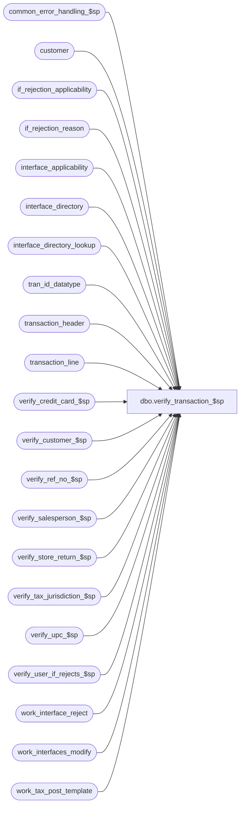

# dbo.verify_transaction_$sp

**Database:** auditworks_external  
**Server:** bedrockdb01  

## Architecture Diagram



## Table Dependencies

| Referenced Table |
|---|
| common_error_handling_$sp |
| customer |
| if_rejection_applicability |
| if_rejection_reason |
| interface_applicability |
| interface_directory |
| interface_directory_lookup |
| tran_id_datatype |
| transaction_header |
| transaction_line |
| verify_credit_card_$sp |
| verify_customer_$sp |
| verify_ref_no_$sp |
| verify_salesperson_$sp |
| verify_store_return_$sp |
| verify_tax_jurisdiction_$sp |
| verify_upc_$sp |
| verify_user_if_rejects_$sp |
| work_interface_reject |
| work_interfaces_modify |
| work_tax_post_template |

## Stored Procedure Code

```sql
create proc dbo.verify_transaction_$sp @process_id                     binary(16),
@user_id                        int,
@transaction_id			tran_id_datatype,
@function_no			tinyint,
@errmsg				nvarchar(255) OUTPUT

AS

DECLARE
@cashier_check 			tinyint,
@customer_modified_flag		int,
@customer_info_check		tinyint,
@credit_card_check		tinyint,
@errno 				int,
@employee_check 		tinyint,
@employee_no 			int,
@exception_jurisdiction_check	tinyint,
@execret 			int,
@if_id                          tinyint,
@merch_origin_store_check	tinyint,
@merch_source_store_check	tinyint,
@merch_fulfillment_store_check	tinyint,
@message_id			int,
@object_name			nvarchar(255),
@operation_name			nvarchar(100),
@process_name			nvarchar(100),
@payroll_employee_check 	tinyint,
@purchasing_employee_check	tinyint,
@reference_no_check		tinyint,
@return_message			int,
@rows 				int,
@store_check 			tinyint,
@stock_origin_store_check	tinyint,
@tax_default_check		tinyint,
@transaction_category 		tinyint,
@transaction_date 		smalldatetime,
@transaction_void_flag		tinyint,
@upc_check 			tinyint,
@update_timing 			tinyint

/* 
 NAME: verify_transaction_$sp 
 DESCRIPTION : To verify if the transaction has I/F rejects by calling the verify_* subroutines.
 Based on code in modify_interface_$sp.
 Error 202005: 'Archived transaction cannot be modified since it does not pass current validation criteria: |1'
 '|1' will be replaced by front-end (defect 5129) with the TEXT of the resource_id specified in errmsg.
 
 CALLED BY:
 - av_transaction_modify_$sp to prevent users from modifying an archived transaction
   if it fails current validation criteria.
 
HISTORY:
DATE      NAME          DEFECT#  DESCRIPTION
Jul04,14 Vicci        TFS-74694  Raise error if cost validation failed (I/F Rejection rule 116 -Merchandise cost unknown).
Jul26,06   Tim            69753  Uplift defect 70769 to SA5
Apr12,06 Vicci            70769  For the CRM interfaces based on interface applicability, 
			         if the transaction category is not defined in interface 
                                 applicability then don't feed the transaction to CRM.
Sep08,05  Paul          DV-1312  apply 41740 to SA5
Jul05,05  Paul          DV-1239  move populate of work table to subproc
Jun03,05  Paul            55041  Correct DV-1202, clean up work tables if business rule violated
Mar30,05  David         DV-1202  Handle I/F reject 114, 115 - Invalid source/fulfillment store no.
Nov29,04  David         DV-1181  Pass proper params to verify_tax_jurisdiction_$sp.
Sep22,04  Paul          DV-1146  receive user_id
Apr19,04  Maryam        DV-1071  Modified to receive @user_name and @process_id as input parameter
				 and pass it to the sub procs.
Dec02,04 Daphna           41740  Log additional txns for CIM (IF26), same as for CPS(IF3)
Sep15,03  ShuZ          1-G7A5F  Remove all references to the interface_directory '... _check' 
                                 fields from stored procedures/triggers and replace with usage 
                                 of if_rejection_applicability table.
Dec18,02  David C          5388  Check for NOT exists in work_interfaces_modify for interface_id 3.
Nov13,02  David C       1-FXRSE  Author.

*/


SELECT @update_timing = 0,
       @stock_origin_store_check = 0,
       @merch_origin_store_check = 0,
       @upc_check = 0,
       @employee_check = 0,
       @store_check = 0,
       @exception_jurisdiction_check = 0,
       @tax_default_check = 0,
       @reference_no_check = 0,
       @process_name = 'verify_transaction_$sp',
       @message_id = 201068


DELETE work_interfaces_modify
 WHERE process_id = @process_id

  SELECT @errno = @@error
  IF @errno != 0
  BEGIN
    SELECT @errmsg = 'Failed to Initialize work_interfaces_modify',
           @object_name = 'work_interfaces_modify',
           @operation_name = 'DELETE'
    GOTO error
  END

DELETE work_interface_reject
 WHERE process_id = @process_id

SELECT @errno = @@error
IF @errno != 0
BEGIN
  SELECT @errmsg = 'Failed to DELETE on work_interface_reject',
         @object_name = 'work_interface_reject',
         @operation_name = 'DELETE'
  GOTO error
END

SELECT @customer_modified_flag = customer_modified_flag,
       @transaction_category = transaction_category,
       @transaction_date = transaction_date,
       @employee_no = employee_no,
       @transaction_void_flag = transaction_void_flag
  FROM transaction_header 
 WHERE transaction_id = @transaction_id

  SELECT @errno = @@error
  IF @errno != 0
  BEGIN
    SELECT @errmsg = 'Unable to read from transaction_header.',
           @object_name = 'transaction_header',
           @operation_name = 'SELECT'
    GOTO error
  END


INSERT INTO work_interfaces_modify (
           interface_id, 
           process_id, 
           update_timing, 
           upc_check,
           customer_liability_check, 
           credit_card_check, 
           employee_no_check,
           customer_info_check, 
           interface_status, 
           store_check, 
           exception_jurisdiction_check,
           tax_default_check, 
           reference_no_check,
           purchasing_employee_check,
           cashier_check,
           payroll_employee_check,
           applicability_method,
           line_modified_flag, 
           all_modifications_relevant )
  SELECT  
           ia.interface_id, 
           @process_id, 
           update_timing, 
           upc_check, 
           customer_liability_check, 
           credit_card_check, 
           employee_no_check,
           customer_info_check, 
           update_timing, 
           store_check, 
           exception_jurisdiction_check, 
           tax_default_check,
           reference_no_check,
           purchasing_employee_check,
           cashier_check,
           payroll_employee_check,
           applicability_method,
           MAX(CONVERT(TINYINT, tl.line_modified_flag)),
           id.all_modifications_relevant
      FROM transaction_line tl, 
           interface_applicability ia, 
           interface_directory_lookup id
     WHERE tl.transaction_id = @transaction_id
       AND tl.line_void_flag = 0
       AND ia.transaction_category = @transaction_category
       AND tl.line_action = ia.line_action
       AND tl.line_object = ia.line_object
       AND ia.interface_id = id.interface_id
       AND id.applicability_method = 0
       AND (id.live_date IS NULL OR id.live_date <= @transaction_date)
       AND (@transaction_void_flag IN (0,8) OR id.interface_voided_transactions = 1)
     GROUP BY ia.interface_id, 
           update_timing, 
           upc_check, 
           customer_liability_check, 
           credit_card_check, 
           employee_no_check,
           customer_info_check, 
           update_timing, 
           store_check, 
           exception_jurisdiction_check, 
           tax_default_check,
           reference_no_check,
           purchasing_employee_check,
           cashier_check,
           payroll_employee_check,
           applicability_method,
           id.all_modifications_relevant

  SELECT @errno = @@error
  IF @errno != 0
  BEGIN
    SELECT @errmsg = 'Failed to INSERT on work_interfaces_modify based on interface applicability',
           @object_name = 'work_interfaces_modify',
           @operation_name = 'INSERT'
    GOTO error
  END
  
INSERT INTO work_interfaces_modify (
           interface_id, 
           process_id, 
           update_timing, 
           upc_check,
           customer_liability_check, 
           credit_card_check, 
           employee_no_check, 
           customer_info_check,
           interface_status,
           store_check, 
           exception_jurisdiction_check, 
           tax_default_check,
           reference_no_check,
           purchasing_employee_check,
           cashier_check,
           payroll_employee_check,
           applicability_method,
           line_modified_flag, 
           all_modifications_relevant )
 SELECT DISTINCT 
           id.interface_id, 
           @process_id, 
           update_timing, 
           upc_check, 
           customer_liability_check, 
           credit_card_check, 
           employee_no_check, 
           customer_info_check, 
           update_timing, 
           store_check, 
           exception_jurisdiction_check, 
           tax_default_check,
           reference_no_check,
           purchasing_employee_check,
           cashier_check,
           payroll_employee_check,
           applicability_method,
           0,
           1
      FROM interface_directory_lookup id
     WHERE id.applicability_method > 0
       AND id.update_timing > 0
       AND (id.live_date IS NULL OR id.live_date <= @transaction_date)
       AND (@transaction_void_flag IN (0,8) OR id.interface_voided_transactions = 1)
 
SELECT @errno = @@error
IF @errno != 0
  BEGIN
    SELECT @errmsg = 'Failed to INSERT on work_interfaces_modify for all-transaction interfaces',
           @object_name = 'work_interfaces_modify',
           @operation_name = 'INSERT'
    GOTO error
  END

/* def 41740 determine whether using IF 3 or 26 */
SELECT @if_id = 0

SELECT @update_timing = update_timing,
       @if_id = 3
  FROM interface_directory
 WHERE interface_id = 3

IF @@rowcount = 0 OR  @update_timing = 0
BEGIN
  SELECT @if_id = 26
    FROM interface_directory
   WHERE interface_id = 26
END
  
IF NOT EXISTS (SELECT 1 FROM work_interfaces_modify -- defect 5388
                WHERE interface_id = @if_id
                  AND process_id = @process_id)
   AND EXISTS (SELECT 1 FROM interface_applicability -- defect 69753
               WHERE interface_id = @if_id
               AND transaction_category = @transaction_category)

BEGIN
  INSERT INTO work_interfaces_modify (
             interface_id, 
             process_id, 
             update_timing, 
             upc_check, 
             customer_liability_check, 
             credit_card_check, 
             employee_no_check, 
             customer_info_check, 
             interface_status,
             purchasing_employee_check,
             cashier_check,
             payroll_employee_check,
             applicability_method,
             line_modified_flag, 
             all_modifications_relevant )
   SELECT DISTINCT 
             id.interface_id, 
             @process_id, 
             update_timing, 
             upc_check, 
             customer_liability_check, 
             credit_card_check, 
             employee_no_check, 
             customer_info_check, 
             update_timing,
             purchasing_employee_check,
             cashier_check,
             payroll_employee_check,
             applicability_method,
             0, 
             id.all_modifications_relevant 
        FROM customer c, interface_directory_lookup id
       WHERE c.transaction_id = @transaction_id
         AND id.interface_id = @if_id
         AND id.applicability_method = 0
         AND id.update_timing > 0
         AND (id.live_date IS NULL OR id.live_date <= @transaction_date)
         AND (@transaction_void_flag IN (0,8) OR id.interface_voided_transactions = 1)
         AND (@employee_no IS NOT NULL
    OR telephone_no1 IS NOT NULL
    OR telephone_no2 IS NOT NULL
    OR last_name IS NOT NULL
    OR customer_no IS NOT NULL)

  SELECT @errno = @@error
  IF @errno != 0
  BEGIN
    SELECT @errmsg = 'Failed to INSERT on work_interfaces_modify CPS/CIM',
           @object_name = 'work_interfaces_modify',
           @operation_name = 'INSERT'
    GOTO error
  END
END -- IF exists interface_id = 3 or 26
  
/* Determine which checks need to be done for this transaction by checking the list of affected interfaces.
     These variables are later used to bypass inapplicable validations in order to maximize performance
     and thereby minimize the response time for the save of archive tran modification. */

SELECT @upc_check = MAX(upc_check),
       @employee_check = MAX(employee_no_check),
       @purchasing_employee_check = MAX(purchasing_employee_check),
       @cashier_check = MAX(cashier_check),
       @payroll_employee_check = MAX(payroll_employee_check),
       @store_check = MAX(store_check),
       @exception_jurisdiction_check = MAX(exception_jurisdiction_check), 
       @tax_default_check = MAX(tax_default_check),
       @reference_no_check = MAX(reference_no_check),
       @credit_card_check = MAX(credit_card_check),
       @customer_info_check = MAX(customer_info_check)              
  FROM work_interfaces_modify WITH (NOLOCK)
 WHERE process_id = @process_id

  SELECT @errno = @@error
  IF @errno != 0
  BEGIN
    SELECT @errmsg = 'Failed to select from work_interfaces_modify',
           @object_name = 'work_interfaces_modify',
       @operation_name = 'SELECT'
    GOTO error
  END

/* The following checks are retrieved separately because they are not maintained in table interface_directory_lookup.
   For each, the only valid values are 0 and 1 */

SELECT @stock_origin_store_check = ISNULL(MAX(1 - ABS(SIGN(ia.if_reject_reason - 111))),0),
	@merch_origin_store_check = ISNULL(MAX(1 - ABS(SIGN(ia.if_reject_reason - 110))),0),
	@merch_source_store_check = ISNULL(MAX(1 - ABS(SIGN(ia.if_reject_reason - 114))),0),
	@merch_fulfillment_store_check = ISNULL(MAX(1 - ABS(SIGN(ia.if_reject_reason - 115))),0)
  FROM work_interfaces_modify wm WITH (NOLOCK), if_rejection_applicability ia WITH (NOLOCK)
 WHERE process_id = @process_id
   AND wm.interface_id = ia.interface_id
   AND ia.if_reject_reason IN (110, 111, 114, 115)

-- Verification of UPC 
EXEC @execret = verify_upc_$sp @process_id, @user_id, @transaction_id, @errmsg OUTPUT, @upc_check
SELECT @errno = @@error
IF @errno != 0
BEGIN
  SELECT @errmsg = ISNULL(@errmsg, 'Failed to execute stored procedure verify_upc_$sp'),
         @object_name = 'verify_upc_$sp',
         @operation_name = 'EXECUTE'
  GOTO error
END
    
  IF (@execret = 1)
  BEGIN
    SELECT @errmsg = 'RESOURCE_ID=662', --'Invalid UPC number.', 
           @errno = 202005
    GOTO error
  END

  IF (@execret = 2)
  BEGIN
    SELECT @errmsg = 'Merchandise cost unknown.', 
           @errno = 201783
    GOTO error
  END

-- Verification of Credit Card #'s 
IF @credit_card_check != 0
BEGIN
  EXEC @execret = verify_credit_card_$sp @process_id, @user_id, @transaction_id, @errmsg OUTPUT
      
  SELECT @errno = @@error
  IF @errno != 0
  BEGIN
    SELECT @errmsg = ISNULL(@errmsg, 'Failed to execute stored procedure verify_credit_card_$sp'),
           @object_name = 'verify_credit_card_$sp',
           @operation_name = 'EXECUTE'
    GOTO error
  END

  IF (@execret = 1)
  BEGIN
    SELECT @errmsg = 'RESOURCE_ID=663', --'Invalid credit card number.', 
           @errno = 202005
    GOTO error
  END
END -- IF @credit_card_check != 0


-- Verification of salesperson 
IF @employee_check >= 1 OR @purchasing_employee_check >= 1 OR @cashier_check >= 1 OR @payroll_employee_check >= 1
BEGIN

  EXEC @execret = verify_salesperson_$sp @process_id, @user_id, @transaction_id, @errmsg OUTPUT, @employee_check, @purchasing_employee_check,
  					 @cashier_check, @payroll_employee_check

  SELECT @errno = @@error
  IF @errno != 0
  BEGIN
    SELECT @errmsg = ISNULL(@errmsg, 'Failed to execute stored procedure verify_salesperson_$sp'),
           @object_name = 'verify_salesperson_$sp',
           @operation_name = 'EXECUTE'
    GOTO error
  END

  IF (@execret = 1)
  BEGIN
    /* Salesperson number is invalid */
    SELECT @errmsg = 'RESOURCE_ID=659', --'Invalid salesperson number.', 
           @errno = 202005
    GOTO error
 END
  IF (@execret > 1)
  BEGIN
    SELECT @errmsg = 'RESOURCE_ID=' + convert(nvarchar,(4298 + @execret)), --'Invalid salesperson number.', 
           @errno = 202005
    GOTO error
  END	  
END -- IF @employee_check >= 1


-- Verification of I/F reject code 9 and 10 
IF (@store_check + @stock_origin_store_check + @merch_origin_store_check + @merch_source_store_check + @merch_fulfillment_store_check) > 0
BEGIN
  EXEC @execret = verify_store_return_$sp @process_id, @user_id, @transaction_id, @errmsg OUTPUT, @store_check, 
		@stock_origin_store_check, @merch_origin_store_check, @merch_source_store_check, @merch_fulfillment_store_check

  SELECT @errno = @@error
  IF @errno != 0
  BEGIN
    SELECT @errmsg = ISNULL(@errmsg, 'Failed to execute stored procedure verify_store_return_$sp'),
           @object_name = 'verify_store_return_$sp',
     @operation_name = 'EXECUTE'
    GOTO error
  END

  IF @execret > 0 -- nonvoid rejects exist
  BEGIN

  -- don't need to insert i/f rejects in this proc, just raise a message to prevent saving the transaction

     -- for a combination of store checks that failed, only need to display one of the error messages.
	SELECT @return_message = 0
	SELECT @return_message = MIN(if_reject_reason)
	  FROM work_interface_reject
	 WHERE process_id = @process_id
	   AND interface_affected_flag = 1

	IF @return_message > 0
	  BEGIN
	  SELECT @errmsg = 'RESOURCE_ID=666' --'Invalid original store number in return detail.'
	  IF @return_message = 10
	    SELECT @errmsg = 'RESOURCE_ID=5509' --'Invalid other store (send store) number in stock detail.'
	  IF @return_message = 111
	    SELECT @errmsg = 'RESOURCE_ID=5510' --'Invalid stock originating store number in stock detail.'	  
	  IF @return_message IN (110, 114, 115)
	    SELECT @errmsg = 'RESOURCE_ID=5512' --'Invalid merch store number in merchandise detail.'	  

	  SELECT @errno = 202005
	  GOTO error
	  END -- If @return_message > 0

  END -- IF @execret > 0 THEN
END -- IF (@store_check > 0 . . . ) THEN


-- Verification of tax_jurisdiction 
IF (@exception_jurisdiction_check >= 1 OR @tax_default_check >= 1)
BEGIN
  SELECT transaction_id, line_id, store_no, transaction_date, line_object_type,
         line_object, class_code, gross_line_amount, discount_amount, amount_sign,
         store_tax_jurisdiction, tax_jurisdiction, style_reference_id, sku_id,
         upc_lookup_division, return_from_store, return_from_date, override_tax_category,
         tax_paid_flag, header_override_flag, all_tax_override_flag, transaction_no,
         register_no, entry_date_time, transaction_series
    INTO #tax_post_main
    FROM work_tax_post_template

    SELECT @errno = @@error, @rows = @@rowcount
    IF @errno != 0
    BEGIN
      SELECT @errmsg = 'Failed to select into #tax_post_main from work_tax_post_template.',
             @object_name = '#tax_post_main',
             @operation_name = 'CREATE'
      GOTO error
    END

  EXEC @execret = verify_tax_jurisdiction_$sp @process_id, @user_id, @transaction_id, @exception_jurisdiction_check,
       @tax_default_check, @function_no, @errmsg OUTPUT

    SELECT @errno = @@error
    IF @errno != 0
    BEGIN
      SELECT @errmsg = ISNULL(@errmsg, 'Failed to execute stored procedure verify_tax_jurisdiction_$sp'),
             @object_name = 'verify_tax_jurisdiction_$sp',
             @operation_name = 'EXECUTE'
      GOTO error
    END

  DROP TABLE #tax_post_main

    SELECT @errno = @@error
    IF @errno != 0
    BEGIN
      SELECT @errmsg = 'Failed to drop table #tax_post_main',
             @object_name = '#tax_post_main',
             @operation_name = 'DROP'
      GOTO error
    END

  IF @execret >= 1
  BEGIN
    IF @execret = 1
      SELECT @errmsg = 'RESOURCE_ID=585', --'Invalid tax jurisdiction or tax jurisdiction remittance is not defined.', 
             @errno = 202005
    ELSE
      SELECT @errmsg = 'RESOURCE_ID=4326', --'Tax jurisdiction / Line object/ Tax level is missing in tax default table.', 
             @errno = 202005
    GOTO error
  END -- IF @execret >= 1
END -- IF tax check


-- Verification of customer info sufficient 
IF @customer_info_check != 0 
BEGIN
  EXEC @execret = verify_customer_$sp @process_id, @user_id, @transaction_id, @errmsg OUTPUT

  SELECT @errno = @@error
  IF @errno != 0
  BEGIN
    SELECT @errmsg = ISNULL(@errmsg, 'Failed to execute stored procedure verify_customer_$sp'),
           @object_name = 'verify_customer_$sp',
           @operation_name = 'EXECUTE'
    GOTO error
  END

  IF (@execret = 1)
  BEGIN
    SELECT @errmsg = 'RESOURCE_ID=660', --'Invalid customer information.', 
     @errno = 202005
    GOTO error
  END -- IF (@execret = 1)
END -- IF @customer_info_check != 0
  
  
-- verification of  reference_no 
IF @reference_no_check >= 1 
BEGIN
  EXEC @execret = verify_ref_no_$sp @process_id, @user_id, @transaction_id, @errmsg OUTPUT, @transaction_category

  SELECT @errno = @@error
  IF @errno != 0
  BEGIN
    SELECT @errmsg = ISNULL(@errmsg, 'Failed to execute stored procedure verify_ref_no_$sp'),
           @object_name = 'verify_ref_no_$sp',
           @operation_name = 'EXECUTE'
    GOTO error
  END

  IF (@execret = 1)
  BEGIN
    SELECT @errmsg = 'RESOURCE_ID=691', --'Reference No Required', 
           @errno = 202005
    GOTO error
  END -- @execret = 1
END -- IF @reference_no_check > 0


-- User defined IF rejects. 
IF EXISTS (SELECT 1
             FROM if_rejection_applicability ia, work_interfaces_modify wi
            WHERE ia.interface_id = wi.interface_id
              AND ia.if_reject_reason >= 200
              AND wi.process_id = @process_id )
BEGIN
  EXEC verify_user_if_rejects_$sp @process_id, @user_id, @transaction_id, @errmsg OUTPUT
  
  SELECT @errno = @@error
  IF @errno != 0
  BEGIN
    SELECT @errmsg = ISNULL(@errmsg, 'Failed to execute stored procedure verify_user_if_rejects_$sp'),
           @object_name = 'verify_user_if_rejects_$sp',
           @operation_name = 'EXECUTE'
    GOTO error
  END

  IF EXISTS (SELECT line_id
               FROM if_rejection_reason
              WHERE transaction_id = @transaction_id
                AND if_reject_reason >= 200)
  BEGIN
    SELECT @errmsg = 'RESOURCE_ID=5637', --'User-defined interface rejects exist for this transaction.', 
           @errno = 202005
    GOTO error
  END -- IF exists user defined I/F rejects

END -- User defined IF rejects. 


DELETE FROM work_interfaces_modify
 WHERE process_id = @process_id

  SELECT @errno = @@error
  IF @errno != 0
  BEGIN
    SELECT @errmsg = 'Failed to cleanup work_interfaces_modify',
           @object_name = 'work_interfaces_modify',
           @operation_name = 'DELETE'
    GOTO error
  END

DELETE work_interface_reject
 WHERE process_id = @process_id

SELECT @errno = @@error
IF @errno != 0
BEGIN
  SELECT @errmsg = 'Failed to DELETE on work_interface_reject',
         @object_name = 'work_interface_reject',
         @operation_name = 'DELETE'
  GOTO error
END

RETURN

error:   /* Common error handler. */

	IF @errno > 201500
	  BEGIN -- clean up work tables to avoid dead rows (ignore any errors)
	   SELECT @message_id = @errno

	   DELETE work_interfaces_modify
	    WHERE process_id = @process_id

	   DELETE work_interface_reject
	    WHERE process_id = @process_id
	  END

	EXEC common_error_handling_$sp @function_no, @errno, @errmsg, 0, @message_id, 
	@process_name, @object_name, @operation_name, 0, 1, 0, null, 0, null, null, null,
	  null, null, null, 0, @process_id, @user_id
	
	RETURN
```

