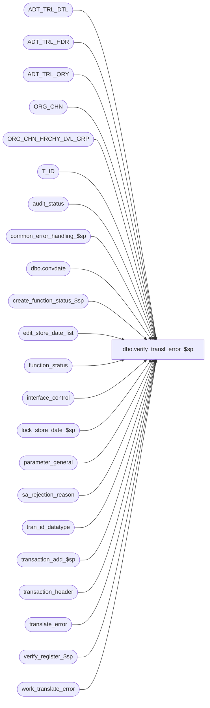

# dbo.verify_transl_error_$sp

**Database:** auditworks_external  
**Server:** bedrockdb01  

## Architecture Diagram



## Table Dependencies

| Referenced Table |
|---|
| ADT_TRL_DTL |
| ADT_TRL_HDR |
| ADT_TRL_QRY |
| ORG_CHN |
| ORG_CHN_HRCHY_LVL_GRP |
| T_ID |
| audit_status |
| common_error_handling_$sp |
| dbo.convdate |
| create_function_status_$sp |
| edit_store_date_list |
| function_status |
| interface_control |
| lock_store_date_$sp |
| parameter_general |
| sa_rejection_reason |
| tran_id_datatype |
| transaction_add_$sp |
| transaction_header |
| translate_error |
| verify_register_$sp |
| work_translate_error |

## Stored Procedure Code

```sql
CREATE proc [dbo].[verify_transl_error_$sp]  @process_id binary(16),
 @user_id    int,
 @action tinyint = 1 /* 1 = verify, 0 = unverify */

AS

/* Proc Name: verify_transl_error_$sp
   Description: To update translate_error_verified column in audit_status for translate_error rows 
		which are flagged as verified. Then verify the registers and stores. 
		Revalidates SA Reject Reason 8, and posts trxns when no more SA rejects for the trxn.
		Calls transaction_add_$sp proc with new function_no 112.
		Called from frontend. work_translate_error is populated by frontend.

HISTORY
Date	 Name      Def#   Desc
May13,15 Vicci TFS-118970 Break out of loop if last store/date could not be locked (instead of doing infinite loop).
Apr29,15 Vicci TFS-118970 Verify register with a 3 to have it do the store status verification and unlock on behalf of the translate error verification.
                          Fix logic to release to cleanup the transaction add if it fails.
                          Fix error handling to clean up if no error in add.
                          Fix logic to skip locked store/dates instead of erroring out.
                          Avoid logging same business rule error twice.
Jan22,14 Vicci   149479 Use TRY/CATCH logic, since otherwise errors such as Error:8114 Message:Error converting data type nvarchar to numeric encountered
                        in called proc verify_credit_card_$sp are not caught nor reported in any way.
Jan18,12 Vicci   132439 Remove references to CRDM user-defined string datatypes from S/A since CRDM is not changing them to support unicode.
Jan05,11 Vicci 1-464I90 Avoid work-table entries being left behind without corresponding function status entry to clean them up
                        when proc fails and translate errors without store/reg/date/trans# were involved.
Sep13,10 Paul    120532 avoid null error on insert to ADT_TRL_DTL when store_no does not exist
Jun03,10 Paul    114682 handle invalid date with translate errors: added check on sa_reject_flag in transaction_header,
				 update audit group hierarchy at end of proc (performance)
May18,10 Vicci   117947 Don't upgrade audit status from Invalid Store/Reg to Edited.
Mar22,10 Vicci   115375 Update translate_error/sa-reject/audit-status in cursor even if only 1 transaction present for s/r/d;  
			log audit trail.  Use correct function# to allow cleanup to set audit_status.translate_error_verified.
			Don't skip unlocked store/dates when in trickle-audit.
Mar03,08 Phu   1-3W8CDJ translate_error.transaction_id NULL causing audit_status.translate_error_verified not evaluated.
Jul30,07 Phu      89875 Make sure that row in ORG_CHN_HRCHY_LVL_GRP is updated for front end screen refresh.
Oct25,06 Phu      77931 Fix outer join for SQL 2005 Mode 90.
Jan31,06 Paul   DV-1329 set verified_date, simplify cursor logic
Sep08,05 Paul   DV-1312 apply 46670 to SA5
Jul05,05 Paul   DV-1239 Use tran_id_datatype
Sep22,04 Paul   DV-1146 receive user_id
Aug23,04 Paul   DV-1120 change refresh logic, pass zero entry_id
Apr21,04 Maryam DV-1071 Pass in @process_id and @user_name and modify the call to the
                        sub procs to receive these two variables as their first 2 parameters.
                        modify the call to lock_store_date_$sp as it no longer outputs the user_name
Jan04,05 Daphna 1-JA116/46670  prevent verification of translate errors for SRD that 
                               have not yet completed edit phase 2
Jul08,03 Paul     10169 correctly set @locked if force accepting
Jun19,03 David  1-LZEID Initialize @force_accept_flag to be 0.
Dec16,02 Paul   1-HCTFY Corrected error logic for 201571 message. Avoid raising this warning
				if called by force_accept_$sp.
Nov18,02 David     5161 Set any entries left in work_translate error after store_reg_date_crsr loop to @action_value.
Oct29,02 Winnie 1-G9TW5 Pass verify_store_status = 1 when calling verify_register_$sp
Sep20,02 Winnie 1-FHAT5 To correctly set the translate_error_verified in audit_status
May06,02 Henry	1-CMIL0 To handle exception translate errors (no associated SA rejects or NULL entries).
			Update feature table (for front-end auto-refresh), re-verify audit_status.
Mar14,02 Henry	1-A8XPT When verify translate rejects, also correct the associated SA reject.
			Added R3 common error handling.
Apr04,01 Phu       7501 Use sql function to retrieve user name
Mar30,00 Sab       6159 Prevent infinite loop
Mar01,00 Phu       5900 Change @@fetch_status > 0 to @@fetch_status <> 0 for MS SQL compatibility
Jan12,99 Sab  5791 Include register_no in CURSOR
Nov26,96 Paul           author
*/

DECLARE @action_value		tinyint,
	@current_date		smalldatetime,
	@cursor_open		tinyint,
	@date_reject_id		tinyint,
	@errmsg			nvarchar(2000),
	@errno			int,
	@force_accept_flag	tinyint,
	@function_no		tinyint,
	@interfaces_updated	int,
	@locked			tinyint,
	@more_sa_rejects	tinyint,
	@no_more_rows		tinyint,
	@override_flag		tinyint,
	@previous_store_no	int,
	@previous_date_rej_id	tinyint,
	@previous_sales_date	smalldatetime,
	@previous_register_no	smallint,
	@register_no		smallint,
        @ret int,
	@rows			int,
	@store_no		int,
	@transaction_date	smalldatetime,
        @transaction_id         tran_id_datatype,
	@object_name		nvarchar(255),
	@process_name		nvarchar(100),
	@operation_name		nvarchar(100),
	@message_id		int,
	@sa_reject_qty		smallint,
	@verified_by_user_id	int,
	@verified_date		smalldatetime,
	@verified_flag		tinyint,
	@violated_sareject_rule	smallint,
	@unverified_date	smalldatetime,
	@entry_date_time	datetime, 
	@sep                    nchar(1),
	@TBL_KEY		nvarchar(255),
  	@TBL_KEY_RSRC_NAME	nvarchar(255),
  	@TBL_KEY_RSRC_PRMS	nvarchar(255),
  	@ENTRY_ID		T_ID,
	@ORG_CHN_NAME		nvarchar(50),
	@transaction_no		int,
	@transaction_series	nchar(1),
	@trickle_polling_flag	tinyint,
	@errmsg2		nvarchar(2000),	
	@some_skipped           int,
	@abort_flag		tinyint;

SELECT @function_no = 140,  --Note:  function 140 = Verify Translate Error (for locking stores), function 117 = Translate Error Verification (for just verifying rejects without associated store/reg/date/trans), 112 for use by Transaction Add status cycle.
	@no_more_rows = 0,
	@previous_store_no = -1,
        @process_name = 'verify_transl_error_$sp',
        @message_id = 201068,
        @force_accept_flag = 0, -- 1-LZEID
        @action_value = 0,
        @current_date = getdate(),
        @override_flag = 1,
        @verified_date = NULL,
        @verified_by_user_id = NULL, -- default value for unaccept
        @sep = NCHAR(12),
	@operation_name = 'SELECT',
	@some_skipped = 0,
	@abort_flag = 0;

BEGIN TRY

SELECT @errmsg = 'Failed to read table parameter_general. ',
       @object_name = 'parameter_general';
SELECT @trickle_polling_flag = ISNULL(trickle_polling_flag,0)
  FROM parameter_general;

--Required in case of recovery mode
SELECT @errmsg = 'Failed to cleanup status. ',
       @object_name = 'function_status',
       @operation_name = 'DELETE';
DELETE function_status
 WHERE (function_no = @function_no OR function_no = 117)
   AND process_id = @process_id;

--Note:  null store/date/date-rej/reg indicate no store date locked, but work-table would still need cleaning up.
SELECT @errmsg = 'Failed to create function status entry for overall Translate Verification. ',
       @object_name = 'create_function_status_$sp',
       @operation_name = 'EXECUTE';
EXEC create_function_status_$sp @process_id, @user_id, 117, 0, @errmsg OUTPUT, @store_no, @transaction_date, @date_reject_id, @register_no, @action;

IF @action >= 10  -- called by force_accept_$sp
 SELECT @action = @action - 10,
	@force_accept_flag = 1;

IF @action = 1 -- verify
  SELECT @action_value = 1,
   	 @verified_date = @current_date,
   	 @verified_by_user_id = @user_id,
   	 @override_flag = NULL;
ELSE
  SELECT @unverified_date = @current_date;

/* prevent verification of translate errors for SRD that have not yet been processed by edit phase 2 */

IF @trickle_polling_flag IN (0,1) 
BEGIN
  SELECT @errmsg = ' for SRD found in edit_store_date_list and trickle-audit not active. ', 
         @object_name = 'work_translate_error',
         @operation_name = 'DELETE';
  DELETE work_translate_error
    FROM work_translate_error w, 
         translate_error t, 
         edit_store_date_list e
   WHERE t.store_no = e.store_no
     AND t.register_no = e.register_no
     AND t.transaction_date = e.transaction_date
     AND t.translate_error_id = w.translate_error_id     
     AND process_id = @process_id;
END;
ELSE  --ELSE of IF @trickle_polling_flag IN (0,1) 
BEGIN -- trickle audit
  SELECT @errmsg = ' translate errors for transactions which are in the midst of trickling in. ',
         @object_name = 'work_translate_error',
         @operation_name = 'DELETE';
  DELETE work_translate_error
    FROM work_translate_error w, 
         translate_error t, 
         transaction_header h
   WHERE t.transaction_id = h.transaction_id
     AND h.edit_progress_flag > 0
     AND t.translate_error_id = w.translate_error_id     
     AND process_id = @process_id; 
END; --ELSE of IF @trickle_polling_flag in (0,2) 

/* save snapshot of verified rows in order to allow concurrent verification by multiple users */

SELECT @errmsg = 'Failed to build temp table #reject_list. ',
       @object_name = ' #reject_list',
       @operation_name = 'INSERT';
SELECT wt.translate_error_id,
       te.store_no,
       te.register_no,
       te.entry_date_time,
       te.transaction_date, -- changed this. Was entry_date_time. Def 1-A8XPT.
       ISNULL(te.transaction_id, 0) AS transaction_id, -- added this. Def 1-A8XPT.
       te.transaction_no,
       te.transaction_series 
  INTO #reject_list
  FROM work_translate_error wt, translate_error te
 WHERE wt.process_id = @process_id
   AND wt.translate_error_id = te.translate_error_id;
SELECT @rows = @@rowcount;

IF @rows <= 0
BEGIN
  SELECT @errmsg = 'Failed to DROP TABLE #reject_list. ',
         @object_name = ' #reject_list',
         @operation_name = 'DROP TABLE';
  DROP TABLE #reject_list;
  GOTO cleanup;
END;

-- get a list of trxns for store-reg-dates that are not dayended yet
SELECT @errmsg = 'Failed to build temp table #work_transl_reject. ',
       @object_name = ' #work_transl_reject',
       @operation_name = 'INSERT';
SELECT DISTINCT st.store_no,
	st.register_no,
	rl.transaction_date,
	st.date_reject_id,
	rl.transaction_id, -- added this. Def 1-A8XPT.
	rr.violated_sareject_rule,
	rl.entry_date_time,
	rl.transaction_no,
	rl.transaction_series
  INTO #work_transl_reject
  FROM #reject_list rl
       INNER JOIN audit_status st ON (rl.store_no = st.store_no
                                      AND rl.register_no = st.register_no
                                      AND rl.transaction_date = st.sales_date)
       LEFT JOIN sa_rejection_reason rr ON (rl.transaction_id = rr.transaction_id
                                            AND rr.violated_sareject_rule = 8)
 WHERE st.audit_status >= 6
   AND st.audit_status <= 300;


  /* The cursor will return a row for each value of date_reject_id that exists in audit_status
     for any rows that match the cursor where clause, i.e. there is a one-to-many relationship between
     translate_error and audit_status when invalid dates (date_reject_id > 0) exist.
     For each affected store-reg-transaction_date, recalculate translate_error_verified in audit_status.
     When a sa_reject exists (@violated_sareject_rule is not null), then revalidate the transaction. */

SELECT @errmsg = 'Failed to define cursor store_reg_date_crsr. ',
       @object_name = 'store_reg_date_crsr',
       @operation_name = 'DECLARE';
DECLARE store_reg_date_crsr CURSOR FAST_FORWARD
FOR
SELECT	store_no,
	transaction_date,
	register_no,
	date_reject_id,
	transaction_id,
	violated_sareject_rule,
	entry_date_time,
	transaction_no,
	transaction_series
FROM #work_transl_reject WITH (NOLOCK)
ORDER BY transaction_date, store_no, date_reject_id, register_no;

SELECT @operation_name = 'DECLARE';
OPEN store_reg_date_crsr;

SELECT  @cursor_open = 1,
	@locked = 0;

WHILE 1=1
 BEGIN

  SELECT @operation_name = 'FETCH';
  FETCH store_reg_date_crsr INTO
	@store_no,
	@transaction_date,
	@register_no,
	@date_reject_id,
	@transaction_id,
	@violated_sareject_rule,
	@entry_date_time,
	@transaction_no,
	@transaction_series;

  IF @@fetch_status <> 0
  BEGIN
   IF @previous_store_no = -1
     BREAK;
   ELSE
     SELECT @no_more_rows = 1;
  END;

  -- check for change of store or date or register
  
  SELECT @operation_name = 'SELECT';
  
  IF ( (@store_no <> @previous_store_no) OR (@transaction_date <> @previous_sales_date) OR
       (@date_reject_id <> @previous_date_rej_id) OR (@register_no <> @previous_register_no)
       OR (@no_more_rows = 1) )
   BEGIN

     IF @no_more_rows = 0 
     BEGIN
       SELECT @errmsg = 'Unable to get store name. ',
              @object_name = 'ORG_CHN';
       SELECT @ORG_CHN_NAME = SUBSTRING(ORG_CHN_NAME,1,30)
  	 FROM ORG_CHN
   	WHERE ORG_CHN_NUM = @store_no;

       IF @ORG_CHN_NAME IS NULL
         SELECT @ORG_CHN_NAME = ' ';
    END;

    IF @previous_store_no <> -1 AND @locked = 1
     BEGIN
       SELECT @verified_flag = 0;

       SELECT @errmsg = 'Unable to select translate error verification status. ',
              @object_name = 'translate_error';
       SELECT @verified_flag = MIN(verified)
         FROM translate_error
        WHERE store_no = @previous_store_no
 	  AND register_no = @previous_register_no
          AND transaction_date = @previous_sales_date;

       SELECT @errmsg = 'Unable to select count S/A rejects for store/reg/date. ',
              @object_name = 'transaction_header';
       SELECT @sa_reject_qty = COUNT(1)
	  FROM transaction_header
	 WHERE store_no = @previous_store_no
	   AND register_no = @previous_register_no
	   AND transaction_date = @previous_sales_date
	   AND date_reject_id = @previous_date_rej_id
	   AND sa_rejection_flag = 1;

       SELECT @errmsg = 'Failed to VERIFY translate_error - last pass. ',
      	      @object_name = 'audit_status',
      	      @operation_name = 'UPDATE';
       UPDATE audit_status
          SET translate_error_verified = ISNULL(@verified_flag,0),
              sa_reject_qty = @sa_reject_qty,
              audit_status = CASE WHEN audit_status IN (7, 8) THEN audit_status ELSE 100 END
        WHERE store_no = @previous_store_no
          AND register_no = @previous_register_no
          AND sales_date = @previous_sales_date
          AND date_reject_id = @previous_date_rej_id
          AND audit_status <= 300;

       SELECT @errmsg = 'Failed to verify register with flag set to 3 to have it verify and unlock store/date. ',
      	      @object_name = 'verify_register_$sp',
      	      @operation_name = 'EXECUTE';
       EXEC verify_register_$sp @process_id, @user_id, @previous_store_no, @previous_register_no, @previous_sales_date, @previous_date_rej_id, @errmsg OUTPUT, 3;

       SELECT @errmsg = 'Failed to cleanup status. ',
	      @object_name = 'function_status',
	      @operation_name = 'DELETE';
       DELETE function_status
	WHERE function_no = @function_no
	  AND process_id = @process_id;

       SELECT @errmsg = 'Failed to cleanup from work table store/reg/date that have been completed (to avoid reprocessing them again in event of failure). ',
	      @object_name = 'work_translate_error',
	      @operation_name = 'DELETE';
       DELETE work_translate_error
	 FROM #reject_list rl, work_translate_error wt
	WHERE wt.process_id = @process_id
	  AND rl.store_no = @previous_store_no
	  AND rl.register_no = @previous_register_no
	  AND rl.transaction_date = @previous_sales_date
	  AND rl.translate_error_id = wt.translate_error_id;

     END; --IF @previous_store_no <> -1 AND locked = 1

     IF @no_more_rows = 1
	   BREAK;

     SELECT @previous_store_no = @store_no,
	    @previous_sales_date = @transaction_date,
	    @previous_date_rej_id = @date_reject_id,
	    @previous_register_no = @register_no,
	    @locked = 0;

     IF @force_accept_flag = 0
     BEGIN
       BEGIN TRANSACTION
       SELECT @ret = NULL;
        
       BEGIN TRY 
         EXEC lock_store_date_$sp @process_id, @user_id, @store_no, @transaction_date, @date_reject_id, @function_no, @ret OUTPUT;
       END TRY
       BEGIN CATCH
         SELECT @errno = ERROR_NUMBER();
         IF @ret IS NULL OR @ret = 0
           SELECT @ret = @errno;
       END CATCH;          
       
       IF @errno != 0 AND @ret <> 201550 AND @errno <> 201550
       BEGIN
         SELECT @errmsg = 'Failed to execute lock_store_date_$sp',
		@object_name = 'lock_store_date_$sp',
		@operation_name = 'EXEC';
         GOTO general_error;
       END

       IF @ret = 0
       BEGIN
         SELECT @locked = 1

         SELECT @errmsg = 'Failed to execute stored proc create_function_status_$sp',
		@object_name = 'create_function_status_$sp',
		@operation_name = 'EXEC';
         EXEC create_function_status_$sp @process_id, @user_id, @function_no, 0, @errmsg OUTPUT, @store_no, @transaction_date, @date_reject_id, @register_no, @action;

         COMMIT TRANSACTION;
       END
       ELSE -- unable to lock, skip all transactions for store-date 
       BEGIN
         IF @@trancount > 0
           COMMIT TRANSACTION;
           
         SELECT @locked = 0, @some_skipped = 1;

	 SELECT @errmsg = 'Failed to cleanup work table (1). ',
	        @object_name = 'work_translate_error',
	        @operation_name = 'DELETE';
	 DELETE work_translate_error
	   FROM #reject_list rl, work_translate_error wt
	  WHERE process_id = @process_id
	    AND rl.store_no = @store_no
	    AND rl.transaction_date = @transaction_date
	    AND rl.translate_error_id = wt.translate_error_id;
       END;

     END
     ELSE  -- bypass locking if called from force accept
       SELECT @ret = 0, @locked = 1;

     IF @ret = 0 
     BEGIN -- update flags for locked store-register
       SELECT @errmsg = 'Failed to SET verified flags. ',
	      @object_name = 'translate_error',
	      @operation_name = 'UPDATE';
       UPDATE translate_error
	  SET verified = @action_value,
	      verified_by_user_id = @verified_by_user_id,
	      verified_date = @verified_date,
	      override_flag = ISNULL(@override_flag,te.override_flag)
	 FROM work_translate_error wt, translate_error te
	WHERE process_id = @process_id
	  AND wt.translate_error_id = te.translate_error_id
	  AND verified != @action_value
	  AND store_no = @store_no
	  AND register_no = @register_no
	  AND transaction_date = @transaction_date;
     END; -- update flags

   END; /* IF (((@store_no <> @previous_store_no) OR ... */


   IF @violated_sareject_rule IS NOT NULL AND @action_value = 1
     AND @locked = 1 AND @date_reject_id = 0 -- If verifying, then remove sa reject type 8
    BEGIN
	 SELECT @more_sa_rejects = 0;

	 -- check if there are additional SA rejects for the trxn.
	 SELECT @errmsg = 'Failed to if any S/A rejects other than translate errors exist. ',
		@object_name = 'sa_rejection_reason',
		@operation_name = 'SELECT';
	 IF EXISTS (SELECT violated_sareject_rule
		      FROM sa_rejection_reason
		     WHERE transaction_id = @transaction_id
		       AND violated_sareject_rule != 8)
	   SELECT @more_sa_rejects = 1;

	 IF @more_sa_rejects = 1
	 BEGIN
	   SELECT @errmsg = 'Failed to delete S/A rejects for translate errors. ',
		  @object_name = 'sa_rejection_reason',
		  @operation_name = 'DELETE';
	    DELETE sa_rejection_reason
	     WHERE transaction_id = @transaction_id
	       AND violated_sareject_rule = 8;
	 END; -- If @more_sa_rejects = 1

	 -- if tran has no other SA rejects, then post valid transaction to interfaces and SA summary tables.
	 IF @more_sa_rejects = 0 AND @transaction_id > 0 
	 BEGIN
	   SELECT @errmsg = 'Failed to set @interfaces_updated. ',
		  @object_name = 'interface_control',
		  @operation_name = 'SELECT'; 
	   SELECT @interfaces_updated = COUNT(1)
	     FROM interface_control
	    WHERE transaction_id = @transaction_id;
	   -- detect change to non-reject

	   SELECT @errmsg = 'Failed to RESET header SA rejection flag. ',
		  @object_name = 'transaction_header',
		  @operation_name = 'UPDATE'; 
	   UPDATE transaction_header
	      SET sa_rejection_flag = 0
	    WHERE transaction_id = @transaction_id
	      AND sa_rejection_flag = 1; -- safety check
	   SELECT @rows = @@rowcount;

	   IF @rows > 0 AND @interfaces_updated = 0
	   BEGIN
	     SELECT @errmsg = 'Failed to ADD the trxn to interfaces. ',
	            @object_name = 'transaction_add_$sp',
	            @operation_name = 'EXECUTE'; 
	     BEGIN TRY 
	       EXEC transaction_add_$sp @process_id, @user_id, @transaction_id, @errmsg OUTPUT, 0, 112; -- new function_no
	     END TRY
	     BEGIN CATCH
	       SELECT @errno = ERROR_NUMBER(),
	              @errmsg = 'Failed to execute transaction_add_$sp for function 112.  ',
	              @object_name = 'transaction_add_$sp',
	              @operation_name = 'EXEC';
	       UPDATE function_status
	          SET released_to_cleanup = 1
	        WHERE function_no = 112
	          AND process_id = @process_id
	          AND user_id = @user_id
	          AND transaction_id = @transaction_id;
	       --Note the function_status entry for 140 is not released for cleanup until this one (for 112) which will unlock the store is done.
	       GOTO general_error;
	     END CATCH;
	   END; -- If @rows > 0
	 END; -- If @more_sa_rejects = 0 AND @transaction_id > 0 
    END; -- If @violated_sareject_rule IS NOT NULL ...

    /* Handle possible combination of invalid date (date_reject_id > 0) and translate reject.
       The loop will process date_reject_id = 0 before processing date_reject_id > 0 
       since the same store-reg-date could also exist with date_reject_id = 0.
       Transactions on an invalid date will have other sa reject reasons. */

    IF @date_reject_id > 0 AND @action = 1 AND @transaction_id > 0 AND @locked = 1 -- THEN
    BEGIN
      SELECT @errmsg = 'Failed to delete sa_rejection_reason (invalid date).  ',
	     @object_name = 'sa_rejection_reason',
	     @operation_name = 'DELETE';
      DELETE sa_rejection_reason
       WHERE transaction_id = @transaction_id
         AND violated_sareject_rule = 8;
    END;

    SELECT @errmsg = 'Failed to perform audit trail logging. ',
	   @object_name = 'ADT_TRL_HDR',
	   @operation_name = 'SELECT';
    --Audit Trail logging
    IF @locked = 1 
    BEGIN
      SELECT @ENTRY_ID = NEWID();
      IF @transaction_id <> 0 OR @transaction_no <> 0 
      BEGIN
        SELECT @TBL_KEY = CASE WHEN @transaction_id > 0 
                               THEN convert(nvarchar, @transaction_id) 
                               ELSE convert(nvarchar, @store_no) + @sep + dbo.convdate(@transaction_date)  + @sep + 
                        	    convert(nvarchar, @register_no) + @sep + convert(nvarchar, @date_reject_id) + @sep + 
                        	    convert(nvarchar, @transaction_no) + @sep + @transaction_series + @sep +  
       	    dbo.convdate(@entry_date_time)
                          END,
               @TBL_KEY_RSRC_NAME = 'TK_STOR_TRAN_DATE_REGI_DATE_REJE_ID_TRAN_NO_TRAN_SERI_ENTR_DATE_TIME',
               @TBL_KEY_RSRC_PRMS = convert(nvarchar, @store_no)  + ' - ' + COALESCE(@ORG_CHN_NAME,convert(nvarchar, @store_no))+ @sep +
                             dbo.convdate(@transaction_date) + @sep + convert(nvarchar, @register_no) + @sep + 
             convert(nvarchar, @date_reject_id) + @sep + convert(nvarchar, @transaction_no) + @sep + 
                          @transaction_series + @sep + dbo.convdate(@entry_date_time);
    END; 
    ELSE
    BEGIN
      SELECT @TBL_KEY = convert(nvarchar, @store_no) + @sep + dbo.convdate(@transaction_date) + @sep + convert(nvarchar, @register_no) + @sep + convert(nvarchar, @date_reject_id),
      	     @TBL_KEY_RSRC_NAME = 'TK_STOR_TRAN_DATE_REGI_DATE_REJE_ID',
      	     @TBL_KEY_RSRC_PRMS = convert(nvarchar, @store_no) + ' - ' + COALESCE(@ORG_CHN_NAME,convert(nvarchar, @store_no)) + @sep 
      	     	+ dbo.convdate(@transaction_date) + @sep + convert(nvarchar, @register_no) 
	                     	+ @sep + convert(nvarchar, @date_reject_id);
    END; --IF @transaction_id <> 0 OR @transaction_no <> 0 

    SELECT @errmsg = 'Cannot log verified/unverified translate error info to audit trail header. ',
	   @object_name = 'ADT_TRL_HDR',
	   @operation_name = 'INSERT';
    INSERT INTO ADT_TRL_HDR (
           ENTRY_ID,
           ENTRY_DATE_TIME,
           USER_ID,
           APP_ID,
           ROOT_TBL_NAME,
           ROOT_TBL_KEY,
           ROOT_TBL_KEY_RSRC_NAME,
           ROOT_TBL_KEY_RSRC_PRMS,
           FNCTN_NUM)
    VALUES (@ENTRY_ID,
      	   COALESCE(@verified_date, @unverified_date),
      	   @user_id,
      	   300,
      	   'TRANSLATE_ERROR',
      	   @TBL_KEY,
      	   @TBL_KEY_RSRC_NAME,
      	   @TBL_KEY_RSRC_PRMS,
      	   @function_no);

    SELECT @errmsg = 'Cannot log verified/unverified translate error info to audit trail detail. ',
	   @object_name = 'ADT_TRL_DTL',
	   @operation_name = 'INSERT';
    INSERT INTO ADT_TRL_DTL (
	   ENTRY_ID,
           TBL_NAME,
           TBL_KEY,
           TBL_KEY_RSRC_NAME,
           TBL_KEY_RSRC_PRMS,
           ACTN_CODE,
           CLMN_NAME,
           OLD_VAL,
           NEW_VAL)
    VALUES (@ENTRY_ID,
	   'TRANSLATE_ERROR',
	   @TBL_KEY,
	   @TBL_KEY_RSRC_NAME,
	   @TBL_KEY_RSRC_PRMS,
	   'M',
	   'VERIFIED',
	   ABS(@action - 1),
	   @action);

    SELECT @errmsg = 'Cannot log verified/unverified translate error info to audit trail query keys. ',
	   @object_name = 'ADT_TRL_QRY',
	   @operation_name = 'INSERT';
    INSERT INTO ADT_TRL_QRY (
	   ENTRY_ID,
	   QRY_KEY_NUM,
	   KEY_PART_VAL_1,
	   KEY_PART_VAL_2,
	   KEY_PART_VAL_3,
	   KEY_PART_VAL_5,
	   KEY_PART_VAL_6,
	   KEY_PART_VAL_8)
    VALUES (@ENTRY_ID,
           301,
           convert(nvarchar, @store_no),
           convert(nvarchar, @register_no),
           dbo.convdate(@transaction_date),
	   CASE WHEN @transaction_id = 0 THEN NULL ELSE convert(nvarchar, @transaction_no) END,
	   CASE WHEN @transaction_id = 0 THEN NULL ELSE @transaction_series END,
	   CASE WHEN @transaction_id = 0 THEN NULL ELSE convert(nvarchar, @transaction_id) END);
  END;  --IF @locked = 1
 
END; /* While 1=1 */

SELECT @errmsg = 'Failed to close and deallocate store_reg_date_crsr cursor. ',
       @object_name = 'store_reg_date_crsr',
       @operation_name = 'CLOSE';
CLOSE store_reg_date_crsr;
SELECT @operation_name = 'DEALLOCATE';
DEALLOCATE store_reg_date_crsr;

SELECT @cursor_open = 0;


/* Now verify/unverify all remaining entries in translate_error table
 (no store-reg-date-tran logged by translate or store-date is no longer open). */
SELECT @errmsg = 'Failed to remove previously processed work_translate_error table entries. ',
       @object_name = 'work_translate_error',
       @operation_name = 'DELETE';
DELETE work_translate_error
  FROM work_translate_error we, translate_error te
 WHERE we.process_id = @process_id
   AND we.translate_error_id = te.translate_error_id
   AND te.verified = @action_value;

SELECT @errmsg = 'Failed to SET verified flag for translate_error table entries. ',
       @object_name = 'translate_error',
       @operation_name = 'UPDATE';
UPDATE translate_error
   SET verified = @action_value,
       verified_by_user_id = @verified_by_user_id,
       verified_date = @verified_date,
       override_flag = ISNULL(@override_flag,te.override_flag)
  FROM translate_error te, work_translate_error we
 WHERE te.verified != @action_value
   AND te.translate_error_id = we.translate_error_id
   AND we.process_id = @process_id;
SELECT @rows = @@rowcount

IF @rows > 0 
BEGIN
  SELECT @TBL_KEY_RSRC_NAME = 'TK_STOR_TRAN_DATE_REGI_DATE_REJE_ID_TRAN_ERRO_ID';

  SELECT @errmsg = 'Failed to set prepare work entries for audit-trail insertion. ',
         @object_name = 'work_translate_error',
         @operation_name = 'UPDATE';
  UPDATE work_translate_error
     SET audit_trail_entry_id = newid()
   WHERE process_id = @process_id;

  SELECT @errmsg = 'Cannot log verified/unverified translate error info to audit trail header (2).  ',
         @object_name = 'ADT_TRL_HDR',
         @operation_name = 'INSERT'
  INSERT INTO ADT_TRL_HDR (
             ENTRY_ID,
             ENTRY_DATE_TIME,
             USER_ID,
             APP_ID,
             ROOT_TBL_NAME,
             ROOT_TBL_KEY,
             ROOT_TBL_KEY_RSRC_NAME,
             ROOT_TBL_KEY_RSRC_PRMS,
             FNCTN_NUM)
  SELECT wt.audit_trail_entry_id,
       	 COALESCE(@verified_date, @unverified_date),
      	 @user_id,
      	 300,
      	 'TRANSLATE_ERROR',
       	 COALESCE(convert(nvarchar, te.store_no), ' ') + @sep + COALESCE(dbo.convdate(te.transaction_date), ' ') + @sep + COALESCE(convert(nvarchar, te.register_no), ' ') + @sep + '0'+ @sep + convert(nvarchar, wt.translate_error_id),
      	 @TBL_KEY_RSRC_NAME,
      	 SUBSTRING(COALESCE(convert(nvarchar, te.store_no) + ' - ' + o.ORG_CHN_NAME, ' ') + @sep + COALESCE(dbo.convdate(te.transaction_date), ' ') + @sep + COALESCE(convert(nvarchar, te.register_no), ' ')+ @sep + '0'+ @sep + convert(nvarchar, wt.translate_error_id) + ' ' + COALESCE(transl_error_msg, ' ') , 1, 255), 
       	 @function_no
    FROM work_translate_error wt
         INNER JOIN  translate_error te ON (wt.translate_error_id = te.translate_error_id)
         LEFT OUTER JOIN ORG_CHN o ON o.ORG_CHN_NUM = te.store_no
   WHERE process_id = @process_id;

  SELECT @errmsg = 'Cannot log verified/unverified translate error info to audit trail detail (2). ',
	 @object_name = 'ADT_TRL_DTL',
         @operation_name = 'INSERT'; 
  INSERT INTO ADT_TRL_DTL (
         ENTRY_ID,
         TBL_NAME,
         TBL_KEY,
         TBL_KEY_RSRC_NAME,
         TBL_KEY_RSRC_PRMS,
         ACTN_CODE,
         CLMN_NAME,
         OLD_VAL,
         NEW_VAL)
  SELECT wt.audit_trail_entry_id,
	 'TRANSLATE_ERROR',
	 COALESCE(convert(nvarchar, te.store_no), ' ') + @sep + COALESCE(dbo.convdate(te.transaction_date), ' ') + @sep
	   + COALESCE(convert(nvarchar, te.register_no), ' ') + @sep + '0'+ @sep + convert(nvarchar, wt.translate_error_id),
	 @TBL_KEY_RSRC_NAME, 
	 SUBSTRING(COALESCE(convert(nvarchar, te.store_no), ' ') + ' - ' + COALESCE(o.ORG_CHN_NAME,convert(nvarchar, @store_no),' ') + @sep
	   + COALESCE(dbo.convdate(te.transaction_date), ' ') + @sep + COALESCE(convert(nvarchar, te.register_no), ' ')
	   + @sep + '0' + @sep + convert(nvarchar, wt.translate_error_id) + ' ' + COALESCE(transl_error_msg, ' ') , 1, 255), 
	 'M',
	 'VERIFIED',
	 ABS(@action_value - 1),
	 @action_value 
    FROM work_translate_error wt
         INNER JOIN  translate_error te ON (wt.translate_error_id = te.translate_error_id)
         LEFT OUTER JOIN ORG_CHN o ON o.ORG_CHN_NUM = te.store_no
   WHERE process_id = @process_id;

  SELECT @errmsg  = 'Unable to insert audit trail query keys (2). ', 
     	 @object_name = 'ADT_TRL_QRY', 
      	 @operation_name = 'INSERT';
  INSERT INTO ADT_TRL_QRY (
	     ENTRY_ID,
	     QRY_KEY_NUM,
	     KEY_PART_VAL_1,
	     KEY_PART_VAL_2,
	     KEY_PART_VAL_3,
	     KEY_PART_VAL_5,
	     KEY_PART_VAL_6,
	     KEY_PART_VAL_8)
  SELECT wt.audit_trail_entry_id,
         301,
         convert(nvarchar, te.store_no),
         convert(nvarchar, te.register_no),
         dbo.convdate(te.transaction_date),
         convert(nvarchar, te.transaction_no),
         te.transaction_series,
         te.transaction_id
    FROM work_translate_error wt
         INNER JOIN  translate_error te 
            ON wt.translate_error_id = te.translate_error_id
   WHERE process_id = @process_id;
END; --IF @rows > 0, left over work table entries to be verified.

/* Now refresh all audit groups (avoids refreshing each audit group multiple times inside the cursor) */
SELECT @errmsg = 'Failed to update ORG_CHN_HRCHY_LVL_GRP. ',
       @object_name = 'ORG_CHN_HRCHY_LVL_GRP',
       @operation_name = 'UPDATE';
UPDATE ORG_CHN_HRCHY_LVL_GRP
   SET GRP_MBR_CHNG = getdate()
 WHERE GRP_MBR_CHNG IS NOT NULL;


cleanup:  
  SELECT @errmsg = 'Failed to cleanup work table (2). ',
  	 @object_name = 'work_translate_error',
 	 @operation_name = 'DELETE';  
  DELETE work_translate_error
   WHERE process_id = @process_id;

  SELECT @errmsg = 'Failed to cleanup function status for overall Translate Verification. ',
  	 @object_name = 'function_status';  
  DELETE function_status
   WHERE function_no = 117
     AND process_id = @process_id;

  IF @some_skipped > 0
  BEGIN
    SELECT @errno = 201571,
  	   @errmsg = 'Could not process all data. Some store-dates were in use. ';
    GOTO business_rule_error;
  END

RETURN;

business_rule_error:
  SELECT @message_id = @errno;
  SELECT @errmsg2 = @process_name + ':  ' + COALESCE(@errmsg, '');
  SELECT @errmsg = @errmsg2;
  EXEC common_error_handling_$sp @function_no, @errno, @errmsg2, 0, @message_id, 
                                 @process_name, @object_name, @operation_name, 
                                 0, 1, 0, null, 0, null, null, null,
	                         null, null, null, 0, @process_id, @user_id;
  RETURN;

general_error:
  SELECT @errno = ERROR_NUMBER(),
         @errmsg2 = @process_name + ':  ' + COALESCE(@errmsg, '') + ' Line: ' + CONVERT(nvarchar, ERROR_LINE()) + ', ' + ERROR_MESSAGE() ;
  EXEC common_error_handling_$sp @function_no, @errno, @errmsg2, 0, @message_id, 
                                 @process_name, @object_name, @operation_name, 0, 1, 0, null, 0, null, null, null,
	                         null, null, null, 0, @process_id, @user_id;
  RETURN;

END TRY

BEGIN CATCH
  SELECT @errno = ERROR_NUMBER();
  IF @errmsg2 IS NULL
  BEGIN
    SELECT @errmsg2 = @process_name + ':  ' + COALESCE(@errmsg, '') + ' Line: ' + CONVERT(nvarchar, ERROR_LINE()) + ', ' + ERROR_MESSAGE();
  END;
  ELSE
  BEGIN
    IF @errno = 201571
      SELECT @abort_flag = 4;  --don't log error to process_error_log since already logged by general_error.
  END;
  SELECT @errmsg = @errmsg2;  

  IF @cursor_open = 1
  BEGIN
    CLOSE store_reg_date_crsr;
    DEALLOCATE store_reg_date_crsr;
  END
  
  IF NOT EXISTS (SELECT 1 FROM function_status WHERE function_no = 112 AND process_id = @process_id AND user_id = @user_id)
  BEGIN
    IF @@trancount > 0
      ROLLBACK TRANSACTION;

    UPDATE function_status
       SET released_to_cleanup = 1
     WHERE function_no = 140
       AND process_id = @process_id
       AND user_id = @user_id;
    SELECT @rows = @@rowcount;

    IF @rows < 1
    BEGIN
      UPDATE function_status
         SET released_to_cleanup = 1
       WHERE function_no = 117
         AND process_id = @process_id
         AND user_id = @user_id;
    END;
    
  END;

  EXEC common_error_handling_$sp @function_no, @errno, @errmsg2, @abort_flag, @message_id, 
                                 @process_name, @object_name, @operation_name, 0, 1, 0, null, 0, null, null, null,
	                         null, null, null, 0, @process_id, @user_id;
  
  RETURN;
END CATCH;
```

