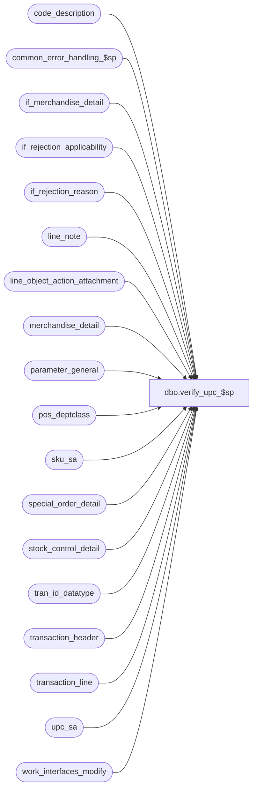

# dbo.verify_upc_$sp

**Database:** auditworks_external  
**Server:** bedrockdb01  

## Architecture Diagram



## Table Dependencies

| Referenced Table |
|---|
| code_description |
| common_error_handling_$sp |
| if_merchandise_detail |
| if_rejection_applicability |
| if_rejection_reason |
| line_note |
| line_object_action_attachment |
| merchandise_detail |
| parameter_general |
| pos_deptclass |
| sku_sa |
| special_order_detail |
| stock_control_detail |
| tran_id_datatype |
| transaction_header |
| transaction_line |
| upc_sa |
| work_interfaces_modify |

## Stored Procedure Code

```sql
create proc dbo.verify_upc_$sp @process_id             binary(16),
@user_id                int,
@transaction_id		tran_id_datatype,
@errmsg			nvarchar(2000) OUTPUT,
@upc_check		tinyint

AS

/*
PROC NAME: verify_upc_$sp
     DESC: This routine will verify if the upc's exist in either
           the merchandise table or CPS table. If a upc does not
           exist, then return 1. If all upc's exist, return 0.
           Called by modify_interface_$sp and verify_transaction_$sp

HISTORY
Date     Name        Def# Desc
Feb26,15 Vicci TFS-107968 When item not on file information to support the audit is not available from the Additional Item information attachment,
                          take it from the Special Order attachment.
Nov24,14 Vicci  TFS-74694 If cost in transaction was $0.00 leave it at $0.00 even if that is no longer the cost in the style-master.
Nov05,14 Vicci  TFS-88852 Code revisions to rectify extremely slow performance when sku/pos-ID lookup is active.
Jul09,14 Vicci  TFS-74694 Log cost and validate I/F Rejection rule 116 (Merchandise cost unknown).
Sep23,13 Vicci     146826 Take pos_identifier_type into account when more than 1 has been defined, and support SQL 2012.
Jan27,11 Paul      123556 treat upc_no = 0 existing in upc_sa as being not on file.
Apr16,10 Vicci     117187 Log additional item information for UPC/POSID/POSDEPT not on file messages.
Aug08,08 Paul       87777 Uplift 79437, 70393 to SA5, code reviewed
Feb02,06 Paul     DV-1329 apply 66881 to SA5
Jul05,05 Paul     DV-1239 Use tran_id_datatype
Jun01,05 Paul     DV-1254 add nolock hints
Sep22,04 Paul     DV-1146 receive user_id
Apr19,04 Maryam   DV-1071 Modified to receive @process_id as input parameter
			  and pass it to common_error_handling_$sp.
Nov06.06 Daphna     79437 Ensure NULL upc_no rejects when sku_lookup_method = 0
Apr05,06 Vicci      70393 When UPC given and assuming found until proven otherwise, set
                          @upc_found_count = 1 until proven otherwise.
Jan31,06 Vicci	    66881 Validate pos_identifier and pos_deptclass if upc_no not given
Apr16,04 Phu        27391 Create I/F reject if upc_no/upc_lookup_division not on file			  
Nov17,03 Phu        15801 Set sku_id, style_reference_id in stock_control
Jul24,03 David    1-MWKC5 Handle case when upc_lookup_division >= 1
Jan29,02 Winnie   1-AIQVL set the correct value for class_code depend on the retain_class_code flag.
Jan18,02 Vicci    1-A9Z28 Adjust join to line_object_action_attachment to take new 
			      transaction_category into account.
May30,01 DanJ        8031 prefixed upc_lookup_division since it's now in 2 tables - never submitted to VC
Jun07,00 Daphna      6351 simplify logic checking upc on stock control details
May17,00 Louise      6294 Added join on upc_lookup_division
Mar01,00 Phu         5900 Change @@fetch_status > 0 to @@fetch_status <> 0 for MS SQL compatibility
Jan20,99 Henry
Jun18,96 Sebastiano   n/a author
*/

DECLARE
  @errno			int,
  @ret_code			tinyint,
  @rows				int,
  @stock_control_count		int,
  @upc_lookup_source		nchar(1),
  @retain_class_code		tinyint,
  @message_id			int,	
  @object_name			nvarchar(255),
  @operation_name		nvarchar(100),
  @process_name			nvarchar(100),
  @sku_lookup_method		tinyint,
  @errmsg2			nvarchar(2000),
  @multiple_pos_id_types_exist	tinyint,
  @cost_check			tinyint,
  @cost_val_without_upc_val	tinyint,
  @copy_transaction_id		tran_id_datatype,
  @transaction_category		tinyint;  

SELECT @ret_code = 0,
       @process_name = 'verify_upc_$sp',
       @message_id = 201068;

BEGIN TRY

SELECT @errmsg = 'Failed to determine if cost validation is active. ',
       @object_name = 'if_rejection_applicability',
       @operation_name = 'SELECT';
SELECT @cost_check = MIN(1), @cost_val_without_upc_val = 1 - MIN(SIGN(wm.upc_check))
  FROM work_interfaces_modify wm WITH (NOLOCK), if_rejection_applicability ia WITH (NOLOCK)
 WHERE wm.process_id = @process_id
   AND wm.interface_id = ia.interface_id
   AND ia.if_reject_reason = 116

IF @cost_check IS NULL 
  SELECT @cost_check = 0, @cost_val_without_upc_val = 0
  
SELECT @errmsg = 'Failed to determine if multiple POS Identifier Types have been defined. ',
       @object_name = 'code_description';
SELECT @multiple_pos_id_types_exist = CASE WHEN COUNT(1) > 1 THEN 1 ELSE 0 END
  FROM code_description
 WHERE code_type = 68
   AND code > 0  --(don't count the 'please log what has been given in the pos_identifier field to the upc_no field instead' request)
   AND code <> 100  --(C/L ref# reassignment)
   AND active_flag = 1;

SELECT @errmsg = 'Failed to SELECT from parameter_general. ',
       @object_name = 'parameter_general';
SELECT @upc_lookup_source = upc_lookup_source,
       @retain_class_code = retain_class_code,
       @sku_lookup_method = sku_lookup_method
  FROM parameter_general;

IF @upc_lookup_source IN ('M', 'C')
BEGIN

  SELECT @errmsg = 'Failed to determine transaction category and copy transaction ID. ',
         @object_name = 'transaction_header',
         @operation_name = 'SELECT';        
  SELECT @copy_transaction_id = copy_transaction_id,
         @transaction_category = transaction_category
    FROM transaction_header
   WHERE transaction_id = @transaction_id;
   
  SELECT @errmsg = 'Failed to UPDATE merchandise_detail upc_on_file_flag. ',
         @object_name = 'merchandise_detail',
         @operation_name = 'UPDATE';        
  UPDATE merchandise_detail
     SET upc_on_file_flag = 0
   WHERE transaction_id = @transaction_id
     AND upc_on_file_flag = 1;

  SELECT @errmsg = 'Failed to lookup upc lookup division and merchandise category. ';
  UPDATE merchandise_detail
     SET upc_lookup_division = la.upc_lookup_division,
	 merchandise_category = la.merchandise_category
    FROM merchandise_detail md
         INNER JOIN transaction_line tl WITH (NOLOCK)
            ON tl.transaction_id = md.transaction_id
           AND tl.line_id = md.line_id
         INNER JOIN line_object_action_attachment la
            ON tl.line_object = la.line_object
           AND tl.line_action = la.line_action
           AND la.attachment_type = 1
           AND @transaction_category = ISNULL(la.transaction_category, @transaction_category)
   WHERE md.transaction_id = @transaction_id
     AND (md.upc_lookup_division <> la.upc_lookup_division OR md.merchandise_category <> la.merchandise_category);

  IF @sku_lookup_method IN (1, 2)
  BEGIN
    SELECT @errmsg = 'Failed to lookup merchandise pos_identifier. ';
    UPDATE merchandise_detail
       SET upc_no = ss.upc_no
      FROM merchandise_detail md
           INNER JOIN sku_sa ss
              ON md.upc_lookup_division = ss.upc_lookup_division
             AND md.pos_identifier = ss.sku
             AND (md.pos_identifier_type = ss.pos_identifier_type OR @multiple_pos_id_types_exist = 0)
     WHERE md.transaction_id = @transaction_id
       AND md.upc_no = 0
       AND md.pos_identifier <> '0'
       AND md.upc_lookup_division > 0;
  END; --IF @sku_lookup_method in (1, 2)

  IF @sku_lookup_method = 2
  BEGIN
    SELECT @errmsg = 'Failed to lookup merchandise pos_deptclass. ';
    UPDATE merchandise_detail
       SET upc_no = p.replace_upc_no
      FROM merchandise_detail md
           INNER JOIN pos_deptclass p
              ON md.pos_deptclass = p.pos_deptclass
             AND md.upc_lookup_division = p.upc_lookup_division
     WHERE md.transaction_id = @transaction_id
       AND md.upc_no = 0
       AND md.pos_identifier = '0'
       AND md.upc_lookup_division > 0;
  END; --IF @sku_lookup_method = 2

  SELECT @errmsg = 'Failed to lookup merchandise UPC. ';
  UPDATE merchandise_detail
     SET sku_id = us.sku_id,
  	 style_reference_id = us.style_reference_id,
  	 class_code = us.class_code,
         subclass_code = us.subclass_code,
  	 upc_on_file_flag = 1,
	 cost = CASE WHEN us.sku_id <> COALESCE(im.sku_id, us.sku_id) OR im.cost IS NULL THEN us.cost ELSE im.cost END
    FROM merchandise_detail md
         INNER JOIN upc_sa us WITH (NOLOCK)
            ON us.upc_no = md.upc_no
  AND us.upc_lookup_division = md.upc_lookup_division
           AND us.upc_no > 0
         LEFT OUTER JOIN if_merchandise_detail im WITH (NOLOCK)
           ON @copy_transaction_id = im.if_entry_no
          AND md.line_id = im.line_id
   WHERE md.transaction_id = @transaction_id
     AND md.upc_lookup_division > 0;

END; -- IF @upc_lookup_source IN ('M', 'C')

IF @retain_class_code = 1
BEGIN
  SELECT @errmsg = 'Failed to UPDATE on merchandise_detail (@retain_class_code = 1). ',
         @object_name = 'merchandise_detail',
         @operation_name = 'UPDATE';
  UPDATE merchandise_detail
     SET class_code = pos_deptclass
   WHERE transaction_id = @transaction_id
     AND pos_deptclass != 0;
END; -- IF @retain_class_code = 1


IF (@upc_check = 0 OR @upc_lookup_source NOT IN ('M', 'C')) AND @cost_check = 0
  RETURN 0;

IF @upc_check > 0 AND @upc_lookup_source IN ('M', 'C')
BEGIN
  SELECT @errmsg = 'Failed to log merch UPC not on file rejections. ',
         @object_name = 'if_rejection_reason',
         @operation_name = 'INSERT';
  INSERT if_rejection_reason (
         transaction_id,
         line_id,
         if_reject_reason,
         memo1,
         memo2,
         memo3,
         other_information)
  SELECT @transaction_id,
         md.line_id,
         1,
         CONVERT(nvarchar, md.upc_no),
         CONVERT(nvarchar, md.pos_deptclass),
         STR(md.ticket_price, 12, 2) + ' ' + STR(md.sold_at_price, 12, 2), 
         other_information = CASE WHEN COALESCE(n.line_note, s.vendor_no, s.imrd, s.reason, o.merchandise_description, o.vendor_style_description, o.color_description, o.size_description) IS NULL THEN NULL 
             		          ELSE SUBSTRING (COALESCE(n.line_note, o.merchandise_description, '') 		--description 
           		               + ' / ' + COALESCE(s.vendor_no, o.vendor_style_description, '') 	--style
           		       	       + ' / ' + COALESCE(s.imrd, o.color_description, '')		--color
           		               + ' / ' + COALESCE(s.reason, o.size_description, '')		--size
           		               , 1, 255) END
    FROM merchandise_detail md WITH (NOLOCK)
         INNER JOIN transaction_line tl WITH (NOLOCK)
            ON tl.transaction_id   = md.transaction_id
           AND tl.line_id          = md.line_id
           AND tl.line_void_flag = 0
         INNER JOIN line_object_action_attachment la WITH (NOLOCK)  --precaution in case merchandise_detail is not a configured attachment for this type of line
            ON tl.line_object = la.line_object
	   AND tl.line_action = la.line_action
	   AND @transaction_category = ISNULL(la.transaction_category, @transaction_category)
	   AND la.attachment_type = 1
	   AND la.upc_lookup_division >= 1
       	  LEFT OUTER JOIN line_note n WITH (NOLOCK)
       	    ON md.transaction_id   = n.transaction_id
	   AND md.line_id          = n.line_id
	   AND n.note_type 	    = 9019 --(Item description)
       	  LEFT OUTER JOIN stock_control_detail s WITH (NOLOCK)
       	    ON md.transaction_id   = s.transaction_id
	   AND md.line_id          = s.line_id
	   AND s.display_def_id   = 66 --(Additional Item Information)
	  LEFT OUTER JOIN special_order_detail o WITH (NOLOCK)
       	    ON md.transaction_id   = o.transaction_id
	   AND md.line_id          = o.line_id
   WHERE md.transaction_id = @transaction_id
     AND md.upc_on_file_flag = 0
     AND md.upc_lookup_division > 0
     AND (@sku_lookup_method = 0 OR md.upc_no !=0 OR md.upc_no IS NULL OR (@sku_lookup_method = 1 AND md.pos_identifier = '0'));
  SELECT @rows = @@rowcount;

  IF @sku_lookup_method IN (1,2)
  BEGIN
    SELECT @errmsg = 'Failed to log merchandise POS Identifier not on file rejects. ',
  @object_name = 'if_rejection_reason',
           @operation_name = 'INSERT';
    INSERT if_rejection_reason (
  	   transaction_id,
	   line_id,
	   if_reject_reason,
	   memo1,
	   memo2,
	   memo3,
	   other_information)
    SELECT @transaction_id,
  	   md.line_id,
	   87,
	   md.pos_identifier,
           CONVERT(nvarchar, md.pos_deptclass),
           STR(md.ticket_price, 12, 2) + ' ' + STR(md.sold_at_price, 12, 2),	
           other_information = CASE WHEN COALESCE(n.line_note, s.vendor_no, s.imrd, s.reason, o.merchandise_description, o.vendor_style_description, o.color_description, o.size_description) IS NULL THEN NULL 
             		          ELSE SUBSTRING (COALESCE(n.line_note, o.merchandise_description, '') 		--description 
           		               + ' / ' + COALESCE(s.vendor_no, o.vendor_style_description, '') 	--style
           		       	       + ' / ' + COALESCE(s.imrd, o.color_description, '')		--color
           		               + ' / ' + COALESCE(s.reason, o.size_description, '')		--size
           		               , 1, 255) END
      FROM merchandise_detail md WITH (NOLOCK)
           INNER JOIN transaction_line tl WITH (NOLOCK)
              ON tl.transaction_id   = md.transaction_id
       	     AND tl.line_id          = md.line_id
       	     AND tl.line_void_flag = 0
           INNER JOIN line_object_action_attachment la WITH (NOLOCK)
              ON tl.line_object = la.line_object
	     AND tl.line_action = la.line_action
	     AND @transaction_category = ISNULL(la.transaction_category, @transaction_category)
	     AND la.attachment_type = 1
	     AND la.upc_lookup_division >= 1
       	    LEFT OUTER JOIN line_note n WITH (NOLOCK)
       	      ON md.transaction_id   = n.transaction_id
	     AND md.line_id          = n.line_id
	     AND n.note_type 	    = 9019 --(Item description)
       	  LEFT OUTER JOIN stock_control_detail s WITH (NOLOCK)
       	    ON md.transaction_id   = s.transaction_id
	   AND md.line_id          = s.line_id
	   AND s.display_def_id   = 66 --(Additional Item Information)
	  LEFT OUTER JOIN special_order_detail o WITH (NOLOCK)
       	    ON md.transaction_id   = o.transaction_id
	   AND md.line_id          = o.line_id
     WHERE md.transaction_id = @transaction_id
       AND md.upc_lookup_division > 0
       AND md.upc_on_file_flag = 0
       AND md.upc_no = 0
       AND (@sku_lookup_method = 1 OR md.pos_identifier IS NULL OR md.pos_identifier <> '0');
    SELECT @rows = @rows + @@rowcount;

    IF @sku_lookup_method = 2
    BEGIN
      SELECT @errmsg = 'Failed to log merchandise POS DeptClass not on file rejects. ',
             @object_name = 'if_rejection_reason',
             @operation_name = 'INSERT'; 
      INSERT if_rejection_reason (
      	     transaction_id,
	     line_id,
	     if_reject_reason,
	     memo1,
	     memo3,
	     other_information)
      SELECT @transaction_id,
  	     md.line_id,
	     88,
	     CONVERT(nvarchar, md.pos_deptclass),
             STR(md.ticket_price, 12, 2) + ' ' + STR(md.sold_at_price, 12, 2), 	
             other_information = CASE WHEN COALESCE(n.line_note, s.vendor_no, s.imrd, s.reason, o.merchandise_description, o.vendor_style_description, o.color_description, o.size_description) IS NULL THEN NULL 
             		          ELSE SUBSTRING (COALESCE(n.line_note, o.merchandise_description, '') 		--description 
           		               + ' / ' + COALESCE(s.vendor_no, o.vendor_style_description, '') 	--style
           		       	       + ' / ' + COALESCE(s.imrd, o.color_description, '')		--color
           		               + ' / ' + COALESCE(s.reason, o.size_description, '')		--size
           		               , 1, 255) END
        FROM merchandise_detail md WITH (NOLOCK)
             INNER JOIN transaction_line tl WITH (NOLOCK)
                ON tl.transaction_id   = md.transaction_id
       	       AND tl.line_id          = md.line_id
       	       AND tl.line_void_flag = 0
             INNER JOIN line_object_action_attachment la WITH (NOLOCK)
                ON tl.line_object = la.line_object
	       AND tl.line_action = la.line_action
	       AND @transaction_category = ISNULL(la.transaction_category, @transaction_category)
	       AND la.attachment_type = 1
	       AND la.upc_lookup_division >= 1
       	      LEFT OUTER JOIN line_note n WITH (NOLOCK)
       	        ON md.transaction_id   = n.transaction_id
	       AND md.line_id          = n.line_id
	       AND n.note_type 	    = 9019 --(Item description)
       	  LEFT OUTER JOIN stock_control_detail s WITH (NOLOCK)
       	    ON md.transaction_id   = s.transaction_id
	   AND md.line_id          = s.line_id
	   AND s.display_def_id   = 66 --(Additional Item Information)
	  LEFT OUTER JOIN special_order_detail o WITH (NOLOCK)
       	    ON md.transaction_id   = o.transaction_id
	   AND md.line_id          = o.line_id
       WHERE md.transaction_id = @transaction_id
         AND md.upc_lookup_division > 0
         AND md.upc_on_file_flag = 0
         AND md.upc_no = 0
         AND md.pos_identifier = '0';
      SELECT @rows = @rows + @@rowcount;
    END;  -- @sku_lookup = 2
  END; -- sku_lookup in (1,2)  

  IF @rows >= 1
  BEGIN
    SELECT @errmsg = 'Failed to UPDATE on transaction_line (upc). ',
           @object_name = 'transaction_line',
           @operation_name = 'UPDATE'; 
    UPDATE transaction_line
       SET interface_rejection_flag = 1
      FROM if_rejection_reason i WITH (NOLOCK)
     WHERE transaction_line.transaction_id = @transaction_id
       AND i.transaction_id = @transaction_id
       AND i.line_id = transaction_line.line_id
       AND i.if_reject_reason IN  (1, 87, 88)
       AND transaction_line.interface_rejection_flag <> 1;   

    SELECT @ret_code = 1; /* UPC/POS ID/POS Dept (1, 87, 88) I/F rejects */
  END;    
END;  --IF @upc_check > 0 AND @upc_lookup_source IN ('M', 'C')

IF @upc_check >= 2 AND @upc_lookup_source IN ('M', 'C')  /* verify stock control detail */
BEGIN

  SELECT @errmsg = 'Failed to set upc lookup division for stock_control_detail entries. ';
  UPDATE stock_control_detail
     SET upc_lookup_division = la.upc_lookup_division
    FROM stock_control_detail sc
         INNER JOIN transaction_line tl WITH (NOLOCK)
            ON tl.transaction_id = sc.transaction_id
           AND tl.line_id = sc.line_id
         INNER JOIN line_object_action_attachment la
            ON tl.line_object = la.line_object
           AND tl.line_action = la.line_action
           AND la.attachment_type = 3
           AND la.note_type = sc.display_def_id
           AND @transaction_category = ISNULL(la.transaction_category, @transaction_category)
   WHERE sc.transaction_id = @transaction_id
     AND (sc.upc_lookup_division <> la.upc_lookup_division OR sc.upc_lookup_division IS NULL);

  SELECT @errmsg = 'Failed to SELECT from stock_control_detail. ',
         @object_name = 'stock_control_detail',
         @operation_name = 'SELECT'; 
  SELECT @stock_control_count = COUNT(transaction_id)
    FROM stock_control_detail WITH (NOLOCK)
   WHERE transaction_id = @transaction_id
     AND upc_lookup_division >= 1;

  IF @stock_control_count >= 1 /* at least one stock control detail */
  BEGIN     
    SELECT @errmsg = 'Failed to reset upc_on_file_flag =0. ',
           @object_name = 'stock_control_detail',
           @operation_name = 'UPDATE';
    UPDATE stock_control_detail
       SET upc_on_file_flag = 0
     WHERE transaction_id = @transaction_id
       AND upc_lookup_division >= 1;
    
    IF  @sku_lookup_method IN (1, 2)
    BEGIN
    SELECT @errmsg = 'Failed to determine if stock_control_detail pos_identifier is on file. ';
      UPDATE stock_control_detail
         SET upc_no = p.upc_no
        FROM stock_control_detail sc, sku_sa p
       WHERE sc.transaction_id = @transaction_id
         AND sc.upc_no = 0
         AND sc.pos_identifier <> '0'
         AND sc.upc_lookup_division > 0
         AND sc.upc_lookup_division = p.upc_lookup_division
         AND sc.pos_identifier = p.sku
         AND (sc.pos_identifier_type = p.pos_identifier_type OR @multiple_pos_id_types_exist = 0);

      IF @sku_lookup_method = 2
      BEGIN
        SELECT @errmsg = 'Failed to determine if stock_control_detail pos_identifier is on file. ';
        UPDATE stock_control_detail
           SET upc_no = p.replace_upc_no
          FROM stock_control_detail sc, pos_deptclass p
         WHERE sc.transaction_id = @transaction_id
           AND sc.upc_no = 0
           AND sc.pos_identifier = '0'
           AND sc.pos_deptclass <> 0
           AND sc.upc_lookup_division > 0
           AND sc.upc_lookup_division = p.upc_lookup_division
           AND sc.pos_deptclass = p.pos_deptclass; 
      END;     --@sku_lookup_method = 2
    END; -- sku_lookup in (1,2)

    SELECT @errmsg = 'Failed to set sku_id in stock_control_detail. ';
    UPDATE stock_control_detail
       SET sku_id = us.sku_id,
           style_reference_id = us.style_reference_id,
           upc_on_file_flag = 1
      FROM stock_control_detail sc, upc_sa us
     WHERE sc.transaction_id = @transaction_id
       AND sc.upc_no <> 0
    AND sc.upc_no = us.upc_no
       AND sc.upc_lookup_division = us.upc_lookup_division;
  
    SELECT @rows = 0; 
  
   SELECT @errmsg = 'Failed to INSERT if_rejection_reason (type 5). ',
           @object_name = 'if_rejection_reason',
           @operation_name = 'INSERT';
    INSERT if_rejection_reason (
           transaction_id,
           line_id,
           if_reject_reason,
           memo1)
    SELECT s.transaction_id,
	   s.line_id,
	   5,
	   CONVERT(nvarchar, upc_no)
      FROM stock_control_detail s, transaction_line l WITH (NOLOCK)
     WHERE l.transaction_id = @transaction_id
       AND l.line_void_flag =0
       AND l.transaction_id = s.transaction_id
       AND l.line_id = s.line_id
       AND upc_on_file_flag = 0
       AND upc_lookup_division >= 1
       AND (upc_no != 0 OR upc_no IS NULL OR @sku_lookup_method = 0 OR (@sku_lookup_method = 1 AND pos_identifier = '0')); 

    SELECT @rows = @@rowcount;
  
    IF @sku_lookup_method IN (1,2)
    BEGIN
      SELECT @errmsg = 'Failed to INSERT if_rejection_reason (type 89). ';
      INSERT if_rejection_reason (
             transaction_id,
             line_id,
             if_reject_reason,
             memo1)
      SELECT s.transaction_id,
	     s.line_id,
	     89,
	     CONVERT(nvarchar, pos_identifier)
        FROM stock_control_detail s, transaction_line l WITH (NOLOCK)
       WHERE l.transaction_id = @transaction_id
         AND l.line_void_flag =0
         AND l.transaction_id = s.transaction_id
         AND l.line_id = s.line_id
         AND upc_on_file_flag = 0
         AND upc_lookup_division >= 1
         AND upc_no = 0
         AND(pos_identifier <> '0' OR pos_identifier IS NULL OR @sku_lookup_method = 1);

      SELECT @rows = @rows + @@rowcount;
          
      IF @sku_lookup_method = 2
      BEGIN
        SELECT @errmsg = 'Failed to INSERT on if_rejection_reason (type 90). ';
        INSERT if_rejection_reason (
               transaction_id,
               line_id,
               if_reject_reason,
               memo1)
        SELECT s.transaction_id,
  	       s.line_id,
	       90,
	       CONVERT(nvarchar, s.pos_deptclass)
          FROM stock_control_detail s, transaction_line l WITH (NOLOCK)
         WHERE l.transaction_id = @transaction_id
           AND l.line_void_flag = 0
           AND l.transaction_id = s.transaction_id
           AND l.line_id = s.line_id
           AND s.upc_on_file_flag = 0
           AND s.upc_lookup_division >= 1
           AND s.upc_no = 0
           AND s.pos_identifier = '0';
 
        SELECT @rows = @rows + @@rowcount;
      END;  -- @sku_lookup_method = 2
    END; --  @sku_lookup_method  IN (1,2)

    IF @rows >= 1  -- any IF rej logged for stock
    BEGIN
      SELECT @errmsg = 'Failed to UPDATE on transaction_line (upc). ',
             @object_name = 'transaction_line',
             @operation_name = 'UPDATE'; 
    UPDATE transaction_line
       SET interface_rejection_flag = 1
      FROM if_rejection_reason i
     WHERE transaction_line.transaction_id = @transaction_id
       AND transaction_line.interface_rejection_flag <> 1
       AND i.transaction_id = @transaction_id
       AND i.line_id = transaction_line.line_id
       AND i.if_reject_reason IN (5, 89, 90);

      SELECT @ret_code = 1; /* if_reject */
  
    END; -- @rows > 0  -- some stock rejects found
  END;  -- @stock_control_count >= 1: at least one stock control detail 
END;  --IF @upc_check >= 2 AND @upc_lookup_source IN ('M', 'C'): verify stock control detail 

IF @cost_check = 1
BEGIN
  SELECT @errmsg = 'Failed to log merch cost unknown rejections. ',
         @object_name = 'if_rejection_reason',
         @operation_name = 'INSERT';
  INSERT if_rejection_reason (
         transaction_id,
         line_id,
         if_reject_reason,
         memo1,
         memo2,
         memo3,
         other_information)
  SELECT @transaction_id,
         md.line_id,
         116,
         CASE WHEN md.upc_no = 0 THEN md.pos_identifier ELSE CONVERT(nvarchar, md.upc_no) END,
         CONVERT(nvarchar, md.pos_deptclass),
         STR(md.ticket_price, 12, 2) + ' ' + STR(md.sold_at_price, 12, 2), 
         other_information = CASE WHEN COALESCE(n.line_note, s.vendor_no, s.imrd, s.reason, o.merchandise_description, o.vendor_style_description, o.color_description, o.size_description) IS NULL THEN NULL 
             		          ELSE SUBSTRING (COALESCE(n.line_note, o.merchandise_description, '') 		--description 
           		               + ' / ' + COALESCE(s.vendor_no, o.vendor_style_description, '') 	--style
           		       	       + ' / ' + COALESCE(s.imrd, o.color_description, '')		--color
           		               + ' / ' + COALESCE(s.reason, o.size_description, '')		--size
           		               , 1, 255) END
    FROM merchandise_detail md WITH (NOLOCK)
         INNER JOIN transaction_line tl WITH (NOLOCK)
            ON tl.transaction_id   = md.transaction_id
           AND tl.line_id          = md.line_id
           AND tl.line_void_flag = 0
         INNER JOIN line_object_action_attachment la WITH (NOLOCK)
            ON tl.line_object = la.line_object
	   AND tl.line_action = la.line_action
	   AND @transaction_category = ISNULL(la.transaction_category, @transaction_category)
	   AND la.attachment_type = 1
	   AND la.upc_lookup_division >= 1
       	  LEFT OUTER JOIN line_note n WITH (NOLOCK)
       	    ON md.transaction_id   = n.transaction_id
	   AND md.line_id          = n.line_id
	   AND n.note_type 	    = 9019 --(Item description)
       	  LEFT OUTER JOIN stock_control_detail s WITH (NOLOCK)
       	    ON md.transaction_id   = s.transaction_id
	   AND md.line_id          = s.line_id
	   AND s.display_def_id   = 66 --(Additional Item Information)
	  LEFT OUTER JOIN special_order_detail o WITH (NOLOCK)
       	    ON md.transaction_id   = o.transaction_id
	   AND md.line_id          = o.line_id
   WHERE md.transaction_id = @transaction_id
     AND md.cost IS NULL
     AND (md.upc_on_file_flag <> 0 OR @cost_val_without_upc_val = 1);  --to avoid rejecting for both a reason of UPC not on file and Cost unknown in the case where all interfaces with the cost validation on have also been correctly set up with UPC validations on.
  SELECT @rows = @@rowcount;

  IF @rows >= 1
  BEGIN
    SELECT @errmsg = 'Failed to UPDATE transaction_line (cost reject). ',
           @object_name = 'transaction_line',
           @operation_name = 'UPDATE'; 
    UPDATE transaction_line
       SET interface_rejection_flag = 1
      FROM if_rejection_reason i
     WHERE transaction_line.transaction_id = @transaction_id
       AND transaction_line.interface_rejection_flag <> 1
       AND i.transaction_id = @transaction_id
       AND i.line_id = transaction_line.line_id
       AND i.if_reject_reason = 116;   

    SELECT @ret_code = 2; /* Merchandise cost unknown (116) I/F reject */
  END;    
END;  --IF @cost_check = 1

RETURN @ret_code;

END TRY

BEGIN CATCH
  SELECT @errno = ERROR_NUMBER();
  IF @errmsg2 IS NULL
  BEGIN
    SELECT @errmsg2 = @process_name + ':  ' + COALESCE(@errmsg, '') + ERROR_MESSAGE() + ' Line: ' + CONVERT(nvarchar, ERROR_LINE());
  END;
  SELECT @errmsg = @errmsg2;  
  EXEC common_error_handling_$sp 100, @errno, @errmsg2, 0, @message_id, @process_name, @object_name, @operation_name, 
       				 1, 1, 0, null, 0, null, null, null, null, null, null, 0, @process_id, @user_id;
  
  RETURN;
END CATCH;
```

