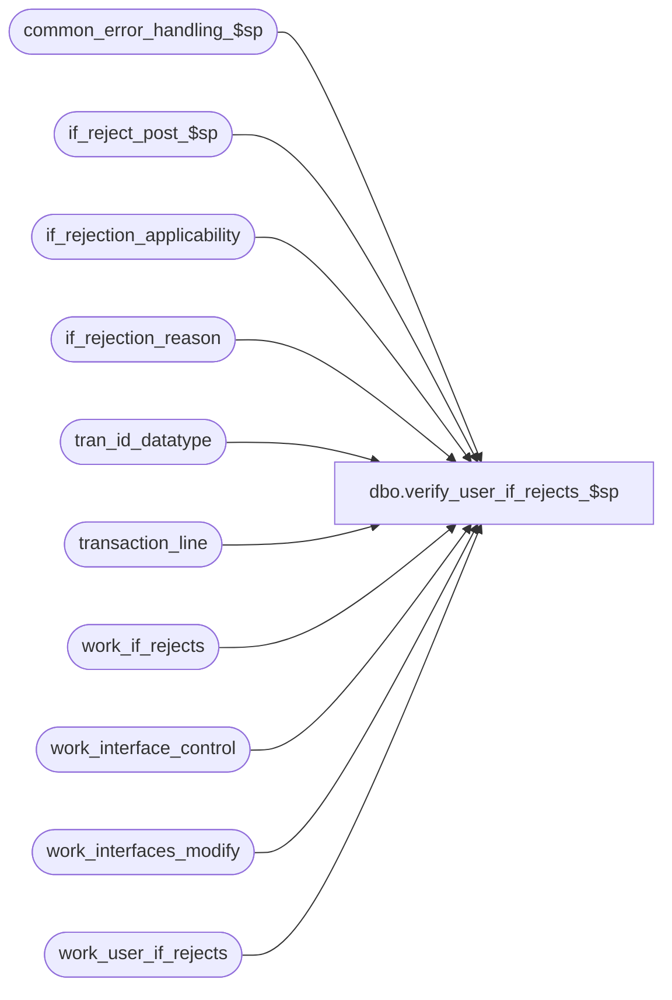

# dbo.verify_user_if_rejects_$sp

**Database:** auditworks_external  
**Server:** bedrockdb01  

## Architecture Diagram



## Table Dependencies

| Referenced Table |
|---|
| common_error_handling_$sp |
| if_reject_post_$sp |
| if_rejection_applicability |
| if_rejection_reason |
| tran_id_datatype |
| transaction_line |
| work_if_rejects |
| work_interface_control |
| work_interfaces_modify |
| work_user_if_rejects |

## Stored Procedure Code

```sql
create proc [dbo].[verify_user_if_rejects_$sp] 
@process_id	 	        binary(16),
@user_id                        int,
@transaction_id			tran_id_datatype,
@errmsg				nvarchar(255) OUTPUT,
@allow_saving_if_rejects	tinyint = 1,
@copy_transaction_id		tran_id_datatype = NULL			

AS

/*

PROC NAME: verify_user_if_rejects_$sp
     DESC: This routine will verify if there are User Defined IF Rejects.
     	   If there are rejects, then populate the if_rejection_reason table
     	   from the work_user_if_rejects table.
           Called by modify_interface_$sp, verify_transaction_$sp. 

HISTORY:

Date     Name        Def# Desc
Feb03,11 Vicci     124563 Don't use @rdbms_process_id since the dynamic sql generated by the UI is now correct.
			  Don't allow modifications to be saved if they would cause a previously valid transaction
			  to become an I/F Reject.
Jul05,05 Paul     DV-1239 use @rdbms_process_id to match dynamic sql, populate work_if_reject in this proc
Sep22,04 Paul     DV-1146 receive user_id
Apr23,04 Maryam   DV-1071 Modified to receive @user_name and @process_id as input parameters
			  and pass it to the subprocs
May10,02 Paul     1-CD0IX added R3 error handling
Mar06,02 Henry    1-BG8Z5 Only verifies applicable I/F rejects setup in if_rejection_applicability.
May04,01 Henry       7369 Author.

*/

DECLARE
  @errno		int,
  @rows			int,
  @message_id		int,
  @object_name		nvarchar(255),
  @process_name		nvarchar(100),
  @operation_name	nvarchar(100),
  @if_reject_reason	smallint
  
SELECT @process_name = 'verify_user_if_rejects_$sp',
	@message_id = 201068

DELETE work_if_rejects
 WHERE process_id = @process_id
SELECT @errno = @@error 
IF @errno != 0 
BEGIN 
  SELECT @errmsg = 'Failed to DELETE work_if_rejects',
         @object_name = 'work_if_rejects',
         @operation_name = 'DELETE' 
  GOTO error 
END 

INSERT work_if_rejects (
       process_id,
       transaction_id,
       if_reject_reason )
SELECT @process_id, @transaction_id, 0
SELECT @errno = @@error
IF @errno != 0
BEGIN
  SELECT @errmsg = 'Failed to INSERT work_if_rejects',
         @object_name = 'work_if_rejects',
         @operation_name = 'INSERT' 
  GOTO error
END

EXEC if_reject_post_$sp @process_id, @user_id, @errmsg OUTPUT
SELECT @errno = @@error
IF @errno <> 0
BEGIN
  IF @errmsg IS NULL
    SELECT @errmsg = 'Failed to execute stored procedure if_reject_post_$sp'
  SELECT @object_name = 'if_reject_post_$sp',
         @operation_name = 'EXECUTE'
  GOTO error
END

UPDATE work_interfaces_modify
   SET interface_status = 99 
  FROM work_user_if_rejects wu,
       work_interfaces_modify wi, 
       if_rejection_applicability ir
 WHERE wi.process_id = @process_id
   AND wu.process_id = @process_id
   AND wu.if_reject_reason = ir.if_reject_reason
   AND wi.interface_id = ir.interface_id
SELECT @errno = @@error,
       @rows = @@rowcount
IF @errno != 0
BEGIN
  SELECT @errmsg = 'Failed to update work_interfaces_modify',
         @object_name = 'work_interfaces_modify',
         @operation_name = 'UPDATE'
  GOTO error
END

IF @rows > 0
BEGIN
  INSERT if_rejection_reason (
	 process_id,
	 transaction_id,
	 line_id,
	 if_reject_reason)
  SELECT DISTINCT @process_id,
	 wu.transaction_id,
	 wu.line_id,
	 wu.if_reject_reason
    FROM work_user_if_rejects wu,
	 work_interfaces_modify wi,
	 if_rejection_applicability ir
   WHERE wu.process_id = @process_id
     AND wu.transaction_id = @transaction_id
     AND wi.process_id = @process_id
     AND wu.if_reject_reason = ir.if_reject_reason
     AND wi.interface_id = ir.interface_id
  SELECT @errno = @@error
  IF @errno != 0
  BEGIN
    SELECT @errmsg = 'Failed to insert if_rejection_reason',
           @object_name = 'if_rejection_reason',
           @operation_name = 'INSERT'
    GOTO error
  END

  UPDATE transaction_line
     SET interface_rejection_flag = 1
    FROM work_user_if_rejects wu, transaction_line tl
   WHERE wu.process_id = @process_id
     AND wu.transaction_id = @transaction_id
     AND tl.transaction_id = wu.transaction_id
     AND tl.line_id = wu.line_id
  SELECT @errno = @@error
  IF @errno != 0
  BEGIN
    SELECT @errmsg = 'Failed to update transaction_line',
           @object_name = 'transaction_line',
           @operation_name = 'UPDATE'
    GOTO error
  END

  IF @allow_saving_if_rejects = 0
  BEGIN
    SELECT @if_reject_reason = MIN(wu.if_reject_reason)
      FROM work_user_if_rejects wu WITH (NOLOCK),
           work_interfaces_modify wi WITH (NOLOCK), 
           if_rejection_applicability ir WITH (NOLOCK),
           work_interface_control wc WITH (NOLOCK)
     WHERE wi.process_id = @process_id
       AND wu.process_id = @process_id
       AND wu.if_reject_reason = ir.if_reject_reason
       AND wi.interface_id = ir.interface_id
       AND wi.interface_id = wc.interface_id
       AND wc.if_entry_no = @copy_transaction_id
       AND wc.interface_status_flag != 99
       AND wc.process_id = @process_id 
    SELECT @errno = @@error
    IF @errno != 0
    BEGIN
      SELECT @errmsg = 'Failed to determine which user-defined I/F Reject rule is preventing save of modifications',
             @object_name = 'work_user_if_rejects',
             @operation_name = 'SELECT'
      GOTO error
    END

    IF @if_reject_reason IS NOT NULL
    BEGIN
      SELECT @errmsg = 'This transaction does not pass rule ' + convert(nvarchar, @if_reject_reason) + ' User-defined Interface Rejection criteria.  Cannot save changes.', 
             @errno = 202004
      GOTO error
    END
  END --IF @allow_saving_if_rejects = 0
END -- IF @rows > 0 

DELETE work_if_rejects
 WHERE process_id = @process_id
SELECT @errno = @@error 
IF @errno != 0 
BEGIN 
  SELECT @errmsg = 'Failed to delete work_if_rejects',
         @object_name = 'work_if_rejects',
         @operation_name = 'DELETE'
  GOTO error
END 

DELETE work_user_if_rejects
 WHERE process_id = @process_id
SELECT @errno = @@error 
IF @errno != 0 
BEGIN 
  SELECT @errmsg = 'Failed to delete work_user_if_rejects',
         @object_name = 'work_user_if_rejects',
         @operation_name = 'DELETE'
  GOTO error
END 

RETURN

error:   /* Common error handler. */
       DELETE work_if_rejects
        WHERE process_id = @process_id
       DELETE work_user_if_rejects
        WHERE process_id = @process_id

	EXEC common_error_handling_$sp 100, @errno, @errmsg, 0, @message_id, 
	  @process_name, @object_name, @operation_name, 0, 1, 0, null, 0,
	  null, null, null, null, null, null, 0, @process_id, @user_id
	RETURN
```

