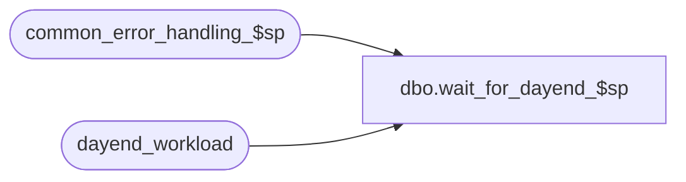

# dbo.wait_for_dayend_$sp

**Database:** auditworks_external  
**Server:** bedrockdb01  

## Architecture Diagram



## Table Dependencies

| Referenced Table |
|---|
| common_error_handling_$sp |
| dayend_workload |

## Stored Procedure Code

```sql
create proc [dbo].[wait_for_dayend_$sp]  
@QueueID 	int, 
@object_id	int = null --

AS

/*
PROC NAME:  wait_for_dayend_$sp
     DESC: Called by Smartview post-audit exports.  This proc will indicate to Smartview
           that the post-audit interfaces are complete and the interface file be released.
HISTORY :
Date     Name	    Def# Desc
May17,02 Paul    1-CD0IX added R3 error handling
Aug10,01 Shapoor    8479 Release the post-audit interface files after the day_end_post_audit_$sp
                          procedure has completed.  No need to wait for the entire dayend to complete.                      
Jun11,01 Winnie     8096 Add object_id as an input value for Smartlook 4.0
*/

DECLARE 
  @stores_left                            int,
  @post_audit_interface_complete         tinyint,
  @message_id				int,
  @object_name				nvarchar(255),
  @process_name				nvarchar(100),
  @operation_name			nvarchar(100),
  @errmsg				nvarchar(255),
  @errno				int

  SELECT @post_audit_interface_complete = 0,
           @stores_left = 0,
           @process_name = 'wait_for_dayend_$sp',
           @message_id = 201068

  SELECT @stores_left = COUNT(*)
    FROM dayend_workload
   WHERE store_audit_status = 301

  SELECT @errno = @@error
  IF @errno != 0
  BEGIN
    SELECT @errmsg = 'Failed to select from dayend_workload',
         @object_name = 'dayend_workload',
         @operation_name = 'SELECT'
    GOTO error
  END

  IF @stores_left = 0 
    SELECT @post_audit_interface_complete = 1
  ELSE
    SELECT @post_audit_interface_complete = 0

RETURN @post_audit_interface_complete

error:   /* Common error handler. */

	EXEC common_error_handling_$sp 251, @errno, @errmsg, 0, @message_id, 
	  @process_name, @object_name, @operation_name
	RETURN 0
```

