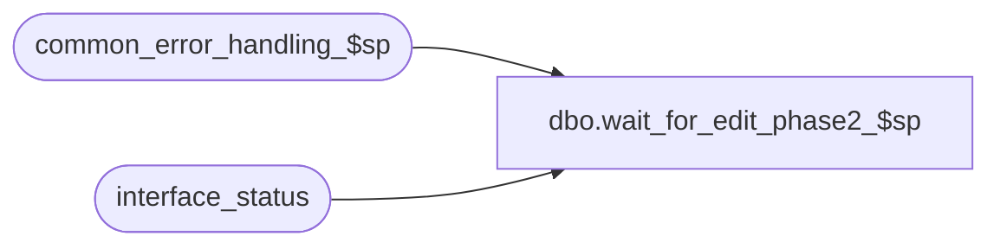

# dbo.wait_for_edit_phase2_$sp

**Database:** auditworks_external  
**Server:** bedrockdb01  

## Architecture Diagram



## Table Dependencies

| Referenced Table |
|---|
| common_error_handling_$sp |
| interface_status |

## Stored Procedure Code

```sql
create proc [dbo].[wait_for_edit_phase2_$sp] 
@interface_id 	tinyint,
@object_id	int = null --

AS

/* 
PROC NAME: wait_for_edit_phase2_$sp
    DESC: This procedure is created to wait for the completion of Edit Phase2
HISTORY :
Date     Name           Def# Desc
May17,02 Paul        1-CD0IX added R3 error handling
Jun11,01 Winnie         8096 add object_id as an input value for Smartlook 4.0
Jan21,00 Maryam         5872 Author
*/

DECLARE
  @edit_phase2_complete			tinyint, 
  @posting_in_progress			tinyint,
  @message_id				int,
  @object_name				nvarchar(255),
  @process_name				nvarchar(100),
  @operation_name			nvarchar(100),
  @errmsg				nvarchar(255),
  @errno				int

  SELECT  @edit_phase2_complete = 0,
           @posting_in_progress = 0,
           @process_name = 'wait_for_edit_phase2_$sp',
           @message_id = 201068

  SELECT @posting_in_progress = posting_in_progress
    FROM interface_status
   WHERE interface_id = @interface_id

  SELECT @errno = @@error
  IF @errno != 0
  BEGIN
    SELECT @errmsg = 'Failed to select from interface_status',
         @object_name = 'interface_status',
         @operation_name = 'SELECT'
    GOTO error
  END
     
  IF @posting_in_progress = 3 
    SELECT @edit_phase2_complete = 1
  ELSE
    SELECT @edit_phase2_complete = 0
     	
RETURN @edit_phase2_complete

error:   /* Common error handler. */

	EXEC common_error_handling_$sp 251, @errno, @errmsg, 0, @message_id, 
	  @process_name, @object_name, @operation_name
	RETURN 0
```

