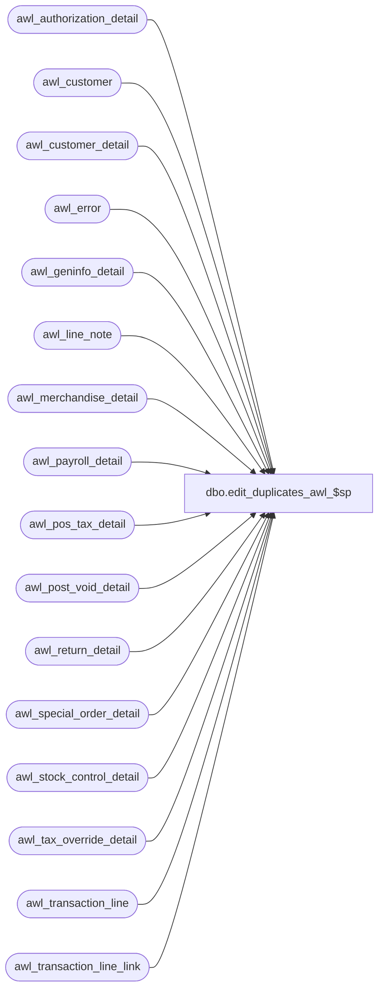

# dbo.edit_duplicates_awl_$sp

**Database:** auditworks_work  
**Server:** bedrockdb01  

## Architecture Diagram



## Table Dependencies

| Referenced Table |
|---|
| awl_authorization_detail |
| awl_customer |
| awl_customer_detail |
| awl_error |
| awl_geninfo_detail |
| awl_line_note |
| awl_merchandise_detail |
| awl_payroll_detail |
| awl_pos_tax_detail |
| awl_post_void_detail |
| awl_return_detail |
| awl_special_order_detail |
| awl_stock_control_detail |
| awl_tax_override_detail |
| awl_transaction_line |
| awl_transaction_line_link |

## Stored Procedure Code

```sql
create proc dbo.edit_duplicates_awl_$sp 
@violated_sareject_rule smallint           
AS

/* 
Proc Name: edit_duplicates_<transl_>$sp
DESCRIPTION: 
Description: To ignore duplicate lines ( caused by translate error ) and recover
   the rest of the transactions in the batch. Value = -1, revaluate all tables for duplicate entries.
   Called by edit_create_index_transl_$sp.

HISTORY
Date	 Name	  Def#	  Desc
Jun29,15 Vicci TFS-127298 Handle auto-config requests for customer_detail (where customer info-type is -3)
Dec17,13 Paul      145958 use try .. catch, use new raiserror for compatability with SQL 2012.
Apr12,06 Daphna     70743 Restructure, add more info to log (uplift from 70677)
Sep15,05 David      60266 Retrofit defect dv-1202.
May04,05 David    DV-1202 Handle transl_geninfo_detail and transl_transaction_line_link.
Mar23,05 Maryam   DV-1202 Rename from_line_id to line_id.
Mar18,05 David    DV-1202 Change index on transl_stock_control_detail.
Jul01,04 Vicci    29561   Handle transl_pos_tax_detail
Sep25,03 Sab	  15379/15482/15484 Correctly delete attachment lines when duplicate lines are encountered in a pollfile.
Nov25,02 HenryW   1-FVT15 Pass in new value to evaluate all work tables.
			  Also improve performance of duplicate handling logic by removing the cursor.
Nov09,01 Paul	  8900	  author

*/

DECLARE @customer_role		smallint,
	@customer_info_type	smallint,
	@entry_date_time	datetime,
	@errmsg			nvarchar(255),
	@errno			int,
	@line_id                numeric(5,0),
	@min_sequence_no        numeric(12,0),
	@note_type              smallint,
	@process_name		nvarchar(30),
	@register_no		smallint,
	@rows			int,
	@store_no		int,
	@tax_level		tinyint,
	@trace_msg		nvarchar(255),	
	@transaction_no		int,
	@transaction_series	nchar(1),
	@translate_msg		nvarchar(255);

SELECT @process_name = 'edit_duplicates<transl_>$sp',
	 @errmsg = 'Failed to create temp table #work_lines_edit';
BEGIN TRY

CREATE TABLE #work_lines_edit (
	store_no		int not null,
	register_no		smallint not null,
	entry_date_time		datetime not null,
	transaction_series	nchar(1) not null,
	transaction_no		int not null,
	line_id			numeric(5,0) not null,
	note_type		smallint null,
	customer_role		smallint null,
	customer_info_type	smallint null,
        lookup_pos_code		nvarchar(20) null, 
	tax_level		tinyint null,
	line_count		int not null,
	min_sequence_no		numeric(12,0) not null,
	violated_sareject_rule  int not null,
	file_name		nvarchar(30) not null,
	tax_rate_id             numeric(12,0) null,
	tax_jurisdiction_id	numeric(10,0) null,
	display_def_id		smallint null,
	form_name		nvarchar(255) null,
	field_name		nvarchar(255) null,
	linked_line_id		numeric(5,0) null );

SELECT	@errno = 0,
	@translate_msg = 'Duplicate lines from the translate were skipped by the edit.';

IF (@violated_sareject_rule = 50 OR @violated_sareject_rule = -1)
BEGIN
    SELECT @errmsg = 'Failed to insert duplicate rows in #work_lines_edit for awl_transaction_line';
  INSERT #work_lines_edit (
	store_no,
	register_no,
	entry_date_time,
	transaction_series,
	transaction_no, 
	line_id,
	line_count,
	min_sequence_no,
	violated_sareject_rule,
	file_name )
  SELECT
	store_no,
	register_no,
	entry_date_time,
	transaction_series,
	transaction_no,
	line_id,
	COUNT(line_id),
	MIN(row_sequence_no),
	50,
	'awl_transaction_line'
  FROM awl_transaction_line
  GROUP BY store_no, register_no, entry_date_time, transaction_series, transaction_no, line_id
  HAVING COUNT(line_id) > 1;

     SELECT @errmsg = 'Failed to delete duplicate rows from awl_transaction_line';
  DELETE awl_transaction_line
   FROM awl_transaction_line al, #work_lines_edit we
  WHERE al.store_no = we.store_no
    AND al.register_no = we.register_no
    AND al.entry_date_time = we.entry_date_time
    AND al.transaction_series = we.transaction_series
    AND al.transaction_no = we.transaction_no 
    AND al.line_id = we.line_id
    AND we.line_count > 1
    AND al.row_sequence_no > we.min_sequence_no 
    AND violated_sareject_rule = 50;

  SELECT @rows = @@rowcount;

  -- log message re dupes   
  IF @rows > 0 
  BEGIN
    SELECT @trace_msg = CHAR(13) + CHAR(10) + ':LOG && duplicates found and deleted from awl_transaction_line ';
    PRINT @trace_msg;   
  END;  

END; /* @violated_sareject_rule = 50 */

IF (@violated_sareject_rule = 41 OR @violated_sareject_rule = -1)
BEGIN
    SELECT @errmsg = 'Failed to insert duplicate rows in #work_lines_edit for awl_merchandise_detail';
  INSERT #work_lines_edit (
	store_no,
	register_no,
	entry_date_time,
	transaction_series,
	transaction_no,
	line_id,
	line_count,
	min_sequence_no,
	violated_sareject_rule,
	file_name )
  SELECT
	store_no,
	register_no,
	entry_date_time,
	transaction_series,
	transaction_no,
	line_id,
	COUNT(line_id),
	MIN(row_sequence_no),
	41,
	'awl_merchandise_detail'
  FROM awl_merchandise_detail
  GROUP BY store_no, register_no, entry_date_time, transaction_series, transaction_no, line_id
  HAVING COUNT(line_id) > 1;

     SELECT @errmsg = 'Failed to delete duplicate rows from awl_merchandise_detail';
  DELETE awl_merchandise_detail
    FROM awl_merchandise_detail am, #work_lines_edit we
   WHERE am.store_no = we.store_no
     AND am.register_no = we.register_no
     AND am.entry_date_time = we.entry_date_time
     AND am.transaction_series = we.transaction_series
     AND am.transaction_no = we.transaction_no 
     AND am.line_id = we.line_id
     AND we.line_count > 1
     AND am.row_sequence_no > we.min_sequence_no 
     AND violated_sareject_rule = 41;
     
  SELECT @rows = @@rowcount;

  -- log message re dupes   
  IF @rows > 0 
  BEGIN
    SELECT @trace_msg = CHAR(13) + CHAR(10) + ':LOG && duplicates found and deleted from awl_merchandise_detail '; 
    PRINT @trace_msg;
  END; 

END; /* @violated_sareject_rule = 41 */

IF (@violated_sareject_rule = 42 OR @violated_sareject_rule = -1)
BEGIN
    SELECT @errmsg = 'Failed to insert duplicate rows in #work_lines_edit for awl_authorization_detail';
  INSERT #work_lines_edit (
	store_no,
	register_no,
	entry_date_time,
	transaction_series,
	transaction_no,
	line_id,
	line_count,
	min_sequence_no,
	violated_sareject_rule,
	file_name )
  SELECT
	store_no,
	register_no,
	entry_date_time,
	transaction_series,
	transaction_no,
	line_id,
	COUNT(line_id),
	MIN(row_sequence_no),
	42,
	'awl_authorization_detail'
  FROM awl_authorization_detail
  GROUP BY store_no, register_no, entry_date_time, transaction_series, transaction_no, line_id
  HAVING COUNT(line_id) > 1;

     SELECT @errmsg = 'Failed to delete duplicate rows from awl_authorization_detail';
  DELETE awl_authorization_detail
    FROM awl_authorization_detail ad, #work_lines_edit we
   WHERE ad.store_no = we.store_no
     AND ad.register_no = we.register_no
     AND ad.entry_date_time = we.entry_date_time
     AND ad.transaction_series = we.transaction_series
     AND ad.transaction_no = we.transaction_no 
     AND ad.line_id = we.line_id
     AND we.line_count > 1
     AND ad.row_sequence_no > we.min_sequence_no 
     AND violated_sareject_rule = 42;

  SELECT @rows = @@rowcount;

  -- log message re dupes   
  IF @rows > 0 
  BEGIN
    SELECT @trace_msg = CHAR(13) + CHAR(10) + ':LOG && duplicates found and deleted from awl_authorization_detail ';
    PRINT @trace_msg;  
  END;
  
END; /* @violated_sareject_rule = 42 */

IF (@violated_sareject_rule = 43 OR @violated_sareject_rule = -1)
BEGIN
    SELECT @errmsg = 'Failed to insert duplicate rows in #work_lines_edit for awl_stock_control_detail';
  INSERT #work_lines_edit (
	store_no,
	register_no,
	entry_date_time,
	transaction_series,
	transaction_no,
	line_id,
	display_def_id,
	line_count,
	min_sequence_no,
	violated_sareject_rule,
	file_name )
  SELECT
	store_no,
	register_no,
	entry_date_time,
	transaction_series,
	transaction_no,
	line_id,
	display_def_id,
	COUNT(line_id),
	MIN(row_sequence_no),
	43,
	'awl_stock_control_detail'
  FROM awl_stock_control_detail
  GROUP BY store_no, register_no, entry_date_time, transaction_series, transaction_no, line_id, display_def_id
  HAVING COUNT(line_id) > 1;

     SELECT @errmsg = 'Failed to delete duplicate rows from awl_stock_control_detail';
  DELETE awl_stock_control_detail
    FROM awl_stock_control_detail ac, #work_lines_edit we
   WHERE ac.store_no = we.store_no
     AND ac.register_no = we.register_no
     AND ac.entry_date_time = we.entry_date_time
     AND ac.transaction_series = we.transaction_series
     AND ac.transaction_no = we.transaction_no 
     AND ac.line_id = we.line_id
     AND ac.display_def_id = we.display_def_id
     AND we.line_count > 1
     AND ac.row_sequence_no > we.min_sequence_no 
     AND violated_sareject_rule = 43;

  SELECT @rows = @@rowcount;

  -- log message re dupes   
  IF @rows > 0 
  BEGIN
    SELECT @trace_msg = CHAR(13) + CHAR(10) + ':LOG && duplicates found and deleted from awl_stock_control_detail ';
    PRINT @trace_msg; 
  END;  
END; /* @violated_sareject_rule = 43 */
   
IF (@violated_sareject_rule = 44 OR @violated_sareject_rule = -1)
BEGIN
    SELECT @errmsg = 'Failed to insert duplicate rows in #work_lines_edit for awl_special_order_detail';
  INSERT #work_lines_edit (
	store_no,
	register_no,
	entry_date_time,
	transaction_series,
	transaction_no,
	line_id,
	line_count,
	min_sequence_no,
	violated_sareject_rule,
	file_name )
  SELECT
	store_no,
	register_no,
	entry_date_time,
	transaction_series,
	transaction_no,
	line_id,
	COUNT(line_id),
	MIN(row_sequence_no),
	44,
	'awl_special_order_detail'
  FROM awl_special_order_detail
  GROUP BY store_no, register_no, entry_date_time, transaction_series, transaction_no, line_id
  HAVING COUNT(line_id) > 1;

     SELECT @errmsg = 'Failed to delete duplicate rows from awl_special_order_detail';     
  DELETE awl_special_order_detail
    FROM awl_special_order_detail ao, #work_lines_edit we
   WHERE ao.store_no = we.store_no
     AND ao.register_no = we.register_no
     AND ao.entry_date_time = we.entry_date_time
     AND ao.transaction_series = we.transaction_series
     AND ao.transaction_no = we.transaction_no 
     AND ao.line_id = we.line_id
     AND we.line_count > 1
     AND ao.row_sequence_no > we.min_sequence_no 
     AND violated_sareject_rule = 44;
     
  SELECT @rows = @@rowcount;

  -- log message re dupes   
  IF @rows > 0 
  BEGIN
    SELECT @trace_msg = CHAR(13) + CHAR(10) + ':LOG && duplicates found and deleted from awl_special_order_detail ';
    PRINT @trace_msg; 
  END;  
  
END; /* @violated_sareject_rule = 44 */

IF (@violated_sareject_rule = 45 OR @violated_sareject_rule = -1)
BEGIN
    SELECT @errmsg = 'Failed to insert duplicate rows in #work_lines_edit for awl_post_void_detail';
  INSERT #work_lines_edit (
	store_no,
	register_no,
	entry_date_time,
	transaction_series,
	transaction_no,
	line_id,
	line_count,
	min_sequence_no,
	violated_sareject_rule,
	file_name )
  SELECT
	store_no,
	register_no,
	entry_date_time,
	transaction_series,
	transaction_no,
	line_id,
	COUNT(line_id),
	MIN(row_sequence_no),
	45,
	'awl_post_void_detail'
  FROM awl_post_void_detail
  GROUP BY store_no, register_no, entry_date_time, transaction_series, transaction_no, line_id
  HAVING COUNT(line_id) > 1;

     SELECT @errmsg = 'Failed to delete duplicate rows from awl_post_void_detail';
  DELETE awl_post_void_detail
    FROM awl_post_void_detail ap, #work_lines_edit we
   WHERE ap.store_no = we.store_no
     AND ap.register_no = we.register_no
     AND ap.entry_date_time = we.entry_date_time
     AND ap.transaction_series = we.transaction_series
     AND ap.transaction_no = we.transaction_no 
     AND ap.line_id = we.line_id
     AND we.line_count > 1
     AND ap.row_sequence_no > we.min_sequence_no 
     AND violated_sareject_rule = 45;
  
  SELECT @rows = @@rowcount;

  -- log message re dupes   
  IF @rows > 0 
  BEGIN
    SELECT @trace_msg = CHAR(13) + CHAR(10) + ':LOG && duplicates found and deleted from awl_post_void_detail ';
    PRINT @trace_msg;  
  END;  

END;/* @violated_sareject_rule = 45 */

IF (@violated_sareject_rule = 46 OR @violated_sareject_rule = -1)
BEGIN
    SELECT @errmsg = 'Failed to insert duplicate rows in #work_lines_edit for awl_payroll_detail';
  INSERT #work_lines_edit (
	store_no,
	register_no,
	entry_date_time,
	transaction_series,
	transaction_no,
	line_id,
	line_count,
	min_sequence_no,
	violated_sareject_rule,
	file_name )
  SELECT
	store_no,
	register_no,
	entry_date_time,
	transaction_series,
	transaction_no,
	line_id,
	COUNT(line_id),
	MIN(row_sequence_no),
	46,
	'awl_payroll_detail'
  FROM awl_payroll_detail
  GROUP BY store_no, register_no, entry_date_time, transaction_series, transaction_no, line_id
  HAVING COUNT(line_id) > 1;

    SELECT @errmsg = 'Failed to delete duplicate rows from awl_payroll_detail';
  DELETE awl_payroll_detail
    FROM awl_payroll_detail ay, #work_lines_edit we
   WHERE ay.store_no = we.store_no
     AND ay.register_no = we.register_no
     AND ay.entry_date_time = we.entry_date_time
     AND ay.transaction_series = we.transaction_series
     AND ay.transaction_no = we.transaction_no 
     AND ay.line_id = we.line_id
     AND we.line_count > 1
     AND ay.row_sequence_no > we.min_sequence_no 
     AND violated_sareject_rule = 46;

  SELECT @rows = @@rowcount;

  -- log message re dupes   
  IF @rows > 0 
  BEGIN
    SELECT @trace_msg = CHAR(13) + CHAR(10) + ':LOG && duplicates found and deleted from awl_payroll_detail ';
    PRINT @trace_msg;  
  END;  

END; /* @violated_sareject_rule = 46 */

IF (@violated_sareject_rule = 48 OR @violated_sareject_rule = -1)
BEGIN
    SELECT @errmsg = 'Failed to insert duplicate rows in #work_lines_edit for awl_tax_override_detail';
  INSERT #work_lines_edit (
	store_no,
	register_no,
	entry_date_time,
	transaction_series,
	transaction_no,
	line_id,
	tax_level,
	line_count,
	min_sequence_no,
	violated_sareject_rule,
	file_name )
  SELECT
	store_no,
	register_no,
	entry_date_time,
	transaction_series,
	transaction_no,
	line_id,
	tax_level,
	COUNT(line_id),
	MIN(row_sequence_no),
	48,
	'awl_tax_override_detail'
  FROM awl_tax_override_detail
  GROUP BY store_no, register_no, entry_date_time, transaction_series, transaction_no, line_id, tax_level
  HAVING COUNT(line_id) > 1;

     SELECT @errmsg = 'Failed to delete duplicate rows from awl_tax_override_detail';
  DELETE awl_tax_override_detail
    FROM awl_tax_override_detail ax, #work_lines_edit we
   WHERE ax.store_no = we.store_no
     AND ax.register_no = we.register_no
     AND ax.entry_date_time = we.entry_date_time
     AND ax.transaction_series = we.transaction_series
     AND ax.transaction_no = we.transaction_no 
     AND ax.line_id = we.line_id
     AND ax.tax_level = we.tax_level
     AND we.line_count > 1
     AND ax.row_sequence_no > we.min_sequence_no 
     AND violated_sareject_rule = 48;

  SELECT @rows = @@rowcount;

  -- log message re dupes   
  IF @rows > 0 
  BEGIN
    SELECT @trace_msg = CHAR(13) + CHAR(10) + ':LOG && duplicates found and deleted from awl_tax_override_detail '; 
    PRINT @trace_msg;   
  END;  

END; /* @violated_sareject_rule = 48 */

IF (@violated_sareject_rule = 49 OR @violated_sareject_rule = -1)
BEGIN
    SELECT @errmsg = 'Failed to insert duplicate rows in #work_lines_edit for awl_return_detail';
  INSERT #work_lines_edit (
	store_no,
	register_no,
	entry_date_time,
	transaction_series,
	transaction_no,
	line_id,
	line_count,
	min_sequence_no,
	violated_sareject_rule,
	file_name )
  SELECT
	store_no,
	register_no,
	entry_date_time,
	transaction_series,
	transaction_no,
	line_id,
	COUNT(line_id),
	MIN(row_sequence_no),
	49,
	'awl_return_detail'
  FROM awl_return_detail
  GROUP BY store_no, register_no, entry_date_time, transaction_series, transaction_no, line_id
  HAVING COUNT(line_id) > 1;

    SELECT @errmsg = 'Failed to delete duplicate rows from awl_return_detail';
  DELETE awl_return_detail
    FROM awl_return_detail ar, #work_lines_edit we
   WHERE ar.store_no = we.store_no
     AND ar.register_no = we.register_no
     AND ar.entry_date_time = we.entry_date_time
     AND ar.transaction_series = we.transaction_series
     AND ar.transaction_no = we.transaction_no 
     AND ar.line_id = we.line_id
     AND we.line_count > 1
     AND ar.row_sequence_no > we.min_sequence_no 
     AND violated_sareject_rule = 49;

  SELECT @rows = @@rowcount;
 
  -- log message re dupes   
  IF @rows > 0 
  BEGIN
    SELECT @trace_msg = CHAR(13) + CHAR(10) + ':LOG && duplicates found and deleted from awl_return_detail '; 
    PRINT @trace_msg;   
  END;  
  
END; /* @violated_sareject_rule = 49 */

IF (@violated_sareject_rule = 51 OR @violated_sareject_rule = -1)
BEGIN
    SELECT @errmsg = 'Failed to insert duplicate rows in #work_lines_edit for awl_customer';
  INSERT #work_lines_edit (
	store_no,
	register_no,
	entry_date_time,
	transaction_series,
	transaction_no,
	line_id,
	customer_role,
	line_count,
	min_sequence_no,
	violated_sareject_rule,
	file_name )
  SELECT
	store_no,
	register_no,
	entry_date_time,
	transaction_series,
	transaction_no,
	line_id,
	customer_role,
	COUNT(line_id),
	MIN(row_sequence_no),
	51,
	'awl_customer'
  FROM awl_customer
  GROUP BY store_no, register_no, entry_date_time, transaction_series, transaction_no, line_id, customer_role
  HAVING COUNT(line_id) > 1;

     SELECT @errmsg = 'Failed to delete duplicate rows from awl_customer';     
  DELETE awl_customer
    FROM awl_customer ac, #work_lines_edit we
   WHERE ac.store_no = we.store_no
     AND ac.register_no = we.register_no
     AND ac.entry_date_time = we.entry_date_time
     AND ac.transaction_series = we.transaction_series
     AND ac.transaction_no = we.transaction_no 
     AND ac.line_id = we.line_id
     AND ac.customer_role = we.customer_role
     AND we.line_count > 1
     AND ac.row_sequence_no > we.min_sequence_no 
     AND violated_sareject_rule = 51;

  SELECT @rows = @@rowcount;

  -- log message re dupes   
  IF @rows > 0 
  BEGIN
    SELECT @trace_msg = CHAR(13) + CHAR(10) + ':LOG && duplicates found and deleted from awl_customer '; 
    PRINT @trace_msg;   
  END;
   
END; /* @violated_sareject_rule = 51 */

IF (@violated_sareject_rule = 52 OR @violated_sareject_rule = -1)
BEGIN
    SELECT @errmsg = 'Failed to insert duplicate rows in #work_lines_edit for awl_customer_detail';
  INSERT #work_lines_edit (
	store_no,
	register_no,
	entry_date_time,
	transaction_series,
	transaction_no,
	line_id,
	customer_role,
	customer_info_type,
        lookup_pos_code,
	line_count,
	min_sequence_no,
	violated_sareject_rule,
	file_name )
  SELECT
	store_no,
	register_no,
	entry_date_time,
	transaction_series,
	transaction_no,
	line_id,
	customer_role,
	customer_info_type,
        CASE WHEN customer_info_type = -3 THEN lookup_pos_code ELSE 'N/A' END,
	COUNT(line_id),
	MIN(row_sequence_no),
	52,
	'awl_customer_detail'
  FROM awl_customer_detail
  GROUP BY store_no, register_no, entry_date_time, transaction_series, transaction_no, 
	line_id, customer_role, customer_info_type, CASE WHEN customer_info_type = -3 THEN lookup_pos_code ELSE 'N/A' END
  HAVING COUNT(line_id) > 1;

     SELECT @errmsg = 'Failed to delete duplicate rows from awl_customer_detail';
  DELETE awl_customer_detail
    FROM awl_customer_detail ai, #work_lines_edit we
   WHERE ai.store_no = we.store_no
     AND ai.register_no = we.register_no
     AND ai.entry_date_time = we.entry_date_time
     AND ai.transaction_series = we.transaction_series
     AND ai.transaction_no = we.transaction_no 
     AND ai.line_id = we.line_id
     AND ai.customer_role = we.customer_role
     AND ai.customer_info_type = we.customer_info_type
     AND CASE WHEN ai.customer_info_type = -3 THEN ai.lookup_pos_code ELSE 'N/A' END = we.lookup_pos_code
     AND we.line_count > 1
     AND ai.row_sequence_no > we.min_sequence_no 
     AND violated_sareject_rule = 52;
     
  SELECT @rows = @@rowcount;

  -- log message re dupes   
  IF @rows > 0 
  BEGIN
    SELECT @trace_msg = CHAR(13) + CHAR(10) + ':LOG && duplicates found and deleted from awl_customer_detail '; 
    PRINT @trace_msg;   
  END;  

END; /* @violated_sareject_rule = 52 */

IF (@violated_sareject_rule = 53 OR @violated_sareject_rule = -1)
BEGIN
    SELECT @errmsg = 'Failed to insert duplicate rows in #work_lines_edit for awl_line_note';
  INSERT #work_lines_edit (
	store_no,
	register_no,
	entry_date_time,
	transaction_series,
	transaction_no,
	line_id,
	note_type,
	line_count,
	min_sequence_no,
	violated_sareject_rule,
	file_name )
  SELECT
	store_no,
	register_no,
	entry_date_time,
	transaction_series,
	transaction_no,
	line_id,
	note_type,
	COUNT(line_id),
	MIN(row_sequence_no),
	53,
	'awl_line_note'
  FROM awl_line_note
  GROUP BY store_no, register_no, entry_date_time, transaction_series, transaction_no, line_id, note_type
  HAVING COUNT(line_id) > 1;

     SELECT @errmsg = 'Failed to delete duplicate rows from awl_line_note';
  DELETE awl_line_note
    FROM awl_line_note an, #work_lines_edit we
   WHERE an.store_no = we.store_no
     AND an.register_no = we.register_no
     AND an.entry_date_time = we.entry_date_time
     AND an.transaction_series = we.transaction_series
     AND an.transaction_no = we.transaction_no 
     AND an.line_id = we.line_id
     AND an.note_type = we.note_type
     AND we.line_count > 1
     AND an.row_sequence_no > we.min_sequence_no 
     AND violated_sareject_rule = 53;

  SELECT @rows = @@rowcount;

  -- log message re dupes   
  IF @rows > 0 
  BEGIN
    SELECT @trace_msg = CHAR(13) + CHAR(10) + ':LOG && duplicates found and deleted from awl_line_note ';
    PRINT @trace_msg;   
  END;       

END; /* @violated_sareject_rule = 53 */

IF (@violated_sareject_rule = 54 OR @violated_sareject_rule = -1)
BEGIN
    SELECT @errmsg = 'Failed to insert duplicate rows in #work_lines_edit for  ' + 'awl_pos_tax_detail';
  INSERT #work_lines_edit (
	store_no,
	register_no,
	entry_date_time,
	transaction_series,
	transaction_no,
	line_id,
	line_count,
	min_sequence_no,
	violated_sareject_rule,
	file_name,
	tax_rate_id,
	tax_jurisdiction_id,
	tax_level )
  SELECT
	store_no,
	register_no,
	entry_date_time,
	transaction_series,
	transaction_no,
	line_id,
	COUNT(line_id),
	MIN(row_sequence_no),
	54,
	'awl_pos_tax_detail',
	tax_rate_id,
	tax_jurisdiction_id,
	tax_level
  FROM awl_pos_tax_detail
  GROUP BY store_no, register_no, entry_date_time, transaction_series, transaction_no, line_id, tax_rate_id, tax_jurisdiction_id, tax_level 
  HAVING COUNT(line_id) > 1;

    SELECT @errmsg = 'Failed to delete duplicate rows from ' + 'awl_pos_tax_detail';     
  DELETE awl_pos_tax_detail
    FROM awl_pos_tax_detail an, #work_lines_edit we
   WHERE an.store_no = we.store_no
     AND an.register_no = we.register_no
     AND an.entry_date_time = we.entry_date_time
     AND an.transaction_series = we.transaction_series
     AND an.transaction_no = we.transaction_no 
     AND an.line_id = we.line_id
     AND an.tax_rate_id = we.tax_rate_id
     AND an.tax_jurisdiction_id = we.tax_jurisdiction_id
     AND an.tax_level = we.tax_level
     AND we.line_count > 1
     AND an.row_sequence_no > we.min_sequence_no 
     AND violated_sareject_rule = 54;

  SELECT @rows = @@rowcount;

  -- log message re dupes   
  IF @rows > 0 
  BEGIN
    SELECT @trace_msg = CHAR(13) + CHAR(10) + ':LOG && duplicates found and deleted from awl_pos_tax_detail ';
    PRINT @trace_msg;   
  END;       
     
END; /* @violated_sareject_rule = 54 */

IF (@violated_sareject_rule = 55 OR @violated_sareject_rule = -1)
BEGIN
    SELECT @errmsg = 'Failed to insert duplicate rows in #work_lines_edit for ' + 'awl_geninfo_detail';
  INSERT #work_lines_edit (
	store_no,
	register_no,
	entry_date_time,
	transaction_series,
	transaction_no,
	line_id,
	line_count,
	min_sequence_no,
	violated_sareject_rule,
	file_name,
	form_name, 
	field_name )
  SELECT
	store_no,
	register_no,
	entry_date_time,
	transaction_series,
	transaction_no,
	line_id,
	COUNT(line_id),
	MIN(row_sequence_no),
	55,
	'awl_geninfo_detail',
	form_name, 
	field_name
  FROM awl_geninfo_detail
  GROUP BY store_no, register_no, entry_date_time, transaction_series, transaction_no, line_id, form_name, field_name 
  HAVING COUNT(line_id) > 1;

     SELECT @errmsg = 'Failed to delete duplicate rows from ' + 'awl_geninfo_detail';
  DELETE awl_geninfo_detail
    FROM awl_geninfo_detail al, #work_lines_edit we
   WHERE al.store_no = we.store_no
     AND al.register_no = we.register_no
     AND al.entry_date_time = we.entry_date_time
     AND al.transaction_series = we.transaction_series
     AND al.transaction_no = we.transaction_no 
     AND al.line_id = we.line_id
     AND al.form_name = we.form_name
     AND al.field_name = we.field_name
     AND we.line_count > 1
     AND al.row_sequence_no > we.min_sequence_no 
     AND violated_sareject_rule = 55;

  SELECT @rows = @@rowcount;

  -- log message re dupes   
  IF @rows > 0 
  BEGIN
    SELECT @trace_msg = CHAR(13) + CHAR(10) + ':LOG && duplicates found and deleted from awl_geninfo_detail '; 
    PRINT @trace_msg;   
  END;       
     
END; /* @violated_sareject_rule = 55 */

IF (@violated_sareject_rule = 56 OR @violated_sareject_rule = -1)
BEGIN
   SELECT @errmsg = 'Failed to insert duplicate rows in #work_lines_edit for ' + 'awl_transaction_line_link';

  INSERT #work_lines_edit (
	store_no,
	register_no,
	entry_date_time,
	transaction_series,
	transaction_no,
	line_id,
	line_count,
	min_sequence_no,
	violated_sareject_rule,
	file_name,
	linked_line_id )
  SELECT
	store_no,
	register_no,
	entry_date_time,
	transaction_series,
	transaction_no,
	line_id,
	COUNT(line_id),
	MIN(row_sequence_no),
	56,
	'awl_transaction_line_link',
	linked_line_id
  FROM awl_transaction_line_link
  GROUP BY store_no, register_no, entry_date_time, transaction_series, transaction_no, line_id, linked_line_id 
  HAVING COUNT(line_id) > 1;

     SELECT @errmsg = 'Failed to delete duplicate rows from ' + 'awl_transaction_line_link';

  DELETE awl_transaction_line_link
    FROM awl_transaction_line_link al, #work_lines_edit we
   WHERE al.store_no = we.store_no
     AND al.register_no = we.register_no
     AND al.entry_date_time = we.entry_date_time
     AND al.transaction_series = we.transaction_series
     AND al.transaction_no = we.transaction_no 
     AND al.line_id = we.line_id
     AND al.linked_line_id = we.linked_line_id
     AND we.line_count > 1
     AND al.row_sequence_no > we.min_sequence_no 
     AND violated_sareject_rule = 56;

  SELECT @rows = @@rowcount;

  -- log message re dupes   
  IF @rows > 0 
  BEGIN
    SELECT @trace_msg = CHAR(13) + CHAR(10) + ':LOG && duplicates found and deleted from awl_transaction_line_link ';
    PRINT @trace_msg;   
  END;       
     
END; /* @violated_sareject_rule = 56 */

INSERT awl_error (
	store_no,
	register_no,
	entry_date_time,
	transaction_series,
	transaction_no,
	line_id,
	transl_reject_reason,  
	posting_end_date_time,
	file_name,
	transl_error_msg)
SELECT
	store_no,
	register_no,
	entry_date_time,
	transaction_series,
	transaction_no,
	line_id,
	violated_sareject_rule + 100,
	getdate(),
	file_name,
	@translate_msg
  FROM #work_lines_edit
  WHERE line_count >= 2;

DROP TABLE #work_lines_edit;


RETURN;

END TRY

BEGIN CATCH;
        SELECT @errno = ERROR_NUMBER(),
		@errmsg = @process_name + ':' + CONVERT(nvarchar,ERROR_LINE()) + ':'
		  + COALESCE(@errmsg, ' ') + ':' + ERROR_MESSAGE();

/* Any errors raised here will be captured in the edit smrtload.log file.
   Not using common error handling here because this proc runs in auditworks_work. */

	SELECT @errmsg = CONVERT(nvarchar,@errno) + ':' + @errmsg;

	RAISERROR (@errmsg, 16, 1);
	
	RETURN;

END CATCH;
```

