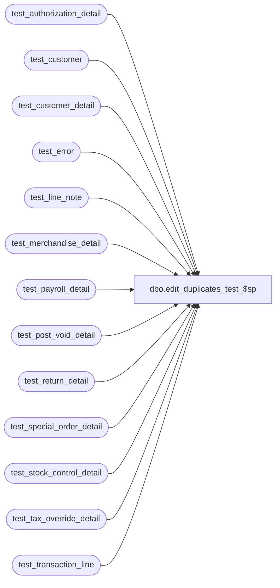

# dbo.edit_duplicates_test_$sp

**Database:** auditworks_work  
**Server:** bedrockdb01  

## Architecture Diagram



## Table Dependencies

| Referenced Table |
|---|
| test_authorization_detail |
| test_customer |
| test_customer_detail |
| test_error |
| test_line_note |
| test_merchandise_detail |
| test_payroll_detail |
| test_post_void_detail |
| test_return_detail |
| test_special_order_detail |
| test_stock_control_detail |
| test_tax_override_detail |
| test_transaction_line |

## Stored Procedure Code

```sql
create proc dbo.edit_duplicates_test_$sp 

@violated_sareject_rule smallint

AS

/* Description: To ignore duplicate lines ( caused by translate error ) and recover
   the rest of the transactions in the batch. Value = -1, revaluate all tables for duplicate entries.
   Called by edit_create_index_transl_$sp.

HISTORY
Date	 Name	  Def#	  Desc
Sep25,03 Sab	  15379/15482/15484 Correctly delete attachment lines when duplicate lines are encountered in a pollfile.
Nov25,02 HenryW   1-FVT15 Pass in new value to evaluate all work tables.
			  Also improve performance of duplicate handling logic by removing the cursor.
Nov09,01 Paul	  8900	  author

*/

DECLARE @customer_role		smallint,
	@customer_info_type	smallint,
	@entry_date_time	datetime,
	@errmsg			varchar(255),
	@errno			int,
	@line_id                numeric(5,0),
	@min_sequence_no        numeric(12,0),
	@note_type              smallint,
	@register_no		smallint,
	@store_no		int,
	@tax_level		tinyint,
	@transaction_no		int,
	@transaction_series	char(1),
	@translate_msg		varchar(255)

CREATE TABLE #work_lines_edit (
	store_no		int not null,
	register_no		smallint not null,
	entry_date_time		datetime not null,
	transaction_series	char(1) not null,
	transaction_no		int not null,
	line_id			numeric(5,0) not null,
	note_type		smallint null,
	customer_role		smallint null,
	customer_info_type	smallint null,
	tax_level		tinyint null,
	line_count		int not null,
	min_sequence_no		numeric(12,0) not null,
	violated_sareject_rule  int not null,
	file_name		varchar(30) not null )

SELECT @errno = @@error
IF @errno != 0
  BEGIN
   SELECT @errmsg = 'Failed to create temp table #work_lines_edit'
   GOTO error
  END

SELECT	@errno = 0,
	@translate_msg = 'Duplicate lines from the translate were skipped by the edit.'

IF (@violated_sareject_rule = 50 OR @violated_sareject_rule = -1)
  BEGIN
   INSERT #work_lines_edit (
	store_no,
	register_no,
	entry_date_time,
	transaction_series,
	transaction_no, 
	line_id,
	line_count,
	min_sequence_no,
	violated_sareject_rule,
	file_name )
   SELECT
	store_no,
	register_no,
	entry_date_time,
	transaction_series,
	transaction_no,
	line_id,
	COUNT(line_id),
	MIN(row_sequence_no),
	50,
	'<transl>_transaction_line'
     FROM test_transaction_line
    GROUP BY store_no, register_no, entry_date_time, transaction_series, transaction_no, line_id
    HAVING COUNT(line_id) > 1

   SELECT @errno = @@error
   IF @errno != 0
     BEGIN
       SELECT @errmsg = 'Failed to insert duplicate rows in #work_lines_edit for  ' + '<transl>_transaction_line'
       GOTO error
     END

  END /* @violated_sareject_rule = 50 */

IF (@violated_sareject_rule = 41 OR @violated_sareject_rule = -1)
  BEGIN
   INSERT #work_lines_edit (
	store_no,
	register_no,
	entry_date_time,
	transaction_series,
	transaction_no,
	line_id,
	line_count,
	min_sequence_no,
	violated_sareject_rule,
	file_name )
   SELECT
	store_no,
	register_no,
	entry_date_time,
	transaction_series,
	transaction_no,
	line_id,
	COUNT(line_id),
	MIN(row_sequence_no),
	41,
	'<transl>_merchandise_detail'
     FROM test_merchandise_detail
    GROUP BY store_no, register_no, entry_date_time, transaction_series, transaction_no, line_id
    HAVING COUNT(line_id) > 1

   SELECT @errno = @@error
   IF @errno != 0
     BEGIN
       SELECT @errmsg = 'Failed to insert duplicate rows in #work_lines_edit for  ' + '<transl>_merchandise_detail'
       GOTO error
     END

  END /* @violated_sareject_rule = 41 */

IF (@violated_sareject_rule = 42 OR @violated_sareject_rule = -1)
  BEGIN
   INSERT #work_lines_edit (
	store_no,
	register_no,
	entry_date_time,
	transaction_series,
	transaction_no,
	line_id,
	line_count,
	min_sequence_no,
	violated_sareject_rule,
	file_name )
   SELECT
	store_no,
	register_no,
	entry_date_time,
	transaction_series,
	transaction_no,
	line_id,
	COUNT(line_id),
	MIN(row_sequence_no),
	42,
	'<transl>_authorization_detail'
     FROM test_authorization_detail
    GROUP BY store_no, register_no, entry_date_time, transaction_series, transaction_no, line_id
    HAVING COUNT(line_id) > 1

   SELECT @errno = @@error
   IF @errno != 0
     BEGIN
       SELECT @errmsg = 'Failed to insert duplicate rows in #work_lines_edit for  ' + '<transl>_authorization_detail'
       GOTO error
     END

  END /* @violated_sareject_rule = 42 */

IF (@violated_sareject_rule = 43 OR @violated_sareject_rule = -1)
  BEGIN
   INSERT #work_lines_edit (
	store_no,
	register_no,
	entry_date_time,
	transaction_series,
	transaction_no,
	line_id,
	line_count,
	min_sequence_no,
	violated_sareject_rule,
	file_name )
   SELECT
	store_no,
	register_no,
	entry_date_time,
	transaction_series,
	transaction_no,
	line_id,
	COUNT(line_id),
	MIN(row_sequence_no),
	43,
	'<transl>_stock_control_detail'
     FROM test_stock_control_detail
    GROUP BY store_no, register_no, entry_date_time, transaction_series, transaction_no, line_id
    HAVING COUNT(line_id) > 1

   SELECT @errno = @@error
   IF @errno != 0
     BEGIN
       SELECT @errmsg = 'Failed to insert duplicate rows in #work_lines_edit for  ' + '<transl>_stock_control_detail'
       GOTO error
     END

  END /* @violated_sareject_rule = 43 */

IF (@violated_sareject_rule = 44 OR @violated_sareject_rule = -1)
  BEGIN
   INSERT #work_lines_edit (
	store_no,
	register_no,
	entry_date_time,
	transaction_series,
	transaction_no,
	line_id,
	line_count,
	min_sequence_no,
	violated_sareject_rule,
	file_name )
   SELECT
	store_no,
	register_no,
	entry_date_time,
	transaction_series,
	transaction_no,
	line_id,
	COUNT(line_id),
	MIN(row_sequence_no),
	44,
	'<transl>_special_order_detail'
     FROM test_special_order_detail
    GROUP BY store_no, register_no, entry_date_time, transaction_series, transaction_no, line_id
    HAVING COUNT(line_id) > 1

   SELECT @errno = @@error
   IF @errno != 0
     BEGIN
       SELECT @errmsg = 'Failed to insert duplicate rows in #work_lines_edit for  ' + '<transl>_special_order_detail'
       GOTO error
     END

  END /* @violated_sareject_rule = 44 */

IF (@violated_sareject_rule = 45 OR @violated_sareject_rule = -1)
  BEGIN
   INSERT #work_lines_edit (
	store_no,
	register_no,
	entry_date_time,
	transaction_series,
	transaction_no,
	line_id,
	line_count,
	min_sequence_no,
	violated_sareject_rule,
	file_name )
   SELECT
	store_no,
	register_no,
	entry_date_time,
	transaction_series,
	transaction_no,
	line_id,
	COUNT(line_id),
	MIN(row_sequence_no),
	45,
	'<transl>_post_void_detail'
     FROM test_post_void_detail
    GROUP BY store_no, register_no, entry_date_time, transaction_series, transaction_no, line_id
    HAVING COUNT(line_id) > 1

   SELECT @errno = @@error
   IF @errno != 0
     BEGIN
       SELECT @errmsg = 'Failed to insert duplicate rows in #work_lines_edit for  ' + '<transl>_post_void_detail'
       GOTO error
     END

  END /* @violated_sareject_rule = 45 */

IF (@violated_sareject_rule = 46 OR @violated_sareject_rule = -1)
  BEGIN
   INSERT #work_lines_edit (
	store_no,
	register_no,
	entry_date_time,
	transaction_series,
	transaction_no,
	line_id,
	line_count,
	min_sequence_no,
	violated_sareject_rule,
	file_name )
   SELECT
	store_no,
	register_no,
	entry_date_time,
	transaction_series,
	transaction_no,
	line_id,
	COUNT(line_id),
	MIN(row_sequence_no),
	46,
	'<transl>_payroll_detail'
     FROM test_payroll_detail
    GROUP BY store_no, register_no, entry_date_time, transaction_series, transaction_no, line_id
    HAVING COUNT(line_id) > 1

   SELECT @errno = @@error
   IF @errno != 0
     BEGIN
       SELECT @errmsg = 'Failed to insert duplicate rows in #work_lines_edit for  ' + '<transl>_payroll_detail'
       GOTO error
     END

  END /* @violated_sareject_rule = 46 */

IF (@violated_sareject_rule = 48 OR @violated_sareject_rule = -1)
  BEGIN
   INSERT #work_lines_edit (
	store_no,
	register_no,
	entry_date_time,
	transaction_series,
	transaction_no,
	line_id,
	tax_level,
	line_count,
	min_sequence_no,
	violated_sareject_rule,
	file_name )
   SELECT
	store_no,
	register_no,
	entry_date_time,
	transaction_series,
	transaction_no,
	line_id,
	tax_level,
	COUNT(line_id),
	MIN(row_sequence_no),
	48,
	'<transl>_tax_override_detail'
     FROM test_tax_override_detail
    GROUP BY store_no, register_no, entry_date_time, transaction_series, transaction_no, line_id, tax_level
    HAVING COUNT(line_id) > 1

   SELECT @errno = @@error
   IF @errno != 0
     BEGIN
       SELECT @errmsg = 'Failed to insert duplicate rows in #work_lines_edit for  ' + '<transl>_tax_override_detail'
       GOTO error
     END

  END /* @violated_sareject_rule = 48 */

IF (@violated_sareject_rule = 49 OR @violated_sareject_rule = -1)
  BEGIN
   INSERT #work_lines_edit (
	store_no,
	register_no,
	entry_date_time,
	transaction_series,
	transaction_no,
	line_id,
	line_count,
	min_sequence_no,
	violated_sareject_rule,
	file_name )
   SELECT
	store_no,
	register_no,
	entry_date_time,
	transaction_series,
	transaction_no,
	line_id,
	COUNT(line_id),
	MIN(row_sequence_no),
	49,
	'<transl>_return_detail'
     FROM test_return_detail
    GROUP BY store_no, register_no, entry_date_time, transaction_series, transaction_no, line_id
    HAVING COUNT(line_id) > 1

   SELECT @errno = @@error
   IF @errno != 0
     BEGIN
       SELECT @errmsg = 'Failed to insert duplicate rows in #work_lines_edit for  ' + '<transl>_return_detail'
       GOTO error
     END

  END /* @violated_sareject_rule = 49 */

IF (@violated_sareject_rule = 51 OR @violated_sareject_rule = -1)
  BEGIN
   INSERT #work_lines_edit (
	store_no,
	register_no,
	entry_date_time,
	transaction_series,
	transaction_no,
	line_id,
	customer_role,
	line_count,
	min_sequence_no,
	violated_sareject_rule,
	file_name )
   SELECT
	store_no,
	register_no,
	entry_date_time,
	transaction_series,
	transaction_no,
	from_line_id,
	customer_role,
	COUNT(from_line_id),
	MIN(row_sequence_no),
	51,
	'<transl>_customer'
     FROM test_customer
    GROUP BY store_no, register_no, entry_date_time, transaction_series, transaction_no, from_line_id, customer_role
    HAVING COUNT(from_line_id) > 1

   SELECT @errno = @@error
   IF @errno != 0
     BEGIN
       SELECT @errmsg = 'Failed to insert duplicate rows in #work_lines_edit for  ' + '<transl>_customer'
       GOTO error
     END

  END /* @violated_sareject_rule = 51 */

IF (@violated_sareject_rule = 52 OR @violated_sareject_rule = -1)
  BEGIN
   INSERT #work_lines_edit (
	store_no,
	register_no,
	entry_date_time,
	transaction_series,
	transaction_no,
	line_id,
	customer_role,
	customer_info_type,
	line_count,
	min_sequence_no,
	violated_sareject_rule,
	file_name )
   SELECT
	store_no,
	register_no,
	entry_date_time,
	transaction_series,
	transaction_no,
	from_line_id,
	customer_role,
	customer_info_type,
	COUNT(from_line_id),
	MIN(row_sequence_no),
	52,
	'<transl>_customer_detail'
     FROM test_customer_detail
    GROUP BY store_no, register_no, entry_date_time, transaction_series, transaction_no, 
	from_line_id, customer_role, customer_info_type
    HAVING COUNT(from_line_id) > 1

   SELECT @errno = @@error
   IF @errno != 0
     BEGIN
       SELECT @errmsg = 'Failed to insert duplicate rows in #work_lines_edit for  ' + '<transl>_customer_detail'
       GOTO error
     END

  END /* @violated_sareject_rule = 52 */

IF (@violated_sareject_rule = 53 OR @violated_sareject_rule = -1)
  BEGIN
   INSERT #work_lines_edit (
	store_no,
	register_no,
	entry_date_time,
	transaction_series,
	transaction_no,
	line_id,
	note_type,
	line_count,
	min_sequence_no,
	violated_sareject_rule,
	file_name )
   SELECT
	store_no,
	register_no,
	entry_date_time,
	transaction_series,
	transaction_no,
	line_id,
	note_type,
	COUNT(line_id),
	MIN(row_sequence_no),
	53,
	'<transl>_line_note'
     FROM test_line_note
    GROUP BY store_no, register_no, entry_date_time, transaction_series, transaction_no, line_id, note_type
    HAVING COUNT(line_id) > 1

   SELECT @errno = @@error
   IF @errno != 0
     BEGIN
       SELECT @errmsg = 'Failed to insert duplicate rows in #work_lines_edit for ' + '<transl>_line_note'
       GOTO error
     END

  END /* @violated_sareject_rule = 53 */


/* Delete all except first ocurrence of each duplicate transaction */

IF (@violated_sareject_rule = 50 OR @violated_sareject_rule = -1)
  BEGIN
    DELETE test_transaction_line
      FROM test_transaction_line al, #work_lines_edit we
     WHERE al.store_no = we.store_no
       AND al.register_no = we.register_no
       AND al.entry_date_time = we.entry_date_time
       AND al.transaction_series = we.transaction_series
       AND al.transaction_no = we.transaction_no 
       AND al.line_id = we.line_id
       AND we.line_count > 1
       AND al.row_sequence_no > we.min_sequence_no 
       AND violated_sareject_rule = 50

   SELECT @errno = @@error
   IF @errno != 0
     BEGIN
       SELECT @errmsg = 'Failed to delete duplicate rows from ' + '<transl>_transaction_line'
       GOTO error
     END
  END

IF (@violated_sareject_rule = 41 OR @violated_sareject_rule = -1)
  BEGIN
    DELETE test_merchandise_detail
      FROM test_merchandise_detail am, #work_lines_edit we
     WHERE am.store_no = we.store_no
       AND am.register_no = we.register_no
       AND am.entry_date_time = we.entry_date_time
       AND am.transaction_series = we.transaction_series
       AND am.transaction_no = we.transaction_no 
       AND am.line_id = we.line_id
       AND we.line_count > 1
       AND am.row_sequence_no > we.min_sequence_no 
       AND violated_sareject_rule = 41

   SELECT @errno = @@error
   IF @errno != 0
     BEGIN
       SELECT @errmsg = 'Failed to delete duplicate rows from ' + '<transl>_merchandise_detail'
       GOTO error
     END
  END

IF (@violated_sareject_rule = 42 OR @violated_sareject_rule = -1)
  BEGIN
    DELETE test_authorization_detail
      FROM test_authorization_detail ad, #work_lines_edit we
     WHERE ad.store_no = we.store_no
       AND ad.register_no = we.register_no
       AND ad.entry_date_time = we.entry_date_time
       AND ad.transaction_series = we.transaction_series
       AND ad.transaction_no = we.transaction_no 
       AND ad.line_id = we.line_id
       AND we.line_count > 1
       AND ad.row_sequence_no > we.min_sequence_no 
       AND violated_sareject_rule = 42

   SELECT @errno = @@error
   IF @errno != 0
     BEGIN
       SELECT @errmsg = 'Failed to delete duplicate rows from ' + '<transl>_authorization_detail'
       GOTO error
     END
  END

IF (@violated_sareject_rule = 43 OR @violated_sareject_rule = -1)
  BEGIN
    DELETE test_stock_control_detail
      FROM test_stock_control_detail ac, #work_lines_edit we
     WHERE ac.store_no = we.store_no
       AND ac.register_no = we.register_no
       AND ac.entry_date_time = we.entry_date_time
       AND ac.transaction_series = we.transaction_series
       AND ac.transaction_no = we.transaction_no 
       AND ac.line_id = we.line_id
       AND we.line_count > 1
       AND ac.row_sequence_no > we.min_sequence_no 
       AND violated_sareject_rule = 43

   SELECT @errno = @@error
   IF @errno != 0
     BEGIN
       SELECT @errmsg = 'Failed to delete duplicate rows from ' + '<transl>_stock_control_detail'
       GOTO error
     END
  END

IF (@violated_sareject_rule = 44 OR @violated_sareject_rule = -1)
  BEGIN
    DELETE test_special_order_detail
      FROM test_special_order_detail ao, #work_lines_edit we
     WHERE ao.store_no = we.store_no
       AND ao.register_no = we.register_no
       AND ao.entry_date_time = we.entry_date_time
       AND ao.transaction_series = we.transaction_series
       AND ao.transaction_no = we.transaction_no 
       AND ao.line_id = we.line_id
       AND we.line_count > 1
       AND ao.row_sequence_no > we.min_sequence_no 
       AND violated_sareject_rule = 44

   SELECT @errno = @@error
   IF @errno != 0
     BEGIN
       SELECT @errmsg = 'Failed to delete duplicate rows from ' + '<transl>_special_order_detail'
       GOTO error
     END
  END

IF (@violated_sareject_rule = 45 OR @violated_sareject_rule = -1)
  BEGIN
    DELETE test_post_void_detail
      FROM test_post_void_detail ap, #work_lines_edit we
     WHERE ap.store_no = we.store_no
       AND ap.register_no = we.register_no
       AND ap.entry_date_time = we.entry_date_time
       AND ap.transaction_series = we.transaction_series
       AND ap.transaction_no = we.transaction_no 
       AND ap.line_id = we.line_id
       AND we.line_count > 1
       AND ap.row_sequence_no > we.min_sequence_no 
       AND violated_sareject_rule = 45

   SELECT @errno = @@error
   IF @errno != 0
     BEGIN
       SELECT @errmsg = 'Failed to delete duplicate rows from ' + '<transl>_post_void_detail'
       GOTO error
     END
  END

IF (@violated_sareject_rule = 46 OR @violated_sareject_rule = -1)
  BEGIN
    DELETE test_payroll_detail
      FROM test_payroll_detail ay, #work_lines_edit we
     WHERE ay.store_no = we.store_no
       AND ay.register_no = we.register_no
       AND ay.entry_date_time = we.entry_date_time
       AND ay.transaction_series = we.transaction_series
       AND ay.transaction_no = we.transaction_no 
       AND ay.line_id = we.line_id
       AND we.line_count > 1
       AND ay.row_sequence_no > we.min_sequence_no 
       AND violated_sareject_rule = 46

   SELECT @errno = @@error
   IF @errno != 0
     BEGIN
       SELECT @errmsg = 'Failed to delete duplicate rows from ' + '<transl>_payroll_detail'
       GOTO error
     END
  END

IF (@violated_sareject_rule = 48 OR @violated_sareject_rule = -1)
  BEGIN
    DELETE test_tax_override_detail
      FROM test_tax_override_detail ax, #work_lines_edit we
     WHERE ax.store_no = we.store_no
       AND ax.register_no = we.register_no
       AND ax.entry_date_time = we.entry_date_time
       AND ax.transaction_series = we.transaction_series
       AND ax.transaction_no = we.transaction_no 
       AND ax.line_id = we.line_id
       AND ax.tax_level = we.tax_level
       AND we.line_count > 1
       AND ax.row_sequence_no > we.min_sequence_no 
       AND violated_sareject_rule = 48

   SELECT @errno = @@error
   IF @errno != 0
     BEGIN
       SELECT @errmsg = 'Failed to delete duplicate rows from ' + '<transl>_tax_override_detail'
       GOTO error
     END
  END

IF (@violated_sareject_rule = 49 OR @violated_sareject_rule = -1)
  BEGIN
    DELETE test_return_detail
      FROM test_return_detail ar, #work_lines_edit we
     WHERE ar.store_no = we.store_no
       AND ar.register_no = we.register_no
       AND ar.entry_date_time = we.entry_date_time
       AND ar.transaction_series = we.transaction_series
       AND ar.transaction_no = we.transaction_no 
       AND ar.line_id = we.line_id
       AND we.line_count > 1
       AND ar.row_sequence_no > we.min_sequence_no 
       AND violated_sareject_rule = 49

   SELECT @errno = @@error
   IF @errno != 0
     BEGIN
       SELECT @errmsg = 'Failed to delete duplicate rows from ' + '<transl>_return_detail'
       GOTO error
     END
  END

IF (@violated_sareject_rule = 51 OR @violated_sareject_rule = -1)
  BEGIN
    DELETE test_customer
      FROM test_customer ac, #work_lines_edit we
     WHERE ac.store_no = we.store_no
       AND ac.register_no = we.register_no
       AND ac.entry_date_time = we.entry_date_time
       AND ac.transaction_series = we.transaction_series
       AND ac.transaction_no = we.transaction_no 
       AND ac.from_line_id = we.line_id
       AND ac.customer_role = we.customer_role
       AND we.line_count > 1
       AND ac.row_sequence_no > we.min_sequence_no 
       AND violated_sareject_rule = 51

   SELECT @errno = @@error
   IF @errno != 0
     BEGIN
       SELECT @errmsg = 'Failed to delete duplicate rows from ' + '<transl>_customer'
       GOTO error
     END
  END

IF (@violated_sareject_rule = 52 OR @violated_sareject_rule = -1)
  BEGIN
    DELETE test_customer_detail
      FROM test_customer_detail ai, #work_lines_edit we
     WHERE ai.store_no = we.store_no
       AND ai.register_no = we.register_no
       AND ai.entry_date_time = we.entry_date_time
       AND ai.transaction_series = we.transaction_series
       AND ai.transaction_no = we.transaction_no 
       AND ai.from_line_id = we.line_id
       AND ai.customer_role = we.customer_role
       AND ai.customer_info_type = we.customer_info_type
       AND we.line_count > 1
       AND ai.row_sequence_no > we.min_sequence_no 
       AND violated_sareject_rule = 52

   SELECT @errno = @@error
   IF @errno != 0
     BEGIN
       SELECT @errmsg = 'Failed to delete duplicate rows from ' + '<transl>_customer_detail'
       GOTO error
     END
  END

IF (@violated_sareject_rule = 53 OR @violated_sareject_rule = -1)
  BEGIN
    DELETE test_line_note
      FROM test_line_note an, #work_lines_edit we
     WHERE an.store_no = we.store_no
       AND an.register_no = we.register_no
       AND an.entry_date_time = we.entry_date_time
       AND an.transaction_series = we.transaction_series
       AND an.transaction_no = we.transaction_no 
       AND an.line_id = we.line_id
       AND an.note_type = we.note_type
       AND we.line_count > 1
       AND an.row_sequence_no > we.min_sequence_no 
       AND violated_sareject_rule = 53

   SELECT @errno = @@error
   IF @errno != 0
     BEGIN
       SELECT @errmsg = 'Failed to delete duplicate rows from ' + '<transl>_line_note'
       GOTO error
     END
  END

INSERT test_error (
	store_no,
	register_no,
	entry_date_time,
	transaction_series,
	transaction_no,
	line_id,
	transl_reject_reason,  
	posting_end_date_time,
	file_name,
	transl_error_msg)
SELECT
	store_no,
	register_no,
	entry_date_time,
	transaction_series,
	transaction_no,
	line_id,
	violated_sareject_rule + 100,
	getdate(),
	file_name,
	@translate_msg
  FROM #work_lines_edit
  WHERE line_count >= 2

DROP TABLE #work_lines_edit

RETURN

error:
	IF @errno < 100000
	  SELECT @errno = @errno + 100000
	SELECT @errmsg = 'edit_duplicates_test_$sp: ' + @errmsg

	RAISERROR @errno @errmsg
	RETURN
```

