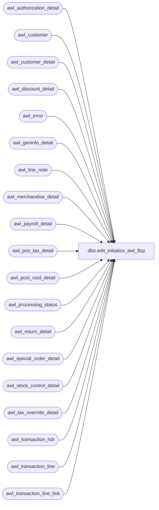

# dbo.edit_initialize_awl_$sp

**Database:** auditworks_work  
**Server:** bedrockdb01  

## Architecture Diagram



## Table Dependencies

| Referenced Table |
|---|
| awl_authorization_detail |
| awl_customer |
| awl_customer_detail |
| awl_discount_detail |
| awl_error |
| awl_geninfo_detail |
| awl_line_note |
| awl_merchandise_detail |
| awl_payroll_detail |
| awl_pos_tax_detail |
| awl_post_void_detail |
| awl_processing_status |
| awl_return_detail |
| awl_special_order_detail |
| awl_stock_control_detail |
| awl_tax_override_detail |
| awl_transaction_hdr |
| awl_transaction_line |
| awl_transaction_line_link |

## Stored Procedure Code

```sql
create proc dbo.edit_initialize_awl_$sp 
@edit_process_no tinyint = 1,
@sa_db_name      nvarchar(30) = 'auditworks'
AS

/* 
Proc Name: edit_initialize_<transl_>$sp
Description: To clear out edit ( import ) temp tables before bulk copy.
             Called from smartload edit.ict file. 

HISTORY:
Date     Name    Def# Desc
Mar31,16 Vicci   DAOM-17 Add input parameter for stream number.  
                         Since in the case of network issues the edit.ict can end up relaunching edit initialize prior to the prior execution 
                         of edit post having completed, raise error if edit stream is already running.
Dec17,13 Paul     145958 use try .. catch, use new raiserror for compatability with SQL 2012.
May03,05 David   DV-1202 Handle transl_transaction_line_link
Mar23,05 David   DV-1202 Handle transl_geninfo_detail
Sep10,04 David	 DV-1120 Handle transl_pos_tax_detail
Nov06,01 Paul    8900 added drop index commands
Jul10,01 ShuZ    8274 Home Delivery Handling
Mar13,99 JimC    4289 Tokenized.
Jul07,96 ??      xxxx Created
*/

DECLARE @errno			int,
    @errno2			int,
	@errmsg			nvarchar(2000),
	@errmsg2		nvarchar(2000),
    @process_name		nvarchar(30),
	@db_id				int,
	@current_db_name                nvarchar(30),
	@context_name	        	varbinary(128),
	@prior_context_info 		varbinary(128),
    @business_rule		tinyint,
	@lang_id		smallint;

SELECT @process_name = 'edit_initialize_awl_$sp',
	   @errmsg = 'Failed to drop indices',
	   @current_db_name = db_name(),
       @context_name = convert(varbinary(128), 'Edit Post ' + convert(nvarchar, IsNull(@edit_process_no, 1))),
       @business_rule = 0;  

BEGIN TRY

SELECT @errmsg = 'Unable to select from master..sysprocesses'
SELECT @db_id = dbid 
  FROM master..sysprocesses
 WHERE spid = @@spid
SELECT @errmsg = 'Unable to determine prior CONTEXT_INFO';
SELECT @prior_context_info = context_info
  FROM master..sysprocesses
 WHERE spid = @@spid
   AND dbid = @db_id
   AND db_name(dbid) = @current_db_name;
IF @prior_context_info IS NULL 
  SELECT @prior_context_info = convert(varbinary(128), '');
  
SELECT @errmsg = 'Unable to set CONTEXT_INFO';
SET CONTEXT_INFO @context_name;

IF EXISTS (SELECT *
             FROM master..sysprocesses
            WHERE context_info = @context_name
              AND spid <> @@spid
              AND LOWER(db_name(dbid)) IN (LOWER(@current_db_name), LOWER(@sa_db_name)))
BEGIN
  SELECT @errno = 201682,
         @errmsg = 'The stored procedure ' + @process_name + ' is already running for stream ' + convert(nvarchar, @edit_process_no) + '.  Please verify.';
  GOTO business_rule_error;
END

IF EXISTS (select * from sysindexes where id = object_id('awl_authorization_detail')
  and name ='awl_authorization_x0')
BEGIN
 DROP INDEX awl_authorization_detail.awl_authorization_x0;
END;

IF EXISTS (select * from sysindexes where id = object_id('awl_customer')
  and name ='awl_customer_x0')
BEGIN
 DROP INDEX awl_customer.awl_customer_x0;
END;

IF EXISTS (select * from sysindexes where id = object_id('awl_customer_detail')
  and name ='awl_customer_detail_x0')
BEGIN
 DROP INDEX awl_customer_detail.awl_customer_detail_x0;
END;

IF EXISTS (select * from sysindexes where id = object_id('awl_discount_detail')
  and name ='awl_discount_x0')
BEGIN
 DROP INDEX awl_discount_detail.awl_discount_x0;
END;

IF EXISTS (select * from sysindexes where id = object_id('awl_line_note')
  and name ='awl_line_note_x0')
BEGIN
 DROP INDEX awl_line_note.awl_line_note_x0;
END;

IF EXISTS (select * from sysindexes where id = object_id('awl_payroll_detail')
  and name ='awl_payroll_x0')
BEGIN
 DROP INDEX awl_payroll_detail.awl_payroll_x0;
END;

IF EXISTS (select * from sysindexes where id = object_id('awl_post_void_detail')
  and name ='awl_post_void_x0')
BEGIN
 DROP INDEX awl_post_void_detail.awl_post_void_x0;
END;

IF EXISTS (select * from sysindexes where id = object_id('awl_return_detail')
  and name ='awl_return_x0')
BEGIN
 DROP INDEX awl_return_detail.awl_return_x0;
END;

IF EXISTS (select * from sysindexes where id = object_id('awl_special_order_detail')
  and name ='awl_special_order_x0')
BEGIN
 DROP INDEX awl_special_order_detail.awl_special_order_x0;
END;

IF EXISTS (select * from sysindexes where id = object_id('awl_stock_control_detail')
  and name ='awl_stock_control_x0')
BEGIN
 DROP INDEX awl_stock_control_detail.awl_stock_control_x0;
END;

IF EXISTS (select * from sysindexes where id = object_id('awl_tax_override_detail')
  and name ='awl_tax_override_x0')
BEGIN
 DROP INDEX awl_tax_override_detail.awl_tax_override_x0;
END;

IF EXISTS (select * from sysindexes where id = object_id('awl_transaction_line')
  and name ='awl_transaction_line_x0')
BEGIN
 DROP INDEX awl_transaction_line.awl_transaction_line_x0;
END;

IF EXISTS (select * from sysindexes where id = object_id('awl_pos_tax_detail')
  and name ='awl_pos_tax_detail_x0')
BEGIN
 DROP INDEX awl_pos_tax_detail.awl_pos_tax_detail_x0;
END;

IF EXISTS (select * from sysindexes where id = object_id('awl_geninfo_detail')
  and name ='awl_geninfo_detail_x0')
BEGIN
 DROP INDEX awl_geninfo_detail.awl_geninfo_detail_x0;
END;

IF EXISTS (select * from sysindexes where id = object_id('awl_transaction_line_link')
  and name ='awl_transaction_line_link_x0')
BEGIN
 DROP INDEX awl_transaction_line_link.awl_transaction_line_link_x0;
END;

SELECT @errmsg = 'Failed to truncate transl tables';

TRUNCATE TABLE awl_transaction_hdr;
TRUNCATE TABLE awl_transaction_line;
TRUNCATE TABLE awl_merchandise_detail;
TRUNCATE TABLE awl_tax_override_detail;
TRUNCATE TABLE awl_discount_detail;
TRUNCATE TABLE awl_post_void_detail;
TRUNCATE TABLE awl_return_detail;
TRUNCATE TABLE awl_authorization_detail;
TRUNCATE TABLE awl_customer;
TRUNCATE TABLE awl_customer_detail;
TRUNCATE TABLE awl_payroll_detail;
TRUNCATE TABLE awl_special_order_detail;
TRUNCATE TABLE awl_stock_control_detail;
TRUNCATE TABLE awl_pos_tax_detail;
TRUNCATE TABLE awl_geninfo_detail;
TRUNCATE TABLE awl_transaction_line_link;
TRUNCATE TABLE awl_line_note;
TRUNCATE TABLE awl_error;
TRUNCATE TABLE awl_processing_status;

SET CONTEXT_INFO @prior_context_info;
RETURN;

business_rule_error:
  SELECT @business_rule = 1;
  SELECT @errmsg2 = @process_name + ':  ' + COALESCE(@errmsg, '');

  IF @prior_context_info IS NULL 
    SELECT @prior_context_info = convert(varbinary(128), '');
  SET CONTEXT_INFO @prior_context_info;

  SELECT @errmsg = CONVERT(nvarchar,@errno) + ':' + @errmsg2;
  
  SELECT @lang_id = msglangid
    FROM sys.syslanguages
   WHERE name = @@language;

  IF NOT EXISTS (SELECT 1 FROM sys.messages
	          WHERE message_id = @errno
	            AND language_id = 1033)
  BEGIN TRY
    EXEC sp_addmessage @msgnum = @errno, 
                       @severity = 16, 
                       @msgtext = '%s', 
                       @lang = 'us_english';
  END TRY
  BEGIN CATCH;
    SELECT @business_rule = 0;
  END CATCH;

  --If the system or session language is not US English, then also add the message using the session language
  IF @@langid <> 0 -- not 'us_english'
  BEGIN
    SELECT @lang_id = msglangid
      FROM sys.syslanguages
     WHERE name = @@language;

    IF NOT EXISTS (SELECT 1 FROM sys.messages
	            WHERE message_id = @errno
	              AND language_id = @lang_id)
    BEGIN
      BEGIN TRY
        EXEC sp_addmessage @msgnum = @errno, 
	                   @severity = 16, 
	                   @msgtext = '%s',
	                   @replace = 'replace';
	--when adding messages for other languages, could use %1! which refers to the first token in the US English message
      END TRY
      BEGIN CATCH;
        SELECT @business_rule = 0;
      END CATCH;
    END; -- If not exists
  END; -- If @@langid <> 0

  IF @business_rule = 1
  BEGIN;  /* Note, argument @error_msg when not expected by token inside message in sys.messages is simply ignored (does no harm).*/
    RAISERROR (@errno, 16, 1, @errmsg);
  END;
  ELSE
    RAISERROR (@errmsg, 16, 1); /* System Errors will be reported with SQL error code = 50000 */

  RETURN;

END TRY

BEGIN CATCH;
  SELECT @errno2 = ERROR_NUMBER();

  IF @prior_context_info IS NULL 
    SELECT @prior_context_info = convert(varbinary(128), '');
  SET CONTEXT_INFO @prior_context_info;

  IF @business_rule = 1
  BEGIN;  /* Note, argument @error_msg when not expected by token inside message in sys.messages is simply ignored (does no harm).*/
    RAISERROR (@errno, 16, 1, @errmsg);  --Note, argument @error_msg when not expected by token inside message in sys.messages is simply ignored (does no harm).
  END;
  ELSE
  BEGIN
    SELECT @errno = @errno2;
    SELECT @errmsg2 = @process_name + ':  ' + COALESCE(@errmsg, '') + ERROR_MESSAGE() + ' Line: ' + CONVERT(nvarchar, ERROR_LINE());
    SELECT @errmsg = CONVERT(nvarchar,@errno) + ':' + @errmsg2;
    
    RAISERROR (@errmsg, 16, 1);  /* System Errors will be reported with SQL error code = 50000 */
  END;  

/* Any errors raised here will be captured in the edit smrtload.log file.
   Not using common error handling here because this proc runs in auditworks_work. */
	
   RETURN;

END CATCH;
```

