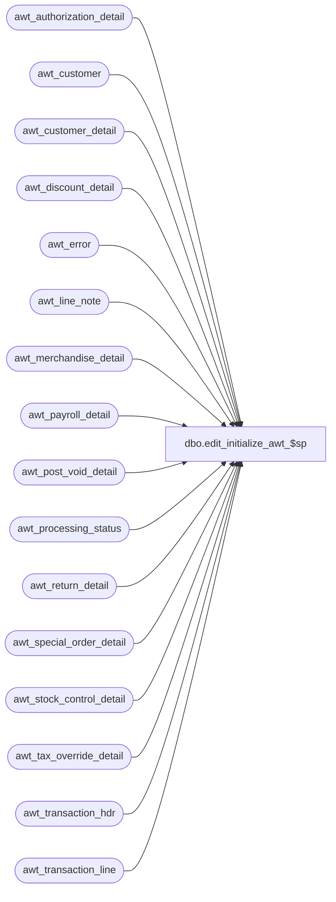

# dbo.edit_initialize_awt_$sp

**Database:** auditworks_work  
**Server:** bedrockdb01  

## Architecture Diagram



## Table Dependencies

| Referenced Table |
|---|
| awt_authorization_detail |
| awt_customer |
| awt_customer_detail |
| awt_discount_detail |
| awt_error |
| awt_line_note |
| awt_merchandise_detail |
| awt_payroll_detail |
| awt_post_void_detail |
| awt_processing_status |
| awt_return_detail |
| awt_special_order_detail |
| awt_stock_control_detail |
| awt_tax_override_detail |
| awt_transaction_hdr |
| awt_transaction_line |

## Stored Procedure Code

```sql
create proc dbo.edit_initialize_awt_$sp        
        AS

/* 
Proc Name: edit_initialize_awt_$sp
Description: To clear out edit ( import ) temp tables before bulk copy.
   Called from smartload edit.ict file. 

HISTORY:
 Date    Name    Def# Desc
Nov06,01 Paul    8900 added drop index commands
Jul10,01 ShuZ    8274 Home Delivery Handling
Mar13,99 JimC    4289 Tokenized.
Jul07,96 ??      xxxx Created
*/

IF EXISTS (select * from sysindexes where id = object_id('awt_authorization_detail')
  and name ='awt_authorization_x0')
BEGIN
 DROP INDEX awt_authorization_detail.awt_authorization_x0
END

IF EXISTS (select * from sysindexes where id = object_id('awt_customer')
  and name ='awt_customer_x0')
BEGIN
 DROP INDEX awt_customer.awt_customer_x0
END

IF EXISTS (select * from sysindexes where id = object_id('awt_customer_detail')
  and name ='awt_customer_detail_x0')
BEGIN
 DROP INDEX awt_customer_detail.awt_customer_detail_x0
END

IF EXISTS (select * from sysindexes where id = object_id('awt_discount_detail')
  and name ='awt_discount_x0')
BEGIN
 DROP INDEX awt_discount_detail.awt_discount_x0
END

IF EXISTS (select * from sysindexes where id = object_id('awt_line_note')
  and name ='awt_line_note_x0')
BEGIN
 DROP INDEX awt_line_note.awt_line_note_x0
END

IF EXISTS (select * from sysindexes where id = object_id('awt_payroll_detail')
  and name ='awt_payroll_x0')
BEGIN
 DROP INDEX awt_payroll_detail.awt_payroll_x0
END

IF EXISTS (select * from sysindexes where id = object_id('awt_post_void_detail')
  and name ='awt_post_void_x0')
BEGIN
 DROP INDEX awt_post_void_detail.awt_post_void_x0
END

IF EXISTS (select * from sysindexes where id = object_id('awt_return_detail')
  and name ='awt_return_x0')
BEGIN
 DROP INDEX awt_return_detail.awt_return_x0
END

IF EXISTS (select * from sysindexes where id = object_id('awt_special_order_detail')
  and name ='awt_special_order_x0')
BEGIN
 DROP INDEX awt_special_order_detail.awt_special_order_x0
END

IF EXISTS (select * from sysindexes where id = object_id('awt_stock_control_detail')
  and name ='awt_stock_control_x0')
BEGIN
 DROP INDEX awt_stock_control_detail.awt_stock_control_x0
END

IF EXISTS (select * from sysindexes where id = object_id('awt_tax_override_detail')
  and name ='awt_tax_override_x0')
BEGIN
 DROP INDEX awt_tax_override_detail.awt_tax_override_x0
END

IF EXISTS (select * from sysindexes where id = object_id('awt_transaction_line')
  and name ='awt_transaction_line_x0')
BEGIN
 DROP INDEX awt_transaction_line.awt_transaction_line_x0
END


TRUNCATE TABLE awt_transaction_hdr
TRUNCATE TABLE awt_transaction_line
TRUNCATE TABLE awt_merchandise_detail
TRUNCATE TABLE awt_tax_override_detail
TRUNCATE TABLE awt_discount_detail
TRUNCATE TABLE awt_post_void_detail
TRUNCATE TABLE awt_return_detail
TRUNCATE TABLE awt_authorization_detail
TRUNCATE TABLE awt_customer
TRUNCATE TABLE awt_customer_detail
TRUNCATE TABLE awt_payroll_detail
TRUNCATE TABLE awt_special_order_detail
TRUNCATE TABLE awt_stock_control_detail
TRUNCATE TABLE awt_line_note
TRUNCATE TABLE awt_error
TRUNCATE TABLE awt_processing_status

RETURN
```

