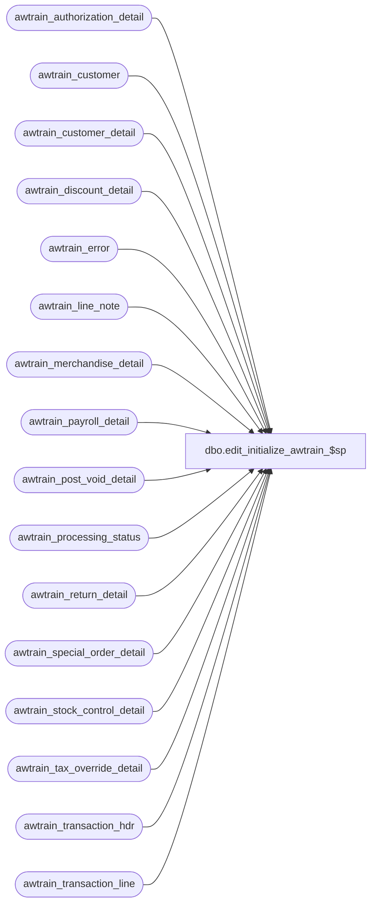

# dbo.edit_initialize_awtrain_$sp

**Database:** auditworks_work  
**Server:** bedrockdb01  

## Architecture Diagram



## Table Dependencies

| Referenced Table |
|---|
| awtrain_authorization_detail |
| awtrain_customer |
| awtrain_customer_detail |
| awtrain_discount_detail |
| awtrain_error |
| awtrain_line_note |
| awtrain_merchandise_detail |
| awtrain_payroll_detail |
| awtrain_post_void_detail |
| awtrain_processing_status |
| awtrain_return_detail |
| awtrain_special_order_detail |
| awtrain_stock_control_detail |
| awtrain_tax_override_detail |
| awtrain_transaction_hdr |
| awtrain_transaction_line |

## Stored Procedure Code

```sql
create procedure dbo.edit_initialize_awtrain_$sp
AS

/* 
DESCRIPTION: 
To clear out edit ( import ) temp tables before bulk copy.
Called from smartload edit.ict file 
HISTORY:
Jul10,2001 ShuZ 8274 Home delivery handling   
Jul07,1996 ??   xxxx Created
Mar13,1999 JimC 4289 Tokenized.
*/

TRUNCATE TABLE awtrain_transaction_hdr
TRUNCATE TABLE awtrain_transaction_line
TRUNCATE TABLE awtrain_merchandise_detail
TRUNCATE TABLE awtrain_tax_override_detail
TRUNCATE TABLE awtrain_discount_detail
TRUNCATE TABLE awtrain_post_void_detail
TRUNCATE TABLE awtrain_return_detail
TRUNCATE TABLE awtrain_authorization_detail
TRUNCATE TABLE awtrain_customer
TRUNCATE TABLE awtrain_customer_detail
TRUNCATE TABLE awtrain_payroll_detail
TRUNCATE TABLE awtrain_special_order_detail
TRUNCATE TABLE awtrain_stock_control_detail
TRUNCATE TABLE awtrain_line_note
TRUNCATE TABLE awtrain_error
TRUNCATE TABLE awtrain_processing_status

RETURN


dbo,dt_generateansiname,/* 
**	Generate an ansi name that is unique in the dtproperties.value column 
*/ 
create procedure dbo.dt_generateansiname(@name varchar(255) output) 
as 
	declare @prologue varchar(20) 
	declare @indexstring varchar(20) 
	declare @index integer 
 
	set @prologue = 'MSDT-A-' 
	set @index = 1 
 
	while 1 = 1 
	begin 
		set @indexstring = cast(@index as varchar(20)) 
		set @name = @prologue + @indexstring 
		if not exists (select value from dtproperties where value = @name) 
			break 
		 
		set @index = @index + 1 
 
		if (@index = 10000) 
			goto TooMany 
	end 
 
Leave: 
 
	return 
 
TooMany: 
 
	set @name = 'DIAGRAM' 
	goto Leave 

dbo,dt_adduserobject,/*
**	Add an object to the dtproperties table
*/
create procedure dbo.dt_adduserobject
as
	set nocount on
	/*
	** Create the user object if it does not exist already
	*/
	begin transaction
		insert dbo.dtproperties (property) VALUES ('DtgSchemaOBJECT')
		update dbo.dtproperties set objectid=@@identity 
			where id=@@identity and property='DtgSchemaOBJECT'
	commit
	return @@identity
```

