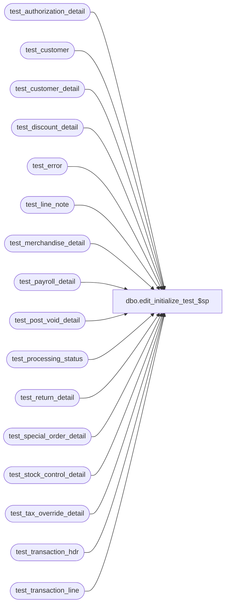

# dbo.edit_initialize_test_$sp

**Database:** auditworks_work  
**Server:** bedrockdb01  

## Architecture Diagram



## Table Dependencies

| Referenced Table |
|---|
| test_authorization_detail |
| test_customer |
| test_customer_detail |
| test_discount_detail |
| test_error |
| test_line_note |
| test_merchandise_detail |
| test_payroll_detail |
| test_post_void_detail |
| test_processing_status |
| test_return_detail |
| test_special_order_detail |
| test_stock_control_detail |
| test_tax_override_detail |
| test_transaction_hdr |
| test_transaction_line |

## Stored Procedure Code

```sql
create proc dbo.edit_initialize_test_$sp        
        AS

/* 
Proc Name: edit_initialize_test_$sp
Description: To clear out edit ( import ) temp tables before bulk copy.
   Called from smartload edit.ict file. 

HISTORY:
 Date    Name    Def# Desc
Nov06,01 Paul    8900 added drop index commands
Jul10,01 ShuZ    8274 Home Delivery Handling
Mar13,99 JimC    4289 Tokenized.
Jul07,96 ??      xxxx Created
*/

IF EXISTS (select * from sysindexes where id = object_id('test_authorization_detail')
  and name ='test_authorization_x0')
BEGIN
 DROP INDEX test_authorization_detail.test_authorization_x0
END

IF EXISTS (select * from sysindexes where id = object_id('test_customer')
  and name ='test_customer_x0')
BEGIN
 DROP INDEX test_customer.test_customer_x0
END

IF EXISTS (select * from sysindexes where id = object_id('test_customer_detail')
  and name ='test_customer_detail_x0')
BEGIN
 DROP INDEX test_customer_detail.test_customer_detail_x0
END

IF EXISTS (select * from sysindexes where id = object_id('test_discount_detail')
  and name ='test_discount_x0')
BEGIN
 DROP INDEX test_discount_detail.test_discount_x0
END

IF EXISTS (select * from sysindexes where id = object_id('test_line_note')
  and name ='test_line_note_x0')
BEGIN
 DROP INDEX test_line_note.test_line_note_x0
END

IF EXISTS (select * from sysindexes where id = object_id('test_payroll_detail')
  and name ='test_payroll_x0')
BEGIN
 DROP INDEX test_payroll_detail.test_payroll_x0
END

IF EXISTS (select * from sysindexes where id = object_id('test_post_void_detail')
  and name ='test_post_void_x0')
BEGIN
 DROP INDEX test_post_void_detail.test_post_void_x0
END

IF EXISTS (select * from sysindexes where id = object_id('test_return_detail')
  and name ='test_return_x0')
BEGIN
 DROP INDEX test_return_detail.test_return_x0
END

IF EXISTS (select * from sysindexes where id = object_id('test_special_order_detail')
  and name ='test_special_order_x0')
BEGIN
 DROP INDEX test_special_order_detail.test_special_order_x0
END

IF EXISTS (select * from sysindexes where id = object_id('test_stock_control_detail')
  and name ='test_stock_control_x0')
BEGIN
 DROP INDEX test_stock_control_detail.test_stock_control_x0
END

IF EXISTS (select * from sysindexes where id = object_id('test_tax_override_detail')
  and name ='test_tax_override_x0')
BEGIN
 DROP INDEX test_tax_override_detail.test_tax_override_x0
END

IF EXISTS (select * from sysindexes where id = object_id('test_transaction_line')
  and name ='test_transaction_line_x0')
BEGIN
 DROP INDEX test_transaction_line.test_transaction_line_x0
END


TRUNCATE TABLE test_transaction_hdr
TRUNCATE TABLE test_transaction_line
TRUNCATE TABLE test_merchandise_detail
TRUNCATE TABLE test_tax_override_detail
TRUNCATE TABLE test_discount_detail
TRUNCATE TABLE test_post_void_detail
TRUNCATE TABLE test_return_detail
TRUNCATE TABLE test_authorization_detail
TRUNCATE TABLE test_customer
TRUNCATE TABLE test_customer_detail
TRUNCATE TABLE test_payroll_detail
TRUNCATE TABLE test_special_order_detail
TRUNCATE TABLE test_stock_control_detail
TRUNCATE TABLE test_line_note
TRUNCATE TABLE test_error
TRUNCATE TABLE test_processing_status

RETURN
```

