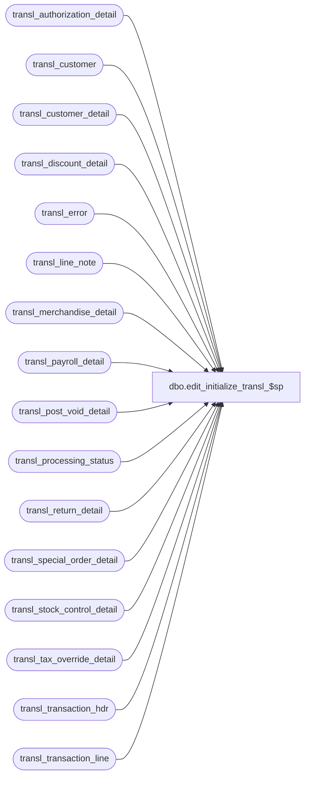

# dbo.edit_initialize_transl_$sp

**Database:** auditworks_work  
**Server:** bedrockdb01  

## Architecture Diagram



## Table Dependencies

| Referenced Table |
|---|
| transl_authorization_detail |
| transl_customer |
| transl_customer_detail |
| transl_discount_detail |
| transl_error |
| transl_line_note |
| transl_merchandise_detail |
| transl_payroll_detail |
| transl_post_void_detail |
| transl_processing_status |
| transl_return_detail |
| transl_special_order_detail |
| transl_stock_control_detail |
| transl_tax_override_detail |
| transl_transaction_hdr |
| transl_transaction_line |

## Stored Procedure Code

```sql
create proc dbo.edit_initialize_transl_$sp        
        AS

/* 
Proc Name: edit_initialize_transl_$sp
Description: To clear out edit ( import ) temp tables before bulk copy.
   Called from smartload edit.ict file. 

HISTORY:
 Date    Name    Def# Desc
Nov06,01 Paul    8900 added drop index commands
Jul10,01 ShuZ    8274 Home Delivery Handling
Mar13,99 JimC    4289 Tokenized.
Jul07,96 ??      xxxx Created
*/

IF EXISTS (select * from sysindexes where id = object_id('transl_authorization_detail')
  and name ='transl_authorization_x0')
BEGIN
 DROP INDEX transl_authorization_detail.transl_authorization_x0
END

IF EXISTS (select * from sysindexes where id = object_id('transl_customer')
  and name ='transl_customer_x0')
BEGIN
 DROP INDEX transl_customer.transl_customer_x0
END

IF EXISTS (select * from sysindexes where id = object_id('transl_customer_detail')
  and name ='transl_customer_detail_x0')
BEGIN
 DROP INDEX transl_customer_detail.transl_customer_detail_x0
END

IF EXISTS (select * from sysindexes where id = object_id('transl_discount_detail')
  and name ='transl_discount_x0')
BEGIN
 DROP INDEX transl_discount_detail.transl_discount_x0
END

IF EXISTS (select * from sysindexes where id = object_id('transl_line_note')
  and name ='transl_line_note_x0')
BEGIN
 DROP INDEX transl_line_note.transl_line_note_x0
END

IF EXISTS (select * from sysindexes where id = object_id('transl_payroll_detail')
  and name ='transl_payroll_x0')
BEGIN
 DROP INDEX transl_payroll_detail.transl_payroll_x0
END

IF EXISTS (select * from sysindexes where id = object_id('transl_post_void_detail')
  and name ='transl_post_void_x0')
BEGIN
 DROP INDEX transl_post_void_detail.transl_post_void_x0
END

IF EXISTS (select * from sysindexes where id = object_id('transl_return_detail')
  and name ='transl_return_x0')
BEGIN
 DROP INDEX transl_return_detail.transl_return_x0
END

IF EXISTS (select * from sysindexes where id = object_id('transl_special_order_detail')
  and name ='transl_special_order_x0')
BEGIN
 DROP INDEX transl_special_order_detail.transl_special_order_x0
END

IF EXISTS (select * from sysindexes where id = object_id('transl_stock_control_detail')
  and name ='transl_stock_control_x0')
BEGIN
 DROP INDEX transl_stock_control_detail.transl_stock_control_x0
END

IF EXISTS (select * from sysindexes where id = object_id('transl_tax_override_detail')
  and name ='transl_tax_override_x0')
BEGIN
 DROP INDEX transl_tax_override_detail.transl_tax_override_x0
END

IF EXISTS (select * from sysindexes where id = object_id('transl_transaction_line')
  and name ='transl_transaction_line_x0')
BEGIN
 DROP INDEX transl_transaction_line.transl_transaction_line_x0
END


TRUNCATE TABLE transl_transaction_hdr
TRUNCATE TABLE transl_transaction_line
TRUNCATE TABLE transl_merchandise_detail
TRUNCATE TABLE transl_tax_override_detail
TRUNCATE TABLE transl_discount_detail
TRUNCATE TABLE transl_post_void_detail
TRUNCATE TABLE transl_return_detail
TRUNCATE TABLE transl_authorization_detail
TRUNCATE TABLE transl_customer
TRUNCATE TABLE transl_customer_detail
TRUNCATE TABLE transl_payroll_detail
TRUNCATE TABLE transl_special_order_detail
TRUNCATE TABLE transl_stock_control_detail
TRUNCATE TABLE transl_line_note
TRUNCATE TABLE transl_error
TRUNCATE TABLE transl_processing_status

RETURN
```

