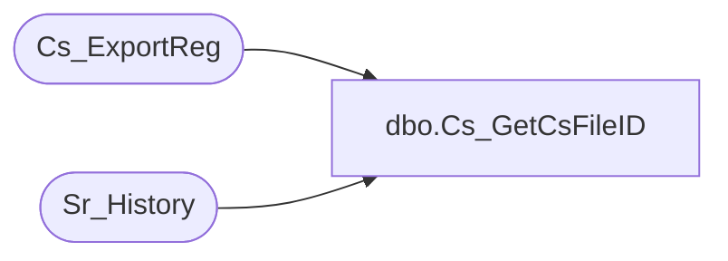

# dbo.Cs_GetCsFileID

**Database:** foundation  
**Server:** bedrockdb01  

## Architecture Diagram



## Table Dependencies

| Referenced Table |
|---|
| Cs_ExportReg |
| Sr_History |

## Stored Procedure Code

```sql
create proc dbo.Cs_GetCsFileID  @object_id_arg int, @db_group_id_arg int, @execution_id_arg int

/*  
	                                                  
   Author: Chris Carveth                         
   Creation Date: May-29-2001 
 
   This function must be called with an execution_id as nonzero  
   OR object_id/db_group_id as non zero. The function returns  
   cs_file_id that corresponds to the arguments passed. In the event  
   that the arguments do not correspond to any cs_file_id, a 0 is  
   returned. 
 
Modified by		Date		Reason 
------------------------------------------------------------------------ 
 
*/ 
AS 

DECLARE @cs_file_id int,
        @object_id int, 
        @db_group_id int 

	 
	select @cs_file_id = 0 
 
    if @execution_id_arg > 0 
	begin 

        select @object_id = object_id, 
               @db_group_id = db_group_id  
          from Sr_History 
         where execution_id = @execution_id_arg
         
        select @cs_file_id = cs_file_id  
          from Cs_ExportReg 
         where object_id = @object_id  
           and db_group_id = @db_group_id
    	 
	end
    else if @object_id_arg > 0 and @db_group_id_arg > 0 
    begin 
 
        select @cs_file_id = cs_file_id  
          from Cs_ExportReg 
         where object_id = @object_id_arg  
           and db_group_id = @db_group_id_arg
 
    end 
    else  
    begin
	    goto EndOfProc
	end
 
 
EndOfProc:
	 
RETURN @cs_file_id
```

