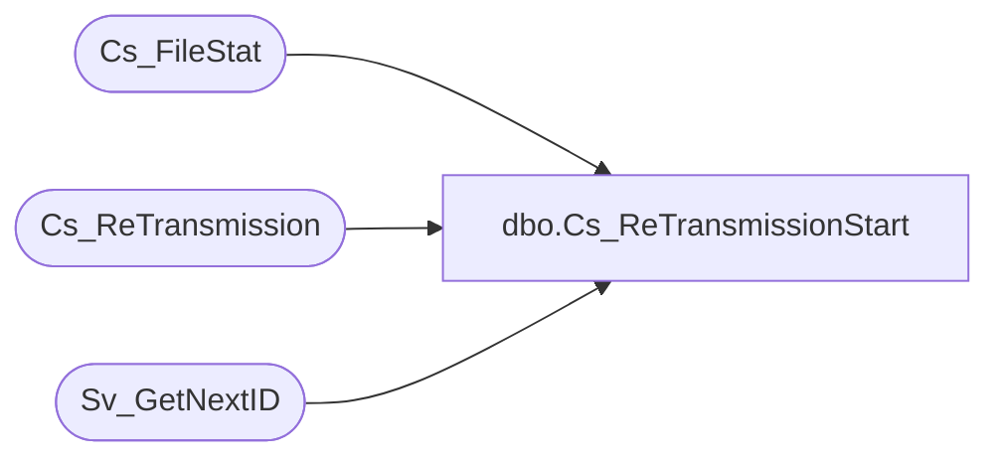

# dbo.Cs_ReTransmissionStart

**Database:** foundation  
**Server:** bedrockdb01  

## Architecture Diagram



## Table Dependencies

| Referenced Table |
|---|
| Cs_FileStat |
| Cs_ReTransmission |
| Sv_GetNextID |

## Stored Procedure Code

```sql
create proc dbo.Cs_ReTransmissionStart   @orig_transmission_id integer 

/*  
	                                                  
   Author: Chris Carveth                         
   Creation Date: May-29-2001 
 
 
Modified by		Date		Reason 
------------------------------------------------------------------------ 
 
*/ 

AS 

DECLARE @result integer,
        @sysdate datetime,
        @new_transmission_id integer

	 
	select @result = -1 
	EXEC @new_transmission_id = Sv_GetNextID 22
    select @sysdate = getdate() 

	begin transaction

    insert into Cs_FileStat (transmission_id, cs_file_id, status_id, found_datafile_datetime, number_of_files, from_execution_id, to_execution_id, backup_still_exists) 
    select @new_transmission_id, cs_file_id, 2, @sysdate, number_of_files, from_execution_id, to_execution_id, backup_still_exists 
      from Cs_FileStat 
     where transmission_id = @orig_transmission_id 

    update Cs_FileStat  
       set retransmitted_datetime = @sysdate 
     where transmission_id = @orig_transmission_id 

    update Cs_ReTransmission  
       set new_transmission_id = @new_transmission_id 
     where transmission_id = @orig_transmission_id   

	commit transaction 
	
    select @result = @new_transmission_id 

EndOfProc:
	 
RETURN @result
```

