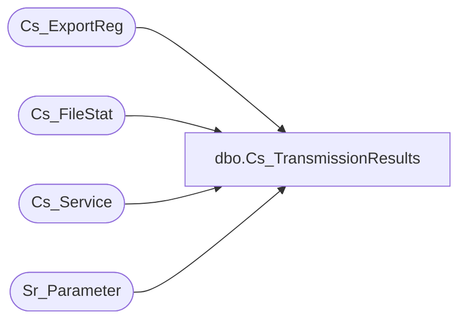

# dbo.Cs_TransmissionResults

**Database:** foundation  
**Server:** bedrockdb01  

## Architecture Diagram



## Table Dependencies

| Referenced Table |
|---|
| Cs_ExportReg |
| Cs_FileStat |
| Cs_Service |
| Sr_Parameter |

## Stored Procedure Code

```sql
create proc dbo.Cs_TransmissionResults    @results_code_arg INTEGER, @filename_arg varchar(30), @results_msg_arg varchar(255) 

/* 
	                                                 
   Author: Chris Carveth                        
   Creation Date: May-29-2001


Modified by		Date		Reason
------------------------------------------------------------------------

*/

AS 

DECLARE @result integer,
        @new_transmission_id integer,
		@expect_confirmation smallint,
		@transmission_id INTEGER,
		@status_id INTEGER,
		@validated_datetime datetime,
		@user_id integer,
		@auto_validate smallint,
		@sysdate datetime

	 
	select @result = -1,
	       @validated_datetime = null,
           @user_id = null,
           @sysdate = getdate(),
           @auto_validate = 0

    -- Find the transmission_id
    select @transmission_id = max(transmission_id) 
      from Cs_FileStat
     where sent_to_polling_filename = @filename_arg

    -- Is auto_validate turned on?
    select @auto_validate = 1 
      from Sr_Parameter
     where tag = 'AutoValidateTransmissions'
       and tag_value = '1'
    
    -- Does the service return a confirmation file
    if @auto_validate = 1 
    begin
	    select @expect_confirmation = s.expect_confirmation
	      from Cs_FileStat f, Cs_ExportReg e, Cs_Service s
	     where f.transmission_id = @transmission_id
	       and f.cs_file_id = e.cs_file_id 
	       and e.service_id = s.service_id
    end
    
    -- if polling was successful (0) ...
    if @results_code_arg = 0 
	begin
        select @status_id = 4
	
        -- auto-validate if no confirmation expected
        if @auto_validate = 1 and @expect_confirmation = 0 
	    begin
		    select @status_id = 7
		    select @validated_datetime = @sysdate
		    select @user_id = 0
	    end
    end
    else
    begin
        -- polling failed
        select @status_id = 6
    end 


    update Cs_FileStat
       set status_id = @status_id, 
           polling_results_code = @results_code_arg,
           polling_results_message = @results_msg_arg,
           polling_results_datetime = @sysdate,
           validated_datetime = @validated_datetime,
           validated_user_id = @user_id 
     where transmission_id = @transmission_id
    
	select @result = 0

EndOfProc:
	 
RETURN @result
```

