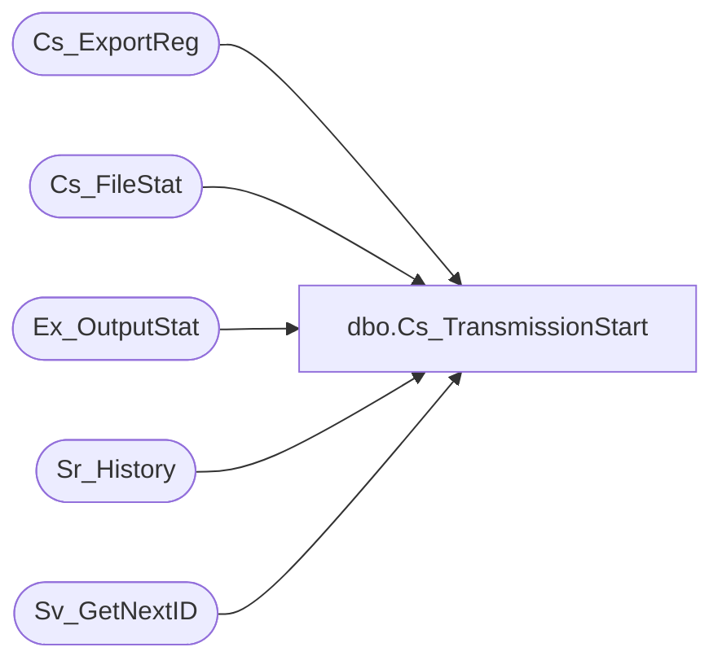

# dbo.Cs_TransmissionStart

**Database:** foundation  
**Server:** bedrockdb01  

## Architecture Diagram



## Table Dependencies

| Referenced Table |
|---|
| Cs_ExportReg |
| Cs_FileStat |
| Ex_OutputStat |
| Sr_History |
| Sv_GetNextID |

## Stored Procedure Code

```sql
create proc dbo.Cs_TransmissionStart  @file_id_arg INTEGER, @number_of_file_arg INTEGER, @execution_id_arg INTEGER

/*  
	                                                  
   Author: Chris Carveth                         
   Creation Date: May-29-2001 
 
 
Modified by		Date		Reason 
------------------------------------------------------------------------ 
 
*/ 

AS 

DECLARE @result integer,
		@transmission_id INTEGER, 
		@last_execution_id INTEGER,  
		@from_execution_id INTEGER,  
		@object_id INTEGER, 
		@db_group_id INTEGER  
	 
	select @result = -1  
 
    select @object_id = object_id, 
           @db_group_id = db_group_id
      from Cs_ExportReg 
     where cs_file_id = @file_id_arg  
  
    -- find the max(exec) from Ex_ouputstat where obj/dbg same and < exec_arg 
    select @last_execution_id = max(o.execution_id)  
      from Ex_OutputStat o, Sr_History h 
     where o.execution_id = h.execution_id  
       and o.execution_id < @execution_id_arg 
       and h.object_id = @object_id 
       and h.db_group_id = @db_group_id  
 
    if @last_execution_id is null 
    begin
       select @last_execution_id = 0 
    end  
 
    -- find min(exec) > exec found in last step where obj/dbg same  
    select @from_execution_id = min(execution_id)  
      from Sr_History  
     where execution_id > @last_execution_id 
       and object_id = @object_id 
       and db_group_id = @db_group_id  
 
    if @from_execution_id is null 
    begin
       select @from_execution_id = 0 
    end  
 
	EXEC @transmission_id = Sv_GetNextID 22 
 
    insert into Cs_FileStat (transmission_id, cs_file_id, status_id, found_datafile_datetime,  
                             number_of_files, from_execution_id, to_execution_id, backup_still_exists) 
                     values (@transmission_id, @file_id_arg, 1, getdate(),  
                             @number_of_file_arg, @from_execution_id, @execution_id_arg, 1) 
     
    select @result = @transmission_id 

EndOfProc:
	 
RETURN @result
```

