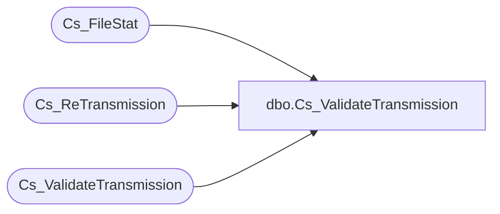

# dbo.Cs_ValidateTransmission

**Database:** foundation  
**Server:** bedrockdb01  

## Architecture Diagram



## Table Dependencies

| Referenced Table |
|---|
| Cs_FileStat |
| Cs_ReTransmission |
| Cs_ValidateTransmission |

## Stored Procedure Code

```sql
create proc dbo.Cs_ValidateTransmission 

  @transmission_id INTEGER, @user_id INTEGER, @validation_flag smallint

/*  
	                                                  
   Author: Chris Carveth                         
   Creation Date: June-12-2001 
 
   @validation_flag  1  = Validate Transmission 
   @validation_flag  2  = Un-Validate Transmission 
 
Modified by		Date		Reason 
------------------------------------------------------------------------ 
 Linda Zenebisis 	july 5, 2002    'validation was not working for linked retransmissons
*/ 

AS 

DECLARE @result integer,
		@retransmitted_datetime datetime, 
		@status_id INTEGER, 
		@prev_transmission_id INTEGER, 
		@validated_datetime datetime, 
		@backup_still_exists smallint,
		@commit_level integer  	 

	select @result = -1
	select @commit_level = 0
 
    if @validation_flag < 1 or @validation_flag > 2
    begin
         goto EndOfProc 
    end  
         
    -- check status of transmission and if backup still exists 
    select @status_id = status_id, 
           @backup_still_exists = backup_still_exists,
           @retransmitted_datetime = retransmitted_datetime  
      from Cs_FileStat 
     where transmission_id = @transmission_id 
 
    --If tryin to validate a 7 or unvalidating an 8 just exit 
    if (@validation_flag = 1 and @status_id = 7) OR (@validation_flag = 2 and @status_id = 8)
    begin
        select @result = 0 
        goto EndOfProc 
    end  
           
    --do not allow validation if status is other than 4,5,8  
    --do not allow unvalidation if status is not 7 (not already valid) 
    --do not allow unvalidation if backup does not exists 
    --do not allow unvalidation if retransmitted_datetime is not null 
    --skip the validation on the linked transmissions because they won't necessarily be 4,5,or 8
    if @@trancount = 0  -- its the first time through. 
    	begin
    	    if (@validation_flag = 1 and ((    @status_id < 4 or @status_id > 5) and @status_id != 8)) OR 
        	(@validation_flag = 2 and (@status_id != 7 OR @backup_still_exists = 0 OR @retransmitted_datetime is not null)) 
 		begin
        	   goto EndOfProc
   		end
    	end  
    
    if @validation_flag = 1
        select @status_id = 7 
    else
     begin 
         select @status_id = 8 
     end 

	if @@trancount = 0 
	begin
		begin tran
		select @commit_level = 1
	end
	      
    update Cs_FileStat 
       set status_id = @status_id, 
           validated_datetime = getdate(), 
           validated_user_id = @user_id 
     where transmission_id = @transmission_id 
 
    -- See if this transmission is a retransmission of a failed attempt 
    select @prev_transmission_id = transmission_id  
      from Cs_ReTransmission 
     where new_transmission_id = @transmission_id 

  
    -- If this transmission is a retransmission of a failed attempt,    
    -- then automatically validate the linked transmission. 
    -- Do not ever recursively unvalidate linked transmissions - Only Validate.  
    if @validation_flag = 1 and @prev_transmission_id is not null 
      begin

        Exec @result = Cs_ValidateTransmission @prev_transmission_id, @user_id, @validation_flag
 
      end
    else 
    begin

        select @result = 0 
    end  

	if @commit_level = 1
	begin
		if @result = 0
		begin
			commit tran
		end
		else
		begin
			rollback
		end
	end
	
EndOfProc: 

RETURN @result
```

