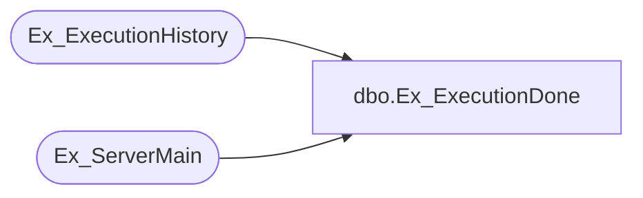

# dbo.Ex_ExecutionDone

**Database:** foundation  
**Server:** bedrockdb01  

## Architecture Diagram



## Table Dependencies

| Referenced Table |
|---|
| Ex_ExecutionHistory |
| Ex_ServerMain |

## Stored Procedure Code

```sql
create proc Ex_ExecutionDone @ExecutionID int, @RowCount int, @JobID int, @ErrorCode int, @ErrorDesc varchar(255)
/*********************************************************/
/*	                                                 		*/
/*	    Author: Chris Carveth                        		*/
/*	    Creation Date: 17-June-1998                  		*/
/*	    Comments: Updates Ex_ExecutionHistory        		*/
/*               Updates Ex_ServerMain avg_duration      */
/*                                                       */
/*********************************************************/
AS 
DECLARE @result int,
		  @TopicID int,
		  @DBGroupID int,
        @ObjectID int,
	     @ThreadIndex int,
	     @auto_execute bit  
	 
	SELECT @result = 0

	SELECT @TopicID = topic_id,
          @DBGroupID = db_group_id, 
          @ObjectID = object_id, 
          @ThreadIndex = thread_index 
 	  FROM Ex_ExecutionHistory 
 	 WHERE execution_id = @ExecutionID

	UPDATE Ex_ExecutionHistory 
	   SET error_code = @ErrorCode,
	       error_description = @ErrorDesc,
	       total_records_count = @RowCount, 
	       end_datetime = getdate(), 
	       duration = datediff(second, start_datetime, getdate())
    WHERE execution_id = @ExecutionID 

	UPDATE Ex_ServerMain
	   SET avg_duration = (SELECT AVG(duration)
     								 FROM Ex_ExecutionHistory 
    							   WHERE topic_id = @TopicID AND 
    		 								object_id = @ObjectID AND
		 	 								db_group_id = @DBGroupID AND
		 	 								thread_index = @ThreadIndex AND
		 	 								total_records_count > 0)
	 WHERE topic_id = @TopicID AND 
 	       object_id = @ObjectID AND
 	       db_group_id = @DBGroupID AND
 	       thread_index = @ThreadIndex  

	SELECT @auto_execute = auto_execute
	  FROM Ex_ServerMain
	 WHERE job_id = @JobID
	
	IF @auto_execute = 0 
		UPDATE Ex_ServerMain
		   SET executing = 0, 
		       done_executions = done_executions + 1 
	 	 WHERE job_id = @JobID
	ELSE
		UPDATE Ex_ServerMain
		   SET executing = 0
	    WHERE job_id = @JobID
	

RETURN @result
```

