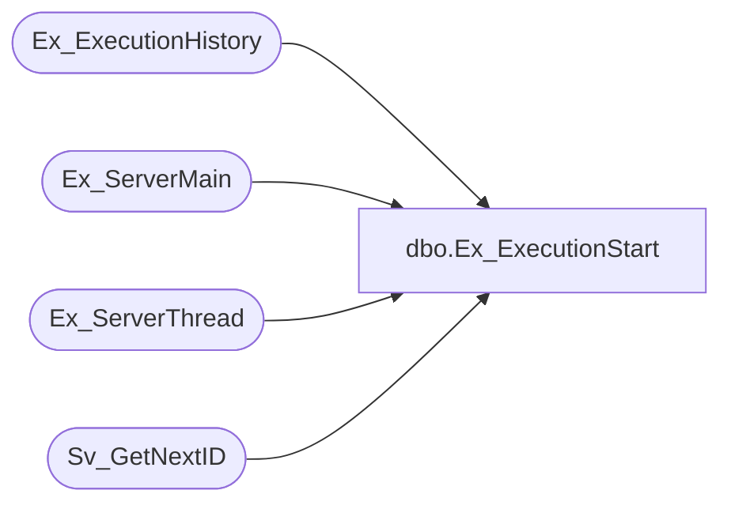

# dbo.Ex_ExecutionStart

**Database:** foundation  
**Server:** bedrockdb01  

## Architecture Diagram



## Table Dependencies

| Referenced Table |
|---|
| Ex_ExecutionHistory |
| Ex_ServerMain |
| Ex_ServerThread |
| Sv_GetNextID |

## Stored Procedure Code

```sql
create proc Ex_ExecutionStart @JobID int 
/*********************************************************/
/*	                                                      */
/*	    Author: Chris Carveth                             */
/*	    Creation Date: 19-June-1998                       */
/*	    Comments: Updates Ex_ExecutionHistory             */
/*                    Updates Ex_ServerMain              */
/*                                                       */
/*********************************************************/
AS 
DECLARE @TopicID int,
	     @ExecutionID int, 
	     @ThreadIndex int, 
	     @ObjectID int, 
	     @DBGroupID int, 
	     @already_running int, 
	     @auto_execute bit, 
	     @scheduled_executions int,
 	     @done_executions int


	SELECT @TopicID = topic_id, 
	       @ThreadIndex = thread_index, 
	       @ObjectID = object_id, 
	       @DBGroupID = db_group_id,
	       @auto_execute = auto_execute,
	       @scheduled_executions = scheduled_executions,
	       @done_executions = done_executions
	  FROM Ex_ServerMain 
	 WHERE job_id = @JobID

	IF @auto_execute = 0 AND  @done_executions >= @scheduled_executions 
	BEGIN
	   RETURN 0
	END 

	SELECT @already_running = COUNT(*) 
	  FROM Ex_ServerMain 
	 WHERE object_id = @ObjectID AND
 	       db_group_id = @DBGroupID AND
 	       executing = 1  

	IF @already_running = 1 
	BEGIN
	   RETURN 0
	END 

	UPDATE Ex_ServerMain
	   SET executing = 1
	 WHERE job_id = @JobID
	       
	EXEC @ExecutionID = Sv_GetNextID 10 	
	
	INSERT INTO Ex_ExecutionHistory (execution_id, topic_id, db_group_id, object_id, thread_index, start_datetime)
  	     VALUES (@ExecutionID, @TopicID, @DBGroupID, @ObjectID, @ThreadIndex, getdate())
  	
  	UPDATE Ex_ServerThread
  	   SET curr_execution_id = @ExecutionID WHERE thread_index = @ThreadIndex
```

