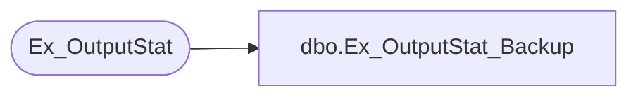

# dbo.Ex_OutputStat_Backup

**Database:** foundation  
**Server:** bedrockdb01  

## Architecture Diagram



## Table Dependencies

| Referenced Table |
|---|
| Ex_OutputStat |

## Stored Procedure Code

```sql
create proc dbo.Ex_OutputStat_Backup 

@ExecutionID int, @SequenceNo int, @ReturnCode int, 
@FileSize int, @FileName varchar(255), @BackupDateTime varchar(30)

/*
Author: Chris Carveth
Creation Date: 28-Jan-2000                       
Comments: 

Modified by		Date		Reason
------------------------------------------------------------------------

*/

AS 

DECLARE @errno int,
		@errmsg char(100),
		@returnerrmsg char(120)
		
	UPDATE Ex_OutputStat 
	   SET backup_file_name = @FileName, 
	       backup_file_size = @FileSize, 
	       backup_return_code = @ReturnCode, 
	       backup_date_time = @BackupDateTime
	 WHERE execution_id = @ExecutionID
	   AND sequence_no = @SequenceNo
	   
	 SELECT @errno = @@error
      	 IF @errno != 0
      	   BEGIN
        	   SELECT @errmsg = 'Failed to UPDATE Ex_OutputStat'
        	   GOTO error           
      	   END

	
RETURN 1

error: 

IF @@trancount != 0
  ROLLBACK TRANSACTION
  
SELECT @errmsg = 'Ex_OutputStat_Backup ' + @errmsg 
if @errno < 100000 
     select @errno = @errno + 100000 

SET @returnerrmsg = @errno + ', ' + @errmsg

Raiserror(@returnerrmsg, 16, 1)

RETURN @errno
```

