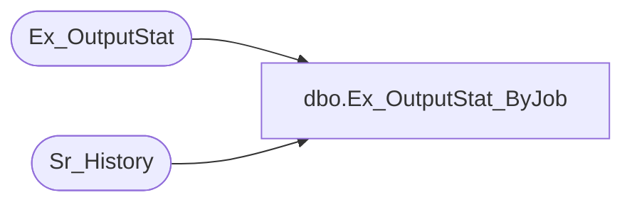

# dbo.Ex_OutputStat_ByJob

**Database:** foundation  
**Server:** bedrockdb01  

## Architecture Diagram



## Table Dependencies

| Referenced Table |
|---|
| Ex_OutputStat |
| Sr_History |

## Stored Procedure Code

```sql
create proc dbo.Ex_OutputStat_ByJob 

@JobID int

/*
Author: Chris Carveth
Creation Date: 14-Feb-2000                       
Comments: 

Status 0 = Unknown
       1 = Accumulate
       2 = Print

Modified by		Date		Reason
------------------------------------------------------------------------

*/

AS 

declare OutputStatCursor cursor	for
	select o.sequence_no, o.append_flag, o.record_count, 
	       o.final_file_name, o.final_file_size2, final_date_time 
	  from Ex_OutputStat o, Sr_History h 
	 where h.job_id = @JobID 
	   and o.execution_id = h.execution_id
	   and o.final_return_code >= 1
	order by o.sequence_no, o.execution_id asc
	for read only

declare @status int,
		@seq_no int,
		@last_seq_no int,
		@append bit,
		@recordcount int,
		@sumcount int,  
		@printsumcount varchar(15),  
		@filename varchar(255),  
		@filesize int,  
        @hdr1 varchar(80), 
        @hdr2 varchar(80), 
        @dtl varchar(80), 
		@final_datetime datetime,  
		@start_datetime varchar(20),  
		@end_datetime varchar(20),  
		@printfilename varchar(255),  
		@lastfilename varchar(255),  
		@printfilesize varchar(15),  
		@errno int,
		@Cr char(1),
	    @errmsg char(100),
		@returnerrmsg char(120)

	select @status = 0,
	       @seq_no = 0,
	       @last_seq_no = 0,
	       @sumcount = 0,
		   @errno = 0,
           @Cr = char(13)
    
--    select @hdr1 = replicate(char(9), 2) + 'Start' + replicate(char(9), 5) + 'End' + replicate(char(9), 6) + "Records" + replicate(char(9), 5) + "Size(bytes)"
--    select @hdr2 = "-------------------" + replicate(char(9), 2) + "-------------------" + replicate(char(9), 3) + "----------------" + replicate(char(9), 2) + "----------------"

    select @hdr1 = '        Start                 End                Records          Size(bytes)'
    select @hdr2 = '-------------------   -------------------   ----------------   ----------------'
		     		
	open OutputStatCursor
	fetch OutputStatCursor into @seq_no, @append, @recordcount, @filename, @filesize, @final_datetime  
	
	while (@@fetch_status != 2) -- not end of cursor
	begin
		if @@fetch_status = 1 -- Error check for fetch
		begin
	  	   select @errmsg = 'some error msg'
	  	   goto error           
		end
	
		-- Do we have a change in seq_no or are we at the end of the seq_no 
		if (@status = 1 and (@last_seq_no != @seq_no or @append = 0))
		begin
			select @status = 2
		end

		-- Is this the first record of a new sequence
		if @status = 0 and @append = 0
		begin
			select @status = 1, 
                   @last_seq_no = @seq_no, 
                   @start_datetime = convert(varchar, @final_datetime, 101) + ' ' + convert(varchar, @final_datetime, 8) 
		end

		-- Are we supposed to print 
		if @status = 2 
		begin

			select @printsumcount = convert(varchar, @sumcount) 
            select @printsumcount = space(15 - DATALENGTH(@printsumcount)) + @printsumcount

            -- Do we print filename and hdrs 
            if @printfilename <> @lastfilename
            begin
	            print @Cr
	 			print @printfilename
	            print @hdr1
	            print @hdr2 
                select @lastfilename = @printfilename 
            end 
            
            select @dtl = @start_datetime + '   ' + @end_datetime  + '    ' + @printsumcount + '    ' + @printfilesize
 			print @dtl

			select @status = 0, @sumcount = 0
	
    		if @append = 0
			begin
				select @status = 1, 
	                   @last_seq_no = @seq_no, 
	                   @start_datetime = convert(varchar, @final_datetime, 101) + ' ' + convert(varchar, @final_datetime, 8) 
			end

		end

		-- Are we supposed to accumulate 
		if @status = 1 
		begin
			select @sumcount = @sumcount + @recordcount,
			       @printfilename = convert(varchar(255), @filename),
			       @printfilesize = convert(varchar, @filesize),
                   @end_datetime = convert(varchar, @final_datetime, 101) +  ' ' + convert(varchar, @final_datetime, 8) 

            select @printfilesize = space(15 - DATALENGTH(@printfilesize)) + @printfilesize
                   
		end
	
    	fetch OutputStatCursor into @seq_no, @append, @recordcount, @filename, @filesize, @final_datetime  
	end		
	
	if @status != 0 
	begin
		select @printsumcount = convert(varchar, @sumcount) 
        select @printsumcount = space(15 - DATALENGTH(@printsumcount)) + @printsumcount

        -- Do we print filename and hdrs
        if @printfilename <> @lastfilename
        begin
	        print @Cr
			print @printfilename
	        print @hdr1
	        print @hdr2
        end 
        
        select @dtl = @start_datetime + '   ' + @end_datetime  + '    ' + @printsumcount + '    ' + @printfilesize
		print @dtl
	end
	
	return 1

error: 
select @errmsg = 'Ex_OutputStat_ByJob ' + @errmsg 
if @errno < 100000 
   select @errno = @errno + 100000 

SET @returnerrmsg = @errno + ', ' + @errmsg

raiserror(@returnerrmsg, 16, 1)

return @errno
```

