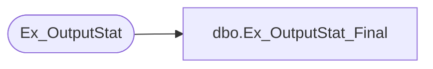

# dbo.Ex_OutputStat_Final

**Database:** foundation  
**Server:** bedrockdb01  

## Architecture Diagram



## Table Dependencies

| Referenced Table |
|---|
| Ex_OutputStat |

## Stored Procedure Code

```sql
create proc dbo.Ex_OutputStat_Final 

@ReturnCode int, @FileSize1 int, @FileSize2 int, @AppendFlag bit, @FlagFileCode int, 
 @FinalFileName varchar(255), @MergeFileName varchar(255), @FinalDateTime varchar(30)

/*
Author: Chris Carveth
Creation Date: 28-Jan-2000                       
Comments: 

Modified by		Date		Reason
------------------------------------------------------------------------

*/

AS 

DECLARE @errno int,
		@errmsg char(100),
		@returnerrmsg char(120)
		

	UPDATE Ex_OutputStat 
	   SET final_file_name = @FinalFileName, 
	       final_file_size1 = @FileSize1, 
	       final_file_size2 = @FileSize2, 
	       final_return_code = @ReturnCode,
	       append_flag = @AppendFlag, 
	       flag_file_code = @FlagFileCode,
	       final_date_time = @FinalDateTime
	 WHERE merge_file_name = @MergeFileName

        SELECT @errno = @@error
      	IF @errno != 0
      	BEGIN
        	   SELECT @errmsg = 'Failed to UPDATE Ex_OutputStat'
        	   GOTO error           
      	END
	
RETURN 1


error: 

IF @@trancount != 0
  ROLLBACK TRANSACTION
  
SELECT @errmsg = 'Ex_OutputStat_Final ' + @errmsg 
if @errno < 100000 
     select @errno = @errno + 100000 

SET @returnerrmsg = @errno + ', ' + @errmsg

Raiserror(@returnerrmsg, 16, 1)

RETURN @errno
```

