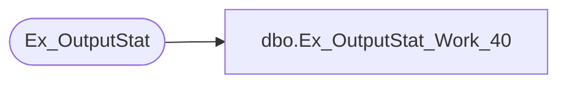

# dbo.Ex_OutputStat_Work_40

**Database:** foundation  
**Server:** bedrockdb01  

## Architecture Diagram



## Table Dependencies

| Referenced Table |
|---|
| Ex_OutputStat |

## Stored Procedure Code

```sql
create proc dbo.Ex_OutputStat_Work_40 

@ExecutionID int, @SequenceNo int, @OutputType int, @RecordCount int, 
 @ReturnCode int, @FileSize int, @FileNumber numeric(12,0), @FileName varchar(255), @WorkDateTime varchar(30) 

/*
Author: Chris Carveth
Creation Date: 28-Jan-2000                       
Comments: 

Modified by		Date		Reason
------------------------------------------------------------------------

*/

AS 

DECLARE @errno int,
	@errmsg char(100),
	@returnerrmsg char(120)

	INSERT INTO Ex_OutputStat 
		   (execution_id, sequence_no, output_type, record_count, 
	  	    work_file_name, work_file_size, work_return_code, work_date_time, file_number)
	VALUES (@ExecutionID, @SequenceNo, @OutputType, @RecordCount, 
			@FileName, @FileSize, @ReturnCode, @WorkDateTime, @FileNumber)

	SELECT @errno = @@error
      	 IF @errno != 0
      	   BEGIN
        	   SELECT @errmsg = 'Failed to Insert Into Ex_OutputStat'
        	   GOTO error           
      	   END
	
RETURN 1


error: 

IF @@trancount != 0
  ROLLBACK TRANSACTION
  
SELECT @errmsg = 'Ex_OutputStat_Work_40 ' + @errmsg 
if @errno < 100000 
     select @errno = @errno + 100000 

SET @returnerrmsg = @errno + ', ' + @errmsg

Raiserror(@returnerrmsg, 16, 1)

RETURN @errno
```

