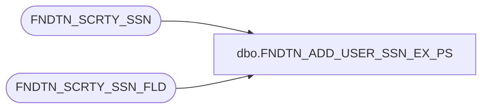

# dbo.FNDTN_ADD_USER_SSN_EX_PS

**Database:** foundation  
**Server:** bedrockdb01  

## Architecture Diagram



## Table Dependencies

| Referenced Table |
|---|
| FNDTN_SCRTY_SSN |
| FNDTN_SCRTY_SSN_FLD |

## Stored Procedure Code

```sql
create proc dbo.FNDTN_ADD_USER_SSN_EX_PS 
@sessionId binary(16), @userId int, @pid int, @machineName varchar (30), @loginId binary(16)
AS 
 insert into FNDTN_SCRTY_SSN (SSN_ID, USER_ID, APP_ID, CMPNY_ID, CRNT_MDL, CRNT_ITEM, STRT_TIME, PID, MCHN_NAME, LAST_VLDTN)
 values (@sessionId, @userId, 0, 0, null, 0, getdate (), @pid, @machineName, getdate ())
 
 delete FNDTN_SCRTY_SSN_FLD where LGN_ID = @loginId and WNDWS_USER = 1
```

