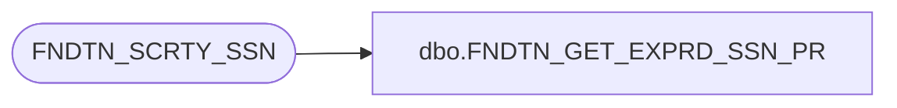

# dbo.FNDTN_GET_EXPRD_SSN_PR

**Database:** foundation  
**Server:** bedrockdb01  

## Architecture Diagram



## Table Dependencies

| Referenced Table |
|---|
| FNDTN_SCRTY_SSN |

## Stored Procedure Code

```sql
create proc dbo.FNDTN_GET_EXPRD_SSN_PR
@sessionId binary(16) output
AS 

	declare cx cursor for 
	SELECT SSN_ID
	  FROM FNDTN_SCRTY_SSN
	 WHERE (dateadd(minute, 5, LAST_VLDTN) < getdate() or LAST_VLDTN is null)
	 and PID > 0
	 and CLND = 0
	 and LCKD = 0
	 
	open cx
	fetch cx into @sessionId

	close cx
	deallocate cx
	
	select @sessionId
```

