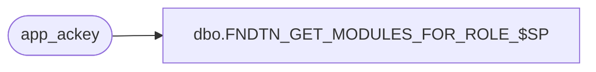

# dbo.FNDTN_GET_MODULES_FOR_ROLE_$SP

**Database:** foundation  
**Server:** bedrockdb01  

## Architecture Diagram



## Table Dependencies

| Referenced Table |
|---|
| app_ackey |

## Stored Procedure Code

```sql
CREATE PROCEDURE [dbo].[FNDTN_GET_MODULES_FOR_ROLE_$SP] (
@ApplicationID int,
@AccessKey nvarchar(max)
)

AS

DECLARE @SplitLength int, @Delimiter nvarchar(5)
DECLARE @AccessKeyList TABLE (ackey nvarchar(max))

SET @Delimiter = ','

--The while loop splits the @AccessKey parameter with delimiter as ',' and stores into a table
WHILE LEN(@AccessKey) > 0
BEGIN

	--Store the length of the string till the first delimiter ','. 
	--If there is no delimiter then store the total length of the @AccessKey parameter 
	SELECT @SplitLength = (CASE CHARINDEX(@Delimiter,@AccessKey) WHEN 0 THEN
		LEN(@AccessKey) 
	ELSE
		CHARINDEX(@Delimiter,@AccessKey) -1 END)

	-- Insert the string into the table
	INSERT INTO @AccessKeyList
	SELECT SUBSTRING(@AccessKey,1,@SplitLength) 

	-- Remove the string from the @AccessKey Parameter
	SELECT @AccessKey = (CASE (LEN(@AccessKey) - @SplitLength) WHEN 0 THEN  ''
	ELSE 
		RIGHT(@AccessKey, LEN(@AccessKey) - @SplitLength - 1) END)
END 
 
BEGIN

	-- Returns a resultset with all the levels of the Keys in the table @AccessKeyList
	SELECT  convert(nvarchar(50) , app.ackey  , 2) as ackey , ackey_name 
	FROM app_ackey app WITH (NOLOCK), @AccessKeyList ackl
	where app.app_id = @ApplicationID
	AND convert(nvarchar(50) , app.ackey  , 2) like ackl.ackey + '%'

END
```

