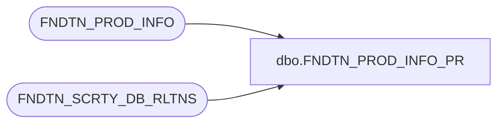

# dbo.FNDTN_PROD_INFO_PR

**Database:** foundation  
**Server:** bedrockdb01  

## Architecture Diagram



## Table Dependencies

| Referenced Table |
|---|
| FNDTN_PROD_INFO |
| FNDTN_SCRTY_DB_RLTNS |

## Stored Procedure Code

```sql
create proc dbo.FNDTN_PROD_INFO_PR 
@OriginalAppId int, 
@OriginalDbGroupId int, 
@TargetAppId int, 
@TargetProductId varchar(16), 
@ConnectString varchar(255) output
/*********************************************************/
/*	                                                 */
/*	    Author: 		Michael Orsoni       	 */
/*	    Creation Date: 	08-April-2003            */
/*	    Comments:           			 */
/*                                                       */
/*********************************************************/
AS 
DECLARE @AppId int,
	@DBGroupId int

	SELECT @ConnectString = ''


	IF @OriginalAppId <> @TargetAppId
	  BEGIN
	  	SELECT @AppId = @TargetAppId

		SELECT @DBGroupId = ISNULL (TRGT_DB_GRP_ID, 0)
		  FROM FNDTN_SCRTY_DB_RLTNS
		 WHERE APP_ID = @OriginalAppId
		   AND DB_GRP_ID = @OriginalDbGroupId
		   AND TRGT_APP_ID = @TargetAppId
	  	
	  END
	ELSE
	  BEGIN
	  	SELECT @AppId = @OriginalAppId, @DBGroupId = @OriginalDbGroupId
	  END

	SELECT @ConnectString = ISNULL(CNCTN_INFO, '')
	  FROM FNDTN_PROD_INFO
	 WHERE APP_ID = @AppId
	   AND CMPNY_ID = @DBGroupId
	   AND PROD_ID = @TargetProductId 

	RETURN
```

