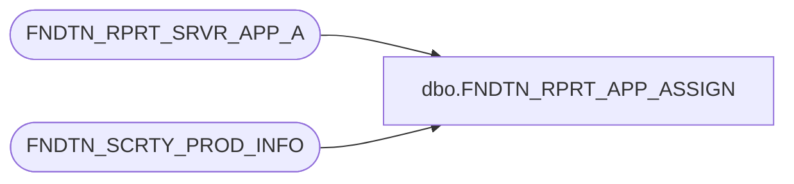

# dbo.FNDTN_RPRT_APP_ASSIGN

**Database:** foundation  
**Server:** bedrockdb01  

## Architecture Diagram



## Table Dependencies

| Referenced Table |
|---|
| FNDTN_RPRT_SRVR_APP_A |
| FNDTN_SCRTY_PROD_INFO |

## Stored Procedure Code

```sql
CREATE PROC dbo.FNDTN_RPRT_APP_ASSIGN @report_id int, @appid smallint
AS 
/* 
PROC NAME: FNDTN_RPRT_APP_ASSIGN
     DESC: ( NEW ) Assign any unassigned company/appid combinations to the Reprort Server Id

HISTORY:
Date     Name       Defect#  Desc
Oct05,15 TonyF      143316   Created for support purposes, will be called by ReportingServices scripts as well

*/   

  INSERT INTO FNDTN_RPRT_SRVR_APP_A (RPRT_SRVR_ID, APP_ID, CMPNY_ID )
    SELECT DISTINCT @report_id, i.APP_ID, i.DB_GRP_ID CMPNY_ID
    FROM FNDTN_SCRTY_PROD_INFO i
    WHERE i.APP_ID = @appid AND 
    NOT EXISTS 
      (select 1 FROM FNDTN_RPRT_SRVR_APP_A WHERE APP_ID = @appid AND (CMPNY_ID = i.DB_GRP_ID OR CMPNY_ID = 0))
    AND NOT EXISTS 
      (select 1 FROM FNDTN_RPRT_SRVR_APP_A WHERE APP_ID = 0 AND CMPNY_ID = 0)
```

