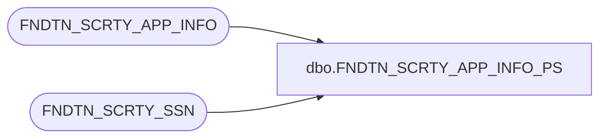

# dbo.FNDTN_SCRTY_APP_INFO_PS

**Database:** foundation  
**Server:** bedrockdb01  

## Architecture Diagram



## Table Dependencies

| Referenced Table |
|---|
| FNDTN_SCRTY_APP_INFO |
| FNDTN_SCRTY_SSN |

## Stored Procedure Code

```sql
create proc dbo.FNDTN_SCRTY_APP_INFO_PS 
@userId int, 
@appId int, 
@dbGroupId int,
@sessionId varchar (255)
/*********************************************************/
/*	    Author: 		Tim Nishikawa & Jacek Furmankiewicz */       	 
/*	    Creation Date: 	17-Sept-2002 & May 2004		 */
/*	    Comments:           adds or updates row      */
/*                              with app info for        */
/*                              current user             */
/*                                                       */
/*********************************************************/
AS 
DECLARE @exists int

	IF NOT EXISTS  (SELECT 1 FROM FNDTN_SCRTY_APP_INFO WHERE USER_ID = @userId AND APP_ID = @appId)
	BEGIN
		INSERT INTO FNDTN_SCRTY_APP_INFO (USER_ID, APP_ID, DB_GRP_ID)
		VALUES (@userId, @appId, @dbGroupId)
	END

	ELSE
	BEGIN
		UPDATE FNDTN_SCRTY_APP_INFO
		SET DB_GRP_ID = @dbGroupId
		WHERE USER_ID = @userId
		AND APP_ID = @appId
	END	

	update FNDTN_SCRTY_SSN 
	set APP_ID = @appId, CMPNY_ID = @dbGroupId
	WHERE SSN_ID = Convert(uniqueidentifier, @sessionId)
```

