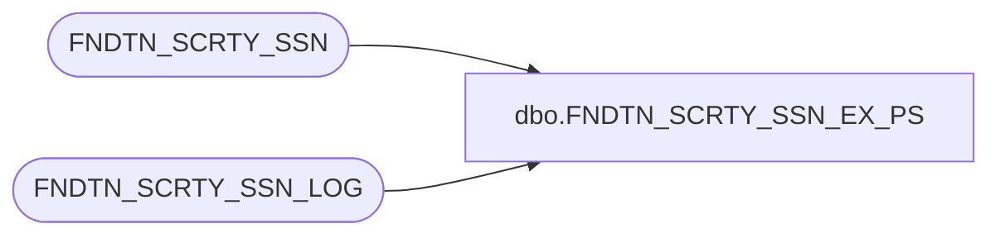

# dbo.FNDTN_SCRTY_SSN_EX_PS

**Database:** foundation  
**Server:** bedrockdb01  

## Architecture Diagram



## Table Dependencies

| Referenced Table |
|---|
| FNDTN_SCRTY_SSN |
| FNDTN_SCRTY_SSN_LOG |

## Stored Procedure Code

```sql
create proc dbo.FNDTN_SCRTY_SSN_EX_PS 
@SessionId binary(16),
@status int
AS 
DECLARE @HistoryPollID int

	INSERT INTO FNDTN_SCRTY_SSN_LOG (SSN_ID, USER_ID, STRT_TIME, END_TIME, MCHN_NAME, PID, STS)
	     SELECT @SessionId, USER_ID, STRT_TIME, getdate (), MCHN_NAME, PID, @status
	       FROM FNDTN_SCRTY_SSN
	      WHERE SSN_ID = @SessionId

	DELETE FNDTN_SCRTY_SSN
	 WHERE SSN_ID = @SessionId
```

