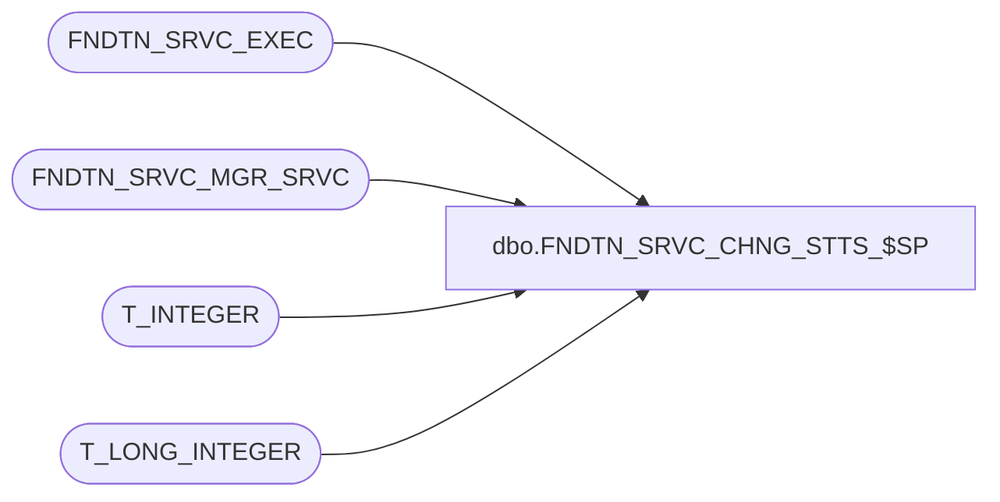

# dbo.FNDTN_SRVC_CHNG_STTS_$SP

**Database:** foundation  
**Server:** bedrockdb01  

## Architecture Diagram



## Table Dependencies

| Referenced Table |
|---|
| FNDTN_SRVC_EXEC |
| FNDTN_SRVC_MGR_SRVC |
| T_INTEGER |
| T_LONG_INTEGER |

## Stored Procedure Code

```sql
CREATE PROCEDURE [dbo].[FNDTN_SRVC_CHNG_STTS_$SP] 
(
@I_EXEC_ID T_LONG_INTEGER,
@I_NEW_STATUS T_INTEGER
)
AS

UPDATE  FNDTN_SRVC_EXEC
SET CRNT_STATUS = @I_NEW_STATUS
WHERE EXEC_ID = @I_EXEC_ID

UPDATE FNDTN_SRVC_MGR_SRVC
SET CRNT_STATUS = @I_NEW_STATUS
WHERE CRNT_EXEC_ID = @I_EXEC_ID
```

