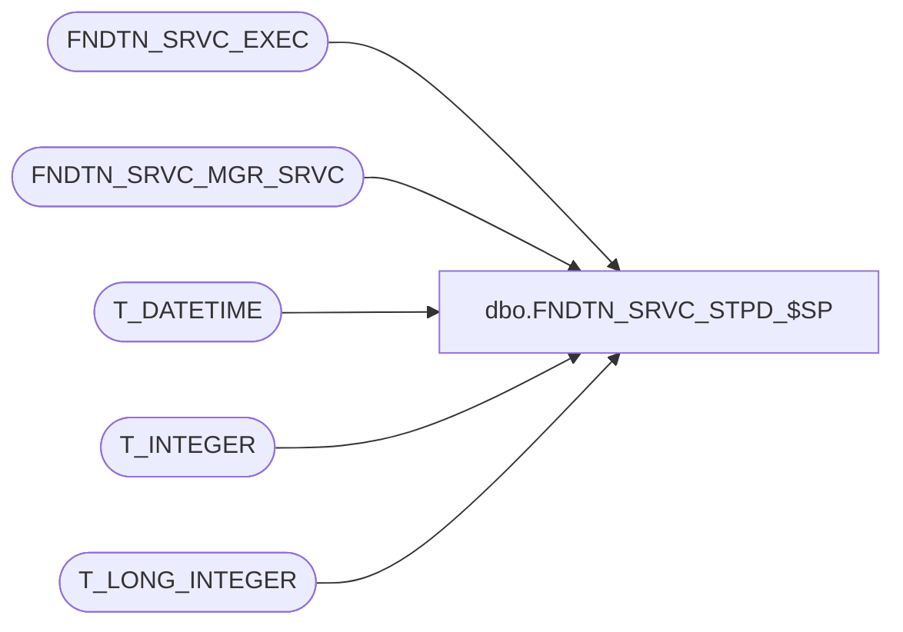

# dbo.FNDTN_SRVC_STPD_$SP

**Database:** foundation  
**Server:** bedrockdb01  

## Architecture Diagram



## Table Dependencies

| Referenced Table |
|---|
| FNDTN_SRVC_EXEC |
| FNDTN_SRVC_MGR_SRVC |
| T_DATETIME |
| T_INTEGER |
| T_LONG_INTEGER |

## Stored Procedure Code

```sql
CREATE PROCEDURE [dbo].[FNDTN_SRVC_STPD_$SP] 
(
@I_EXEC_ID T_LONG_INTEGER,
@I_EXIT_TIME T_DATETIME,
@I_EXIT_CODE T_LONG_INTEGER,
@I_STP_MTHD_ID T_INTEGER,
@I_SRVC_INSTNC_ID T_INTEGER
)
AS

UPDATE  FNDTN_SRVC_EXEC
SET CRNT_STATUS = 5,
EXIT_TIME = @I_EXIT_TIME,
EXIT_CODE = @I_EXIT_CODE,
STP_MTHD_ID = @I_STP_MTHD_ID
WHERE EXEC_ID = @I_EXEC_ID

UPDATE FNDTN_SRVC_MGR_SRVC
SET CRNT_STATUS = 5,
CRNT_PRCS_ID = NULL,
CRNT_EXEC_ID = NULL
WHERE SRVC_INSTNC_ID = @I_SRVC_INSTNC_ID
```

