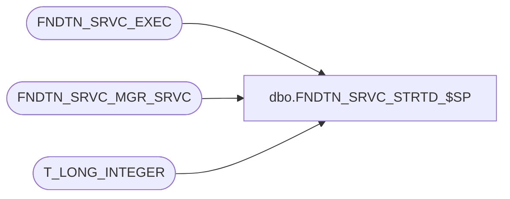

# dbo.FNDTN_SRVC_STRTD_$SP

**Database:** foundation  
**Server:** bedrockdb01  

## Architecture Diagram



## Table Dependencies

| Referenced Table |
|---|
| FNDTN_SRVC_EXEC |
| FNDTN_SRVC_MGR_SRVC |
| T_LONG_INTEGER |

## Stored Procedure Code

```sql
CREATE PROCEDURE [dbo].[FNDTN_SRVC_STRTD_$SP] 
(
@I_EXEC_ID T_LONG_INTEGER,
@I_RPCS_ID T_LONG_INTEGER
)
AS

UPDATE FNDTN_SRVC_EXEC
SET START_TIME = GETDATE(),
CRNT_STATUS = 3
WHERE EXEC_ID = @I_EXEC_ID

UPDATE FNDTN_SRVC_MGR_SRVC
SET CRNT_STATUS = 3,
CRNT_PRCS_ID = @I_RPCS_ID
WHERE CRNT_EXEC_ID = @I_EXEC_ID
```

