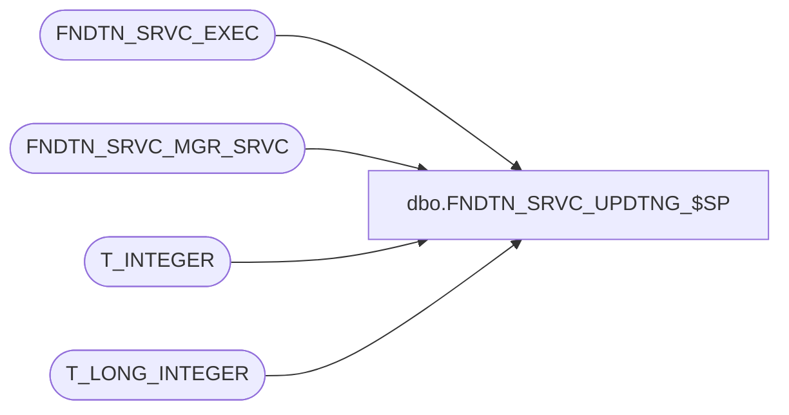

# dbo.FNDTN_SRVC_UPDTNG_$SP

**Database:** foundation  
**Server:** bedrockdb01  

## Architecture Diagram



## Table Dependencies

| Referenced Table |
|---|
| FNDTN_SRVC_EXEC |
| FNDTN_SRVC_MGR_SRVC |
| T_INTEGER |
| T_LONG_INTEGER |

## Stored Procedure Code

```sql
CREATE PROCEDURE [dbo].[FNDTN_SRVC_UPDTNG_$SP]
(
@I_SRVC_INSTNC_ID T_INTEGER
)
AS

DECLARE @EXEC_ID T_LONG_INTEGER

INSERT INTO FNDTN_SRVC_EXEC(SRVC_INSTNC_ID, CRNT_STATUS)
VALUES (@I_SRVC_INSTNC_ID, 1)

SELECT @EXEC_ID = @@IDENTITY

UPDATE FNDTN_SRVC_MGR_SRVC
SET CRNT_STATUS = 1,
CRNT_EXEC_ID = @EXEC_ID
WHERE SRVC_INSTNC_ID = @I_SRVC_INSTNC_ID

RETURN @EXEC_ID
```

