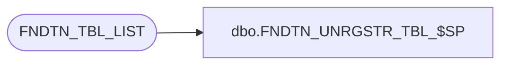

# dbo.FNDTN_UNRGSTR_TBL_$SP

**Database:** foundation  
**Server:** bedrockdb01  

## Architecture Diagram



## Table Dependencies

| Referenced Table |
|---|
| FNDTN_TBL_LIST |

## Stored Procedure Code

```sql
create proc dbo.FNDTN_UNRGSTR_TBL_$SP 
(
  @table_name   varchar(32)  
)
AS
 
  /* Procedure	: FNDTN_UNREGISTER_TABLE_$SP	 				*/
  /* Author	: Ian Kendrick							*/
  /* Date	: 25 Feb 2005							*/
  /*										*/
  /* Purpose	: Unregister a table created for a session with foundation	*/
  
DECLARE

  @i_cmd nvarchar(255)
  
BEGIN

  IF EXISTS (SELECT 1 FROM sysobjects WHERE name = @table_name and type='U')
  BEGIN
   
    SELECT @i_cmd = 'DROP TABLE ' + @table_name
    
    EXEC sp_executesql @i_cmd
    
  END
  
  BEGIN TRAN
  
  DELETE FROM FNDTN_TBL_LIST
        WHERE TBL_NAME = @table_name
     
  COMMIT
  
END
```

