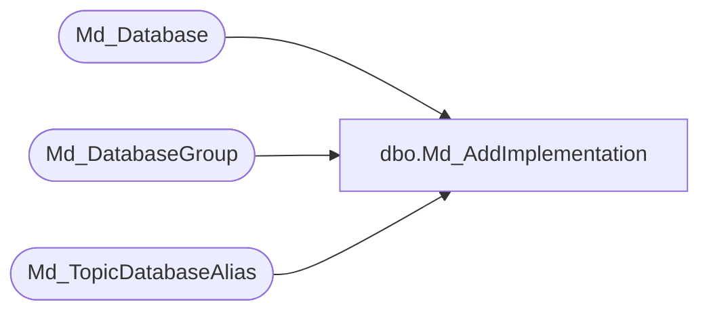

# dbo.Md_AddImplementation

**Database:** foundation  
**Server:** bedrockdb01  

## Architecture Diagram



## Table Dependencies

| Referenced Table |
|---|
| Md_Database |
| Md_DatabaseGroup |
| Md_TopicDatabaseAlias |

## Stored Procedure Code

```sql
create procedure Md_AddImplementation (@topicid integer,@housekeeping integer,@dbaliasid integer,@desc1 varchar(30),@desc2 varchar(30),@username varchar(60), @userpwd varchar(60),
@vdbname varchar(30),@bserver varchar(60),@dbname varchar(30),
@dbdesc1 varchar(30), @dbdesc2 varchar(30))  
/*********************************************************/
/*	                                                 */
/*	    Author: Linda Zenebisis           		 */
/*	    Creation Date: 12-February-2001              */
/*	    Comments:  adds or updates implementations   */
/*                                                       */
/*********************************************************/
	As
  
Declare  @dbgroupid integer, @dbid integer

 select @dbgroupid = (select max(db_group_id) from Md_DatabaseGroup where topic_id =  @topicid)
 
	 if @dbgroupid >0 
		begin
		select @dbgroupid = @dbgroupid +1
		end 
	 else 
		begin
		select @dbgroupid = (@topicid * 100)+1
		end 
		
 insert into Md_DatabaseGroup(db_group_id,db_group_label_1,db_group_label_2,user_name,user_password,vdb_name,topic_id,file_dsn_info,server_name,group_type)
 	values(@dbgroupid,@desc1,@desc2,@username,@userpwd,@vdbname,@topicid,NULL,@bserver,@housekeeping)
 
 select @dbid = (select max(database_id) from Md_Database a, Md_TopicDatabaseAlias b 
 where a.db_alias_id = b.db_alias_id
 and b.topic_id = @topicid )
 
 if @dbid >0 
 	begin
 	select @dbid = @dbid +1
 	end 
 else 
 	begin
 	select @dbid = (@topicid * 100)+1
 	end 
 
  insert into Md_Database(database_id,database_name,server_name,database_label_1,database_label_2,db_alias_id,db_group_id)
  	values(@dbid,@dbname,@bserver,@dbdesc1,@dbdesc2,@dbaliasid,@dbgroupid)
 
 
 
return @dbgroupid
```

