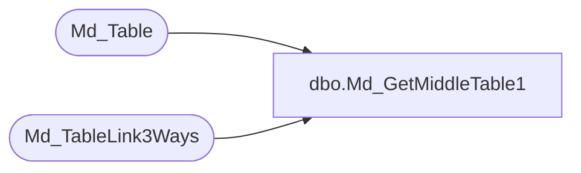

# dbo.Md_GetMiddleTable1

**Database:** foundation  
**Server:** bedrockdb01  

## Architecture Diagram



## Table Dependencies

| Referenced Table |
|---|
| Md_Table |
| Md_TableLink3Ways |

## Stored Procedure Code

```sql
create proc dbo.Md_GetMiddleTable1 @FirstTableID int, @SecondTableID int
/*******************************************************/
/*	                                               */
/*	    Author : Ashraf Zaid                       */
/*	    Creation Date : 24 Nov 1997                */
/*	    Comments : Return a middle table           */
/*	               required to link the 2 input    */
/*                     tables                          */
/* 	    Modified Feb 24 2000 part of 3.5 to use    */
/*                     the pre-build Md_TableLink3Ways */
/*                     to resolve the link             */
/*******************************************************/
AS 
DECLARE @result int,
	@Priority int
	
	SELECT @Priority = MIN(b.priority)
	FROM Md_TableLink3Ways a, Md_Table b
	WHERE a.from_table_id = @FirstTableID
	  AND a.to_table_id = @SecondTableID
	  AND a.middle_table_id1 = b.table_id
	
	SELECT @result = a.middle_table_id1
	FROM Md_TableLink3Ways a, Md_Table b
	WHERE a.from_table_id = @FirstTableID
	  AND a.to_table_id = @SecondTableID
	  AND a.middle_table_id1 = b.table_id
	  AND b.priority = @Priority

	SELECT @result = ISNULL(@result,0)

RETURN @result
```

