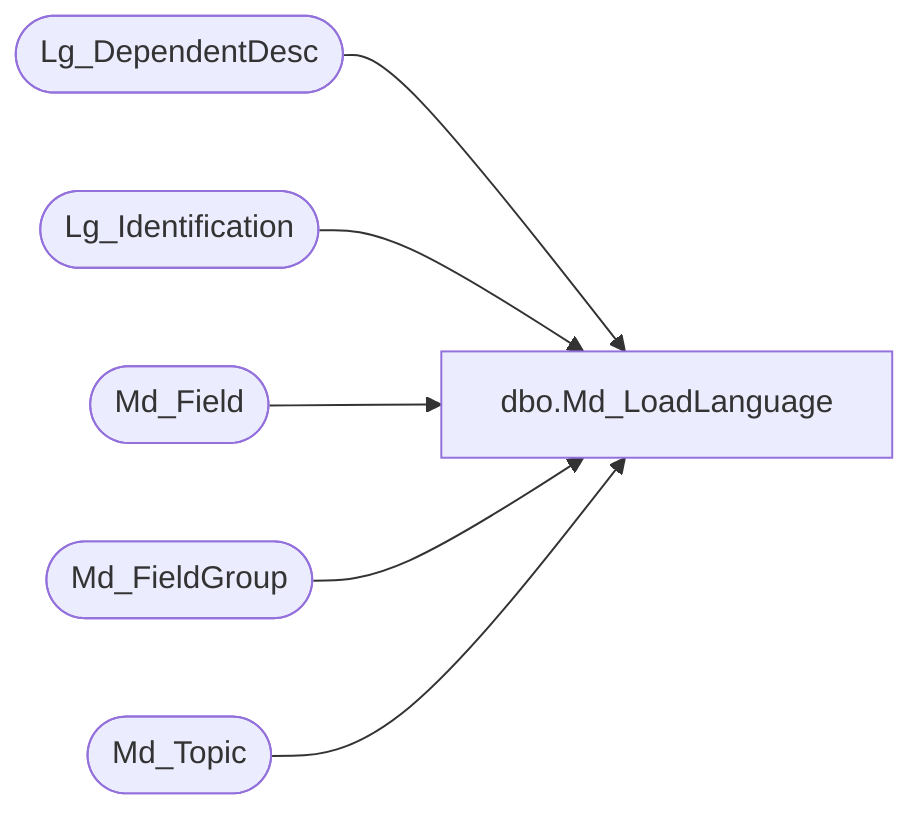

# dbo.Md_LoadLanguage

**Database:** foundation  
**Server:** bedrockdb01  

## Architecture Diagram



## Table Dependencies

| Referenced Table |
|---|
| Lg_DependentDesc |
| Lg_Identification |
| Md_Field |
| Md_FieldGroup |
| Md_Topic |

## Stored Procedure Code

```sql
CREATE procedure dbo.Md_LoadLanguage ( @LangID int )
 
/***************************************************************************/
--
--   Author: 		Yusuo Chang 
--   Creation Date: 	16-May-2005
--   Comments: 		Load specified language into Lg_DependantDesc table
--
/***************************************************************************/
/*
-- Annie Deland - September 25, 2013 
-- defect 141878 - Length of fields involved was changed so updated the 
-- stored proc to reflect the new length.
-- defect 142764 - change last line of update statement for short label
-- to check if first_pair_text is not null instead of checking second_pair_text
*/ 

AS 

	--select @LangID=3084
	if not exists 
	    (select * 
	     from Lg_Identification 
	     where language_id=@LangID)
	begin
	  print 'Specified language id does not exists'
	  return -1;
	end

	--Update table Md_Topic
	update Md_Topic
	set Md_Topic.topic_label_2=SUBSTRING(lg.first_pair_text,1,60)
	   ,topic_description_2=lg.second_pair_text
	from Lg_DependentDesc lg
	where Md_Topic.resource_id=lg.resource_id
	and lg.language_id=@LangID

	--Update table Md_FieldGroup
	update Md_FieldGroup
	set field_group_label_2= SUBSTRING(lg.first_pair_text,1,90)
	   ,field_group_description_2=lg.second_pair_text
	from Lg_DependentDesc lg
	where Md_FieldGroup.resource_id=lg.resource_id
	and lg.language_id=@LangID

	--Update table Md_Field
	update Md_Field
	set field_label_2=SUBSTRING(lg.first_pair_text,1,90)
	   ,field_description_2=lg.second_pair_text
	from Lg_DependentDesc lg
	where Md_Field.resource_id_1=lg.resource_id
	and lg.first_pair_text is not null
	and lg.language_id=@LangID

	update Md_Field
	set short_label_2=SUBSTRING(lg.first_pair_text,1,60)
	from Lg_DependentDesc lg
	where Md_Field.resource_id_2=lg.resource_id
	and lg.first_pair_text is not null
	and lg.language_id=@LangID

RETURN 1
```

