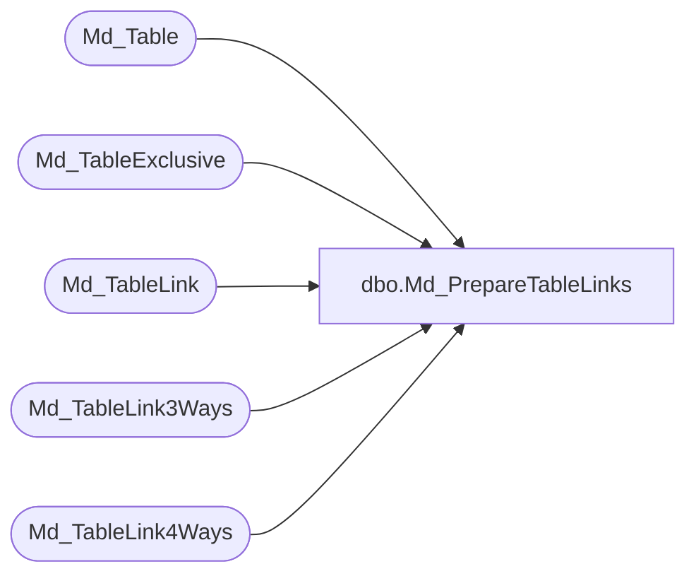

# dbo.Md_PrepareTableLinks

**Database:** foundation  
**Server:** bedrockdb01  

## Architecture Diagram



## Table Dependencies

| Referenced Table |
|---|
| Md_Table |
| Md_TableExclusive |
| Md_TableLink |
| Md_TableLink3Ways |
| Md_TableLink4Ways |

## Stored Procedure Code

```sql
create proc dbo.Md_PrepareTableLinks  @TopicID int
/*******************************************************/
/*	                                                 */
/*	    Author : Ashraf Zaid                         */
/*	    Creation Date : Feb 10 2000                  */
/*	    Comments : Rebuild the table                 */
/*  Md_TableLink3Ways from the contents of Md_TableLink  */
/*  Md_TableLink4Ways from the contents of Md_TableLink  */
/*	                                                 */
/*******************************************************/

AS 

begin

	/********************  Md_TableLink3Ways ************************/	
	BEGIN TRANSACTION

	DELETE FROM Md_TableLink3Ways
	WHERE topic_id = @TopicID

	INSERT INTO Md_TableLink3Ways(topic_id, from_table_id, middle_table_id1, to_table_id, exclusive_count)
	SELECT @TopicID, a.from_table_id, a.to_table_id, b.from_table_id, 0
	FROM Md_TableLink a, Md_TableLink b, Md_Table t
	WHERE a.to_table_id = b.to_table_id
	  AND a.from_table_id = t.table_id
	  AND t.topic_id = @TopicID
	  AND a.from_table_id < b.from_table_id

	INSERT INTO Md_TableLink3Ways(topic_id, from_table_id, middle_table_id1, to_table_id, exclusive_count)
	SELECT @TopicID, a.to_table_id, a.from_table_id, b.to_table_id, 0
	FROM Md_TableLink a, Md_TableLink b, Md_Table t
	WHERE a.from_table_id = b.from_table_id
	  AND a.from_table_id = t.table_id
	  AND t.topic_id = @TopicID
	  AND a.to_table_id < b.to_table_id

	INSERT INTO Md_TableLink3Ways(topic_id, from_table_id, middle_table_id1, to_table_id, exclusive_count)
	SELECT @TopicID, a.to_table_id, a.from_table_id, b.from_table_id, 0
	FROM Md_TableLink a, Md_TableLink b, Md_Table t
	WHERE a.from_table_id = b.to_table_id
	  AND a.from_table_id = t.table_id
	  AND t.topic_id = @TopicID
	  AND a.to_table_id < b.from_table_id

	INSERT INTO Md_TableLink3Ways(topic_id, from_table_id, middle_table_id1, to_table_id, exclusive_count)
	SELECT @TopicID, a.from_table_id, a.to_table_id, b.to_table_id, 0
	FROM Md_TableLink a, Md_TableLink b, Md_Table t
	WHERE a.to_table_id = b.from_table_id
	  AND a.from_table_id = t.table_id
	  AND t.topic_id = @TopicID
	  AND a.from_table_id < b.to_table_id

	/* Remove all the links that include more than one table form the Md_TableExclusive table */

	UPDATE Md_TableLink3Ways
	SET exclusive_count = exclusive_count + 1	
	WHERE from_table_id in (SELECT table_id from Md_TableExclusive)
	AND topic_id = @TopicID
	
	UPDATE Md_TableLink3Ways
	SET exclusive_count = exclusive_count + 1
	WHERE middle_table_id1 in (SELECT table_id from Md_TableExclusive)
	AND topic_id = @TopicID

	UPDATE Md_TableLink3Ways 
	SET exclusive_count = exclusive_count + 1
	WHERE to_table_id in (SELECT table_id from Md_TableExclusive)
	AND topic_id = @TopicID

	DELETE Md_TableLink3Ways
	WHERE exclusive_count > 1
	AND topic_id = @TopicID

	COMMIT TRANSACTION

	DELETE Md_TableLink3Ways
	FROM Md_TableLink3Ways a, Md_TableLink b
	WHERE a.from_table_id = b.from_table_id
	  AND a.to_table_id = b.to_table_id
	  AND a.topic_id = @TopicID

	/********************  Md_TableLink4Ways ************************/	
	BEGIN TRANSACTION

	DELETE FROM Md_TableLink4Ways
	WHERE topic_id = @TopicID
	
	INSERT INTO Md_TableLink4Ways(topic_id, from_table_id, middle_table_id1, middle_table_id2, to_table_id, exclusive_count)
	SELECT @TopicID, a.from_table_id, a.middle_table_id1, a.to_table_id, b.from_table_id, 0
	FROM Md_TableLink3Ways a, Md_TableLink b
	WHERE a.to_table_id = b.to_table_id
	  AND a.topic_id = @TopicID
	  AND a.from_table_id < b.from_table_id

	INSERT INTO Md_TableLink4Ways(topic_id, from_table_id, middle_table_id1, middle_table_id2, to_table_id, exclusive_count)
	SELECT @TopicID, a.to_table_id, a.middle_table_id1, a.from_table_id, b.to_table_id, 0
	FROM Md_TableLink3Ways a, Md_TableLink b
	WHERE a.from_table_id = b.from_table_id
	  AND a.topic_id = @TopicID
	  AND a.to_table_id < b.to_table_id

	INSERT INTO Md_TableLink4Ways(topic_id, from_table_id, middle_table_id1, middle_table_id2, to_table_id, exclusive_count)
	SELECT @TopicID, a.from_table_id, a.middle_table_id1, a.to_table_id, b.to_table_id, 0
	FROM Md_TableLink3Ways a, Md_TableLink b
	WHERE a.to_table_id = b.from_table_id
	  AND a.topic_id = @TopicID
	  AND a.from_table_id < b.to_table_id
	  
	INSERT INTO Md_TableLink4Ways(topic_id, from_table_id, middle_table_id1, middle_table_id2, to_table_id, exclusive_count)
	SELECT @TopicID, a.to_table_id, a.middle_table_id1, a.from_table_id, b.from_table_id, 0
	FROM Md_TableLink3Ways a, Md_TableLink b
	WHERE a.from_table_id = b.to_table_id
	  AND a.topic_id = @TopicID
	  AND a.to_table_id < b.from_table_id
  
	/* Remove all the links that include more than one table form the Md_TableExclusive table */
	 
	UPDATE Md_TableLink4Ways
	SET exclusive_count = exclusive_count + 1	
	WHERE from_table_id in (SELECT table_id from Md_TableExclusive)
	AND topic_id = @TopicID
	
	UPDATE Md_TableLink4Ways
	SET exclusive_count = exclusive_count + 1
	WHERE middle_table_id1 in (SELECT table_id from Md_TableExclusive)
	AND topic_id = @TopicID

	UPDATE Md_TableLink4Ways
	SET exclusive_count = exclusive_count + 1
	WHERE middle_table_id2 in (SELECT table_id from Md_TableExclusive)
	AND topic_id = @TopicID

	UPDATE Md_TableLink4Ways
	SET exclusive_count = exclusive_count + 1
	WHERE to_table_id in (SELECT table_id from Md_TableExclusive)
	AND topic_id = @TopicID

	DELETE Md_TableLink4Ways
	WHERE exclusive_count > 1
	AND topic_id = @TopicID

	COMMIT TRANSACTION

	DELETE Md_TableLink4Ways
	FROM Md_TableLink4Ways a, Md_TableLink b
	WHERE a.from_table_id = b.from_table_id
	  AND a.to_table_id = b.to_table_id
	  AND a.topic_id = @TopicID
	  
	DELETE Md_TableLink4Ways
	FROM Md_TableLink4Ways a, Md_TableLink3Ways b
	WHERE a.from_table_id = b.from_table_id
	  AND a.to_table_id = b.to_table_id
	  AND a.topic_id = @TopicID
	  AND b.topic_id = @TopicID

end
```

