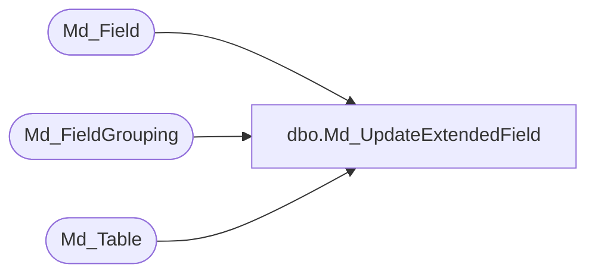

# dbo.Md_UpdateExtendedField

**Database:** foundation  
**Server:** bedrockdb01  

## Architecture Diagram



## Table Dependencies

| Referenced Table |
|---|
| Md_Field |
| Md_FieldGrouping |
| Md_Table |

## Stored Procedure Code

```sql
CREATE PROCEDURE [dbo].[Md_UpdateExtendedField]
	-- Add the parameters for the stored procedure here
	@i_extended_field_id binary(16), 
	@i_extended_field_name varchar(30),
	@i_table_name varchar(255),
	@i_field_type char(1),
	@i_field_width tinyint,
	@i_field_data_type varchar(30),
	@i_topic_ids varchar(80)

AS
BEGIN
	SET NOCOUNT ON

	DECLARE @field_id int,
			@table_id int,
			@topic_id int,
			@dim_id int,
			@field_expression varchar(255)

	SELECT @field_expression = 'cast(X.FDN_CSTMZTN_DATA as xml).value(''(/Fields[1]/' + @i_extended_field_name + '[1])'', ''' + @i_field_data_type + ''')', @i_topic_ids = ',' + @i_topic_ids + ','

	DECLARE table_cursor CURSOR LOCAL FAST_FORWARD FOR 
	SELECT table_id, topic_id 
	FROM Md_Table
	WHERE table_name = @i_table_name
	AND CHARINDEX(@i_topic_ids, ',' + convert(varchar(10), topic_id) + ',') >= 0

	OPEN table_cursor

	FETCH NEXT FROM table_cursor INTO @table_id, @topic_id

	WHILE @@FETCH_STATUS = 0 BEGIN

		SELECT @field_id = null
		SELECT @field_id = field_id FROM Md_Field WHERE table_id = @table_id AND extended_field_id = @i_extended_field_id
		
		if (@field_id is null) BEGIN -- new field
			SELECT @field_id = isnull(max(field_id),30000) + 1 FROM Md_Field where field_id > 30000		
	
			INSERT INTO Md_Field (field_id, field_owner_id, table_id, topic_id, field_label_1, field_label_2, field_expression_1, field_expression_2,
				field_type, field_width, field_permission, field_flags, lookup_id, lookup_type, extended_field_id)
				VALUES(@field_id, 1, @table_id, @topic_id, @i_extended_field_name, @i_extended_field_name, @field_expression, @field_expression,
				@i_field_type, @i_field_width, 'XXXXXX', ' 111       1        ', 0, 0, @i_extended_field_id)
		END ELSE BEGIN -- old field
			UPDATE Md_Field 
			SET field_label_1 = @i_extended_field_name,
				field_label_2 = @i_extended_field_name,
				field_expression_1 = @field_expression,
				field_expression_2 = @field_expression,
				field_type = @i_field_type,
				field_width = @i_field_width
			WHERE field_id = @field_id
		END

		DELETE FROM Md_FieldGrouping WHERE field_id = @field_id
		
		INSERT INTO Md_FieldGrouping(field_group_id, field_id)
		SELECT distinct field_group_id, @field_id 
		FROM Md_FieldGrouping a INNER JOIN Md_Field b on a.field_id  = b.field_id
		WHERE b.table_id = @table_id

		FETCH NEXT FROM table_cursor INTO @table_id, @topic_id
	END -- while @@FETCH_STATUS
	
	CLOSE table_cursor
	DEALLOCATE table_cursor
END
```

