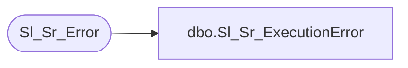

# dbo.Sl_Sr_ExecutionError

**Database:** foundation  
**Server:** bedrockdb01  

## Architecture Diagram



## Table Dependencies

| Referenced Table |
|---|
| Sl_Sr_Error |

## Stored Procedure Code

```sql
create proc dbo.Sl_Sr_ExecutionError @i_ExecutionID int, @i_ErrorCode int,@i_ExeName varchar(30), @i_ClassName varchar(30), @i_FunctionName varchar(30), @i_Message varchar(255)
/*********************************************************/
/*	                                                 */
/*	    Author: Chris Carveth              		 */
/*	    Creation Date: 05-March-1999                 */
/*	    Comments:                                    */
/*                                                       */
/*          Tim Nishikawa  17-Feb-2004  renamed          */
/*                         parameters to match oracle    */
/*                         version of proc.              */
/*                                                       */
/*********************************************************/

AS 

        INSERT INTO Sl_Sr_Error (execution_id, error_code, exe_name, class_name, function_name,
                              message, error_datetime)
             VALUES (@i_ExecutionID, @i_ErrorCode, @i_ExeName, @i_ClassName, @i_FunctionName, 
                              @i_Message, getdate())
             
RETURN @@identity
```

