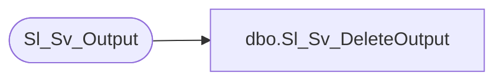

# dbo.Sl_Sv_DeleteOutput

**Database:** foundation  
**Server:** bedrockdb01  

## Architecture Diagram



## Table Dependencies

| Referenced Table |
|---|
| Sl_Sv_Output |

## Stored Procedure Code

```sql
create proc dbo.Sl_Sv_DeleteOutput 

@i_output_id 	int
as
/* Proc to delete an output from Sv_Output and Sv_OutputPage will be deleted by the trigger Sv_OutputDelete */
/* By Ashraf Zaid			Date June 23 1997 
   Tim Nishikawa    Feb 17 2004  renamed parameter to match Oracle version of proc. */
DELETE FROM Sl_Sv_Output
	WHERE output_id = @i_output_id
```

