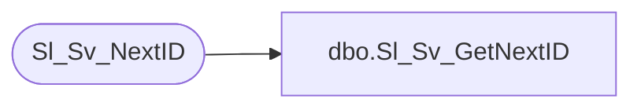

# dbo.Sl_Sv_GetNextID

**Database:** foundation  
**Server:** bedrockdb01  

## Architecture Diagram



## Table Dependencies

| Referenced Table |
|---|
| Sl_Sv_NextID |

## Stored Procedure Code

```sql
create proc dbo.Sl_Sv_GetNextID @i_table_id 	int
as

/* 
	Proc to get a unique id for a table from Sv_NextID 

    Modifications:
    --------------
    Ashraf Zaid		June 10 1997  - Developed.
    Chris C.            April 4, 2000 - Changed to avoid Deadlocks in Exports.
    Tim Nishikawa	Feb 17 2004   - renamed parameter to match Oracle version of proc.
*/

DECLARE	@next_id 	int,
	    @max_id		int

    BEGIN TRANSACTION

	UPDATE Sl_Sv_NextID
	   SET next_id = next_id + 1
	 WHERE table_id = @i_table_id

	SELECT @next_id = next_id,
		   @max_id = max_id
  	  FROM Sl_Sv_NextID 
 	 WHERE table_id = @i_table_id

    COMMIT TRANSACTION

	IF @next_id = @max_id
		SELECT @next_id = 0

Return @next_id
```

