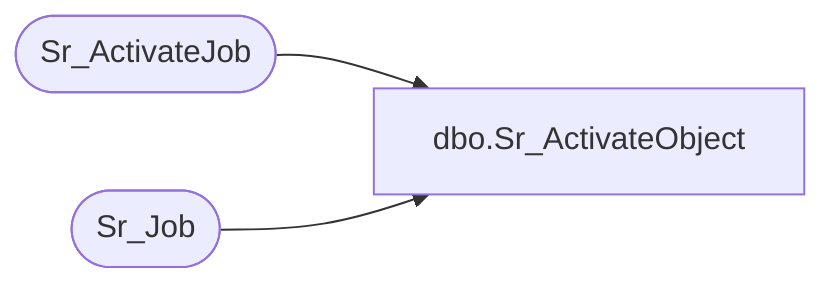

# dbo.Sr_ActivateObject

**Database:** foundation  
**Server:** bedrockdb01  

## Architecture Diagram



## Table Dependencies

| Referenced Table |
|---|
| Sr_ActivateJob |
| Sr_Job |

## Stored Procedure Code

```sql
create proc dbo.Sr_ActivateObject  (@object_id int, @object_type int, @db_group_id int, @data varchar(50), @data_ext varchar(50)  , @server_id INT = -1, @machine_id INT = -1 )

AS

/*
PROC NAME:  Sr_ActivateObject
     DESC:  selects job id from Sr_Job, calls Sr_ActivateJob
  HISTORY:

Date 		Name 		Def#	Desc
16-JUL-2004     Daphna F       38642    use server_id and machine_id (when not null) to select 
                                        job_id 
25-JUL-2000	Andrea Nagy		author	


	                                                 
*/
 

DECLARE  @job_id int
/*	Enter all variables cursors and constants following
	this line */
begin

IF (@server_id = -1 OR @machine_id = -1)
BEGIN  
  SELECT @job_id = min(job_id)
    FROM Sr_Job
   WHERE object_id = @object_id
     AND db_group_id = @db_group_id
     AND object_type = @object_type 
END
ELSE
BEGIN
  SELECT @job_id = min(job_id)
    FROM Sr_Job
   WHERE object_id = @object_id
     AND db_group_id = @db_group_id
     AND object_type = @object_type 
     AND server_id = @server_id
     AND machine_id = @machine_id
END

exec Sr_ActivateJob @job_id, @data, @data_ext
end
```

