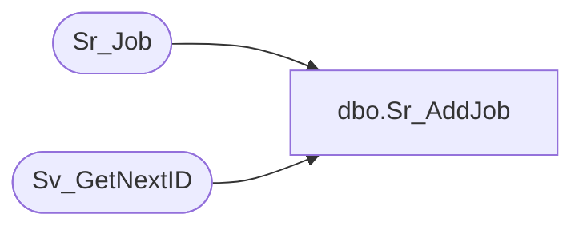

# dbo.Sr_AddJob

**Database:** foundation  
**Server:** bedrockdb01  

## Architecture Diagram



## Table Dependencies

| Referenced Table |
|---|
| Sr_Job |
| Sv_GetNextID |

## Stored Procedure Code

```sql
create proc dbo.Sr_AddJob 

@MachineId int, @ServerId	int

/*********************************************************/
/*	                                                 */
/*	    Author: Adam Whiston                         */
/*	    Creation Date: 19-Feb-1999                   */
/*	    Comments: Adds a job to Sr_Job		 */
/*                                                       */
/*********************************************************/

/*
Amendments
Modified by		Date		Reason
------------------------------------------------------------------------
Andrea 			12-Jul-99	Added job_flags to the insert
Tim			19-Aug-99	Added machine_id to insert with value=@MachineId param
Tim			31-Aug-99	Changed default values: interval_count=1, interval_type=1
Andrea			06-Oct-99	Added "pid" to Sr_AddJob insert
Chris			16-Sep-02	Added call to Sv_GetNextID
Annie			15-Mar-10	Scheduling mode is now set to 2 (number of executions) by default.

*/
AS 
	DECLARE @new_id int 

	begin transaction

	EXEC @new_id = Sv_GetNextID 14
				
	INSERT Sr_Job (job_id, server_id, sequence_number, topic_id, object_id, object_type, db_group_id, interval_count,
		       interval_type, start_date_time, end_date_time, schedule_details, last_date_time, 
		       next_date_time, locked, scheduled_executions, done_executions, 
		       auto_execute, execution_id, active, avg_duration, label, cmd_line, cmd_line_parameters, data, 
		       previous_status, next_job_id, debug_level, created_date_time, scheduling_mode, max_threads, job_flags,
                       machine_id, pid)
              VALUES ( @new_id, @ServerId, 0, 0, 0, 0, 0, 1, 1, NULL, NULL, NULL, NULL, NULL,
                       0, 0, 0, 0, 0, 0, NULL, NULL, NULL, NULL, NULL, NULL, 0, 64, getdate(), 2, 5, 0, @MachineId, 0)
        
	IF @@rowcount <> 1
	   SELECT @new_id = 0

        commit transaction   
        
	RETURN @new_id
```

